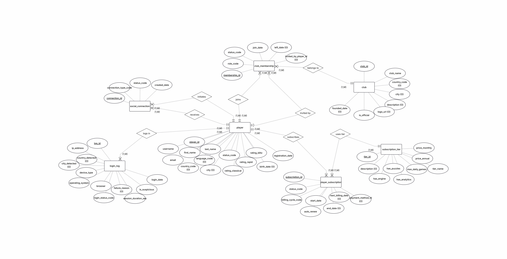
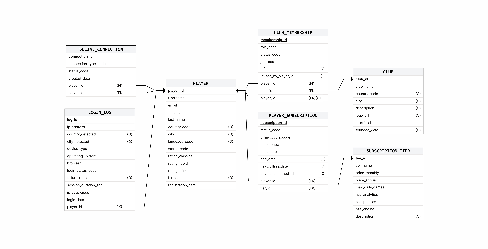

# Chess Platform – Users and Clubs

**Database Design Project – Phase A**
Course 150225 | Jerusalem College of Technology – Machon Lev | 2026

| | |
|---|---|
| **Students** | Elazar Krispel (ID: 8309) · Alon Greenstein (ID: 7002) |
| **System** | Chess Tournament Management System |
| **Selected Unit** | Class 1 – Users and Clubs |

---

## Table of Contents

1. [Introduction](#introduction)
2. [Application Screens (AI Studio)](#application-screens)
3. [ERD Diagram](#erd-diagram)
4. [DSD Diagram](#dsd-diagram)
5. [Design Decisions](#design-decisions)
6. [Data Insertion](#data-insertion)
7. [Backup and Restore](#backup-and-restore)

---

## Introduction

### System Overview

This database module manages the **user and club lifecycle** of an online chess platform. It covers everything from the moment a player registers through their day-to-day activity to their social interactions and club affiliations.

The data stored in this unit includes:

- **Players** – personal details, geographic information, three separate ELO ratings (Classical, Rapid, Blitz), account status, and registration timeline.
- **Clubs** – chess clubs with country and city data, an official/unofficial flag, and founding date.
- **Club Memberships** – which players belong to which clubs, in what role (Owner, Admin, Moderator, Member), who invited them, when they joined, and when (if ever) they left.
- **Subscription Tiers** – the platform's subscription plans, including monthly/annual pricing and feature flags (analytics, puzzles, engine access).
- **Player Subscriptions** – which subscription tier each player is on, billing cycle, auto-renewal status, and subscription date range.
- **Login Logs** – a detailed audit trail of every login attempt: IP address, detected location, device type, operating system, browser, session duration, and a suspicious-activity flag.
- **Social Connections** – follow/friend relationships between players, with connection type and status.

### Main Functionality

The core operations this unit supports are:

1. **Player lifecycle management** – register new players, update status (active / suspended / banned), track activity over time.
2. **Club management** – create and maintain clubs, manage membership with role-based access control.
3. **Subscription and billing** – assign players to subscription tiers, track billing cycles and renewal dates.
4. **Security and audit** – log every login attempt with device and geo-location data; flag suspicious activity for review.
5. **Social graph** – record and query player-to-player connections (follows, friendships).

---

## Application Screens

The initial system screens were designed using **Google AI Studio**. The application prototype (not yet connected to the database) can be viewed here:

**[Open AI Studio Application](https://ai.studio/apps/4a0fe7d1-9180-4610-82de-3dff0eb943e8)**

The prototype covers four main screens:

1. **Player Dashboard** – displays a player's profile, ratings across all three time controls, and recent activity.
2. **Club Management** – browse and manage clubs, view member lists and roles.
3. **Subscription Overview** – view active subscription tier, billing cycle, and renewal date.
4. **Login Activity / Security Log** – audit trail of login attempts with device and location details.

---

## ERD Diagram

The Entity-Relationship Diagram below shows all entities and their relationships before normalization into relational tables.



---

## DSD Diagram

The Database Schema Diagram (DSD) shows the final relational schema – tables, columns, data types, primary keys, foreign keys, and constraints.



---

## Design Decisions

### 1. Lookup / Enum Tables for All Status Fields

Every status or categorical field uses a dedicated lookup table (e.g. `player_status`, `membership_role`, `login_status`) rather than a plain `VARCHAR` or a PostgreSQL `ENUM` type.

**Rationale:** Lookup tables enforce referential integrity via foreign key constraints, are easy to extend without schema migrations, and make it trivial to add human-readable labels or translations in the future.

Tables created: `player_status`, `membership_role`, `membership_status`, `subscription_status`, `billing_cycle`, `login_status`, `social_connection_type`, `social_connection_status`.

### 2. Three Separate Rating Columns

The `player` table has three independent rating columns: `rating_classical`, `rating_rapid`, and `rating_blitz`, each `INTEGER` with `DEFAULT 1200` and `CHECK (>= 0)`.

**Rationale:** The three time-control categories (Classical, Rapid, Blitz) are tracked separately on real chess platforms (e.g. Chess.com, Lichess). Storing them as a single "rating" field would lose important information. The default of 1200 is the standard provisional rating used across chess platforms.

### 3. Invitation Tracking with Self-Invitation Guard

`club_membership.invited_by_player_id` is a self-referential FK back to `player`. A `CHECK` constraint ensures `invited_by_player_id != player_id` (a player cannot invite themselves).

**Rationale:** Tracking who invited whom enables viral-growth analytics, anti-spam measures, and the ability to revoke memberships that were obtained through policy violations. The self-invitation guard prevents a trivially invalid data state.

### 4. Social Connection Uniqueness

The `social_connection` table has a `UNIQUE (from_player_id, to_player_id, connection_type_code)` constraint and a `CHECK (from_player_id != to_player_id)` constraint.

**Rationale:** This prevents duplicate connections of the same type and self-connections without requiring application-level enforcement. One player can simultaneously have a "follow" and a "friend" relationship with another (different `connection_type_code`), which the unique index handles correctly.

### 5. Meaningful DATE Fields

Every main entity has at least two meaningful `DATE` fields:

| Table | DATE Field 1 | DATE Field 2 |
|---|---|---|
| `player` | `birth_date` | `registration_date` |
| `club` | `founded_date` | – |
| `club_membership` | `join_date` | `left_date` |
| `player_subscription` | `start_date` | `end_date` |
| `login_log` | `login_date` | – |
| `social_connection` | `created_date` | – |

`left_date >= join_date` and subscription date ordering are enforced with `CHECK` constraints.

### 6. Login Security Fields

`login_log` stores `is_suspicious BOOLEAN` and a `CHECK` constraint that requires `failure_reason` to be `NULL` when `login_status_code = 'success'`. Session duration is stored in seconds (`session_duration_sec INTEGER DEFAULT 0, CHECK (>= 0)`).

**Rationale:** These fields enable security dashboards to surface anomalous login patterns without requiring a separate security table.

---

## Data Insertion

Data was inserted using **manual INSERT statements** written directly into `insertTables.sql`.

The file contains INSERT statements for all 15 tables:
- All 8 lookup/status tables are seeded with real, meaningful values (e.g. `'active'`, `'suspended'`, `'banned'` for player statuses).
- The remaining 7 tables — the 6 core operational tables plus the `subscription_tier` reference table — are each populated with at least 500 records, and 4 of them (`club_membership`, `player_subscription`, `login_log`, `social_connection`) with 20,000 records each.

The INSERT file runs inside a single `BEGIN` / `COMMIT` transaction to ensure atomicity — if any statement fails, the entire population is rolled back cleanly.

---

## Backup and Restore

Two separate backup methods were used.

### Method 1 – Command-Line (`pg_dump`)

A plain-SQL dump was created using the `pg_dump` utility from inside the Docker container:

```bash
pg_dump -U admin_chess chess_db > backup/backup_2026-04-28_cmd.sql
```

Backup file: [`backup/backup_2026-04-28_cmd.sql`](backup/backup_2026-04-28_cmd.sql)

To restore on another machine:

```bash
psql -U admin_chess -d chess_db -f backup/backup_2026-04-28_cmd.sql
```

The restore was verified on a second computer by running `SELECT COUNT(*)` on each table and confirming the row counts matched the original database.

---

### Method 2 – pgAdmin UI

A second backup was created through the **pgAdmin 4** graphical interface:

1. Right-click the `chess_db` database → **Backup…**
2. Set format to **Custom**, filename to `backup_2026-04-28_pgadmin.backup`, and click **Backup**.

Backup file: [`backup/backup_2026-04-28_pgadmin.backup`](backup/backup_2026-04-28_pgadmin.backup)

To restore, the **Restore…** dialog was used in pgAdmin with the same custom-format file, selecting the target database and clicking **Restore**.
