# דוח פרויקט – שלב ב: שאילתות ואילוצים

**מחלקה:** Chess Platform – Users and Clubs  
**סטודנטים:** אלעזר קריספל (8309) · אלון גרינשטיין (7002)

---

## 1. מבוא

בשלב ב הוכחנו שבסיס הנתונים של פלטפורמת השחמט מספק מידע עסקי אמיתי ולא רק מאחסן נתונים. ביצענו:

- **8 שאילתות SELECT** (4 רגילות + 4 כפולות בשתי גרסאות כל אחת)
- **3 שאילתות UPDATE** עם תנאים עסקיים לא טריוויאליים
- **3 שאילתות DELETE** עם תנאים עסקיים לא טריוויאליים
- **2 תרחישי טרנזקציה** – ROLLBACK ו-COMMIT
- **3 אילוצים חדשים** בעזרת `ALTER TABLE`
- **3 אינדקסים** עם מדידת זמן ריצה לפני ואחרי

---

## 2. שאילתות SELECT רגילות

---

### שאילתא 1: שחקנים פעילים עם דירוגים וספירת מועדונים

#### מטרת השאילתא
מציגה למנהל המערכת רשימת שחקנים פעילים, הדירוגים שלהם בשלושת פורמטי המשחק, ומספר המועדונים שבהם הם חברים כרגע.

#### המסך במערכת
**Player Dashboard** – לוח הבקרה של שחקן / דוח ניהולי.

#### קוד SQL

```sql
SELECT
    p.player_id,
    p.username,
    p.first_name || ' ' || p.last_name   AS full_name,
    p.country_code,
    p.rating_classical,
    p.rating_rapid,
    p.rating_blitz,
    p.registration_date,
    COUNT(DISTINCT cm.club_id)            AS active_clubs_count
FROM player p
LEFT JOIN club_membership cm
       ON cm.player_id    = p.player_id
      AND cm.status_code  = 'active'
WHERE p.status_code = 'active'
GROUP BY
    p.player_id, p.username, p.first_name, p.last_name,
    p.country_code, p.rating_classical, p.rating_rapid,
    p.rating_blitz, p.registration_date
ORDER BY p.rating_classical DESC
LIMIT 20;
```

#### צילום הרצה ותוצאה (עד 5 שורות)
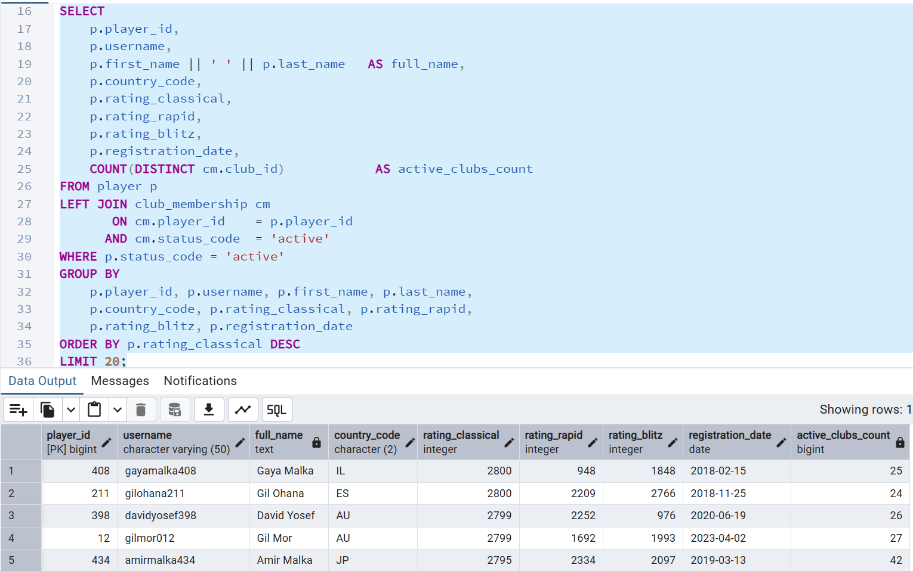


#### הסבר
השאילתא מחברת את `player` עם `club_membership` ב-LEFT JOIN כדי לשמר שחקנים ללא מועדונים. היא מסננת רק שחקנים פעילים, מקבצת לפי שחקן, ומחזירה את ספירת המועדונים הפעילים. הסדר הוא לפי דירוג קלאסי בסדר יורד – מתאים לדוח ה-Top Players.

---

### שאילתא 2: פעילות לוגין חודשית

#### מטרת השאילתא
מרכזת נתוני כניסה לפי שנה וחודש: כמה כניסות היו, כמה הצליחו, כמה נכשלו, כמה היו חשודות, ומה משך הסשן הממוצע.

#### המסך במערכת
**Security Dashboard / Reports** – דשבורד אבטחה ודוחות.

#### קוד SQL

```sql
SELECT
    EXTRACT(YEAR  FROM login_date)::INTEGER             AS login_year,
    EXTRACT(MONTH FROM login_date)::INTEGER             AS login_month,
    COUNT(*)                                            AS total_logins,
    SUM(CASE WHEN login_status_code = 'success' THEN 1 ELSE 0 END) AS successful_logins,
    SUM(CASE WHEN login_status_code = 'failed'  THEN 1 ELSE 0 END) AS failed_logins,
    SUM(CASE WHEN is_suspicious = TRUE          THEN 1 ELSE 0 END) AS suspicious_count,
    ROUND(AVG(session_duration_sec), 0)                AS avg_session_sec
FROM login_log
GROUP BY
    EXTRACT(YEAR  FROM login_date),
    EXTRACT(MONTH FROM login_date)
ORDER BY login_year DESC, login_month DESC;
```

#### צילום הרצה ותוצאה (עד 5 שורות)
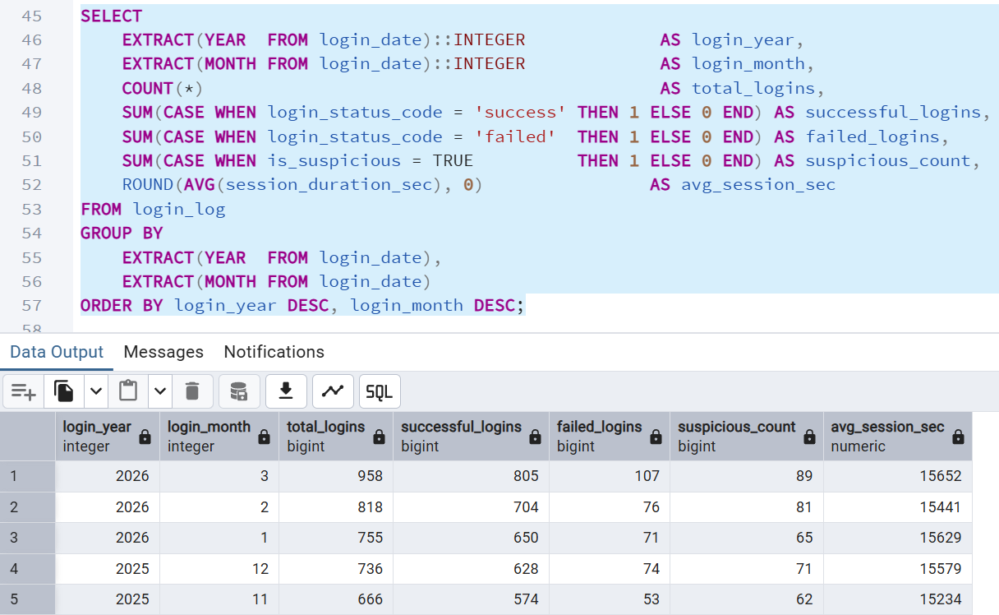

#### הסבר
השאילתא פורקת את עמודת `login_date` לשנה ולחודש בעזרת `EXTRACT`, ואז מקבצת ומסכמת לפי תקופה. `SUM(CASE WHEN ...)` מאפשר ספירה מותנית בלי שאילתות משנה נוספות.

---

### שאילתא 3: טיירי המנוי הפופולריים ביותר

#### מטרת השאילתא
מציגה לאדמין אילו תוכניות מנוי הכי פופולריות, כמה מנויים פעילים לכל תוכנית, וכמה בוטלו.

#### המסך במערכת
**Subscription Analytics / Admin Dashboard** – ניתוח מנויים.

#### קוד SQL

```sql
SELECT
    st.tier_name,
    COUNT(ps.subscription_id)                                        AS total_subscribers,
    SUM(CASE WHEN ps.status_code = 'active'    THEN 1 ELSE 0 END)   AS active_subscribers,
    st.price_monthly,
    st.price_annual,
    st.has_analytics,
    st.has_puzzles,
    st.has_engine,
    SUM(CASE WHEN ps.status_code = 'cancelled' THEN 1 ELSE 0 END)   AS cancelled_subscribers
FROM subscription_tier st
JOIN player_subscription ps ON ps.tier_id = st.tier_id
GROUP BY
    st.tier_id, st.tier_name, st.price_monthly, st.price_annual,
    st.has_analytics, st.has_puzzles, st.has_engine
ORDER BY active_subscribers DESC, total_subscribers DESC
LIMIT 15;
```

#### צילום הרצה ותוצאה (עד 5 שורות)
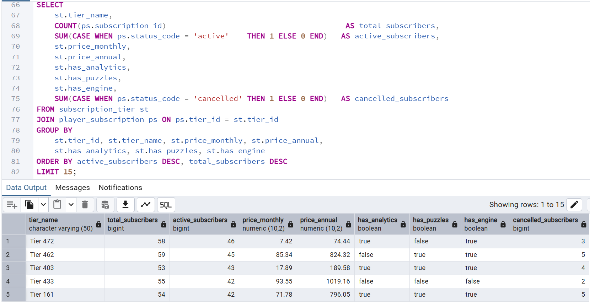

#### הסבר
JOIN בין `subscription_tier` ל-`player_subscription`, קיבוץ לפי tier, וספירה מותנית לפי status_code. מאפשר להשוות בין פופולריות כוללת לבין פעילות בפועל.

---

### שאילתא 4: שחקנים עם הכי הרבה קשרים חברתיים

#### מטרת השאילתא
מדרגת שחקנים לפי מספר הקשרים החברתיים שלהם – חברים מאושרים ועוקבים – לטבלת לוח התוצאות.

#### המסך במערכת
**Social Leaderboard** – לוח מובילים חברתי.

#### קוד SQL

```sql
SELECT
    p.username,
    p.first_name || ' ' || p.last_name   AS full_name,
    p.country_code,
    p.rating_classical,
    COUNT(CASE WHEN sc.connection_type_code = 'friend'
               AND  sc.status_code          = 'accepted' THEN 1 END) AS accepted_friends,
    COUNT(CASE WHEN sc.connection_type_code = 'follow'   THEN 1 END) AS followers,
    COUNT(sc.connection_id)                                           AS total_connections
FROM player p
LEFT JOIN social_connection sc ON sc.to_player_id = p.player_id
WHERE p.status_code = 'active'
GROUP BY
    p.player_id, p.username, p.first_name, p.last_name,
    p.country_code, p.rating_classical
ORDER BY total_connections DESC
LIMIT 15;
```

#### צילום הרצה ותוצאה (עד 5 שורות)
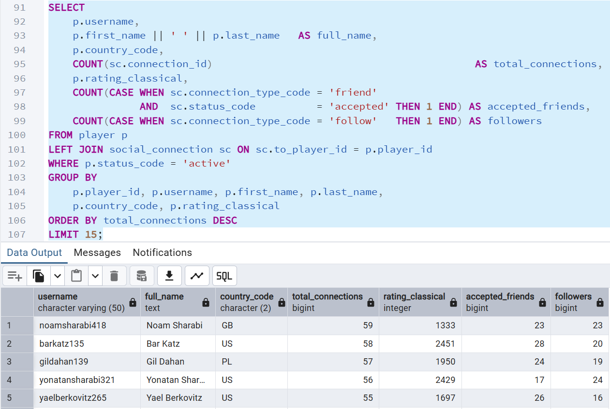

#### הסבר
LEFT JOIN ב-`social_connection` על `to_player_id` (מי שחקן זה קיבל אליו חיבורים). ספירה מותנית מפרידה בין חברויות מאושרות לעוקבים.

---

## 3. שאילתות SELECT כפולות

---

### שאילתא כפולה 5: שחקנים החברים ב-3 מועדונים פעילים לפחות

#### מטרת השאילתא
מזהה שחקנים מעורבים במיוחד שחברים ב-3 מועדונים פעילים לפחות – מועמדים ל-ambassador או לתפקידי ניהול.

#### המסך במערכת
**Club Management – High Engagement Players**

#### גרסה א – GROUP BY + HAVING

```sql
SELECT
    p.player_id,
    p.username,
    p.first_name || ' ' || p.last_name     AS full_name,
    p.country_code,
    COUNT(DISTINCT cm.club_id)              AS club_count
FROM player p
JOIN club_membership cm
  ON cm.player_id   = p.player_id
 AND cm.status_code = 'active'
GROUP BY p.player_id, p.username, p.first_name, p.last_name, p.country_code
HAVING COUNT(DISTINCT cm.club_id) >= 3
ORDER BY club_count DESC;
```

#### גרסה ב – IN + Subquery + Correlated Count

```sql
SELECT
    p.player_id,
    p.username,
    p.first_name || ' ' || p.last_name     AS full_name,
    p.country_code,
    (SELECT COUNT(DISTINCT cm2.club_id)
       FROM club_membership cm2
      WHERE cm2.player_id   = p.player_id
        AND cm2.status_code = 'active')     AS club_count
FROM player p
WHERE p.player_id IN (
    SELECT cm.player_id
    FROM   club_membership cm
    WHERE  cm.status_code = 'active'
    GROUP  BY cm.player_id
    HAVING COUNT(DISTINCT cm.club_id) >= 3
)
ORDER BY club_count DESC;
```

#### צילום תוצאה
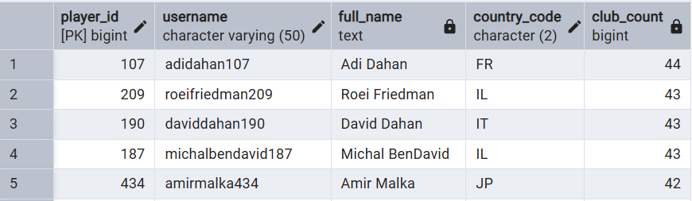

#### ההבדל בין הגרסאות
גרסה א סורקת את `club_membership` פעם אחת, מקבצת ומסננת עם HAVING.  
גרסה ב בונה תחילה רשימת player_id מתאימים (IN), ואז מחשבת את `club_count` בשאילתא מתואמת לכל שורה – סריקה נוספת לכל שחקן.

#### השוואת יעילות
גרסה א יעילה יותר – סריקה אחת בלבד של הטבלה. גרסה ב מבצעת N סריקות נוספות (אחת לכל שחקן מועמד) לחישוב club_count, מה שמוסיף עלות.

---

### שאילתא כפולה 6: שחקנים עם מנוי פעיל

#### מטרת השאילתא
מציגה את רשימת השחקנים שיש להם כרגע מנוי פעיל בפלטפורמה.

#### המסך במערכת
**Subscription Management**

שתי הגרסאות מחזירות אותם שדות: `player_id, username, full_name, country_code, status_code`

#### גרסה א – JOIN + DISTINCT

```sql
SELECT DISTINCT
    p.player_id,
    p.username,
    p.first_name || ' ' || p.last_name     AS full_name,
    p.country_code,
    p.status_code
FROM player p
JOIN player_subscription ps
  ON ps.player_id   = p.player_id
 AND ps.status_code = 'active'
ORDER BY p.player_id
LIMIT 20;
```

#### גרסה ב – WHERE EXISTS

```sql
SELECT
    p.player_id,
    p.username,
    p.first_name || ' ' || p.last_name     AS full_name,
    p.country_code,
    p.status_code
FROM player p
WHERE EXISTS (
    SELECT 1
    FROM   player_subscription ps
    WHERE  ps.player_id   = p.player_id
      AND  ps.status_code = 'active'
)
ORDER BY p.player_id
LIMIT 20;
```

#### צילום תוצאה
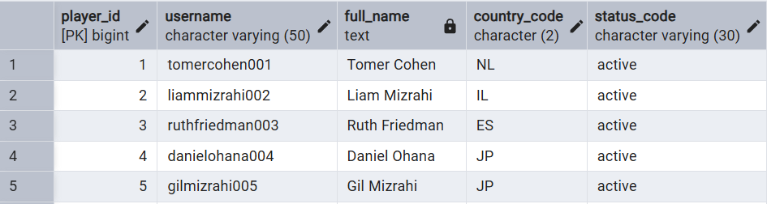

#### ההבדל בין הגרסאות
גרסה א (JOIN) עלולה להחזיר שורות כפולות אם לשחקן יש מספר מנויים פעילים – DISTINCT מתקן זאת אך מוסיף עלות מיון.  
גרסה ב (EXISTS) עוצרת בהתאמה הראשונה ואינה מייצרת כפילויות, ולכן בד"כ מהירה יותר.

#### השוואת יעילות
גרסה ב יעילה יותר – `EXISTS` מפסיקה לחפש ברגע שנמצאה שורה תואמת ראשונה.

---

### שאילתא כפולה 7: שחקנים שמעולם לא התחברו למערכת

#### מטרת השאילתא
מאתרת שחקנים שנרשמו אך לא ביצעו אף כניסה – מועמדים לקמפיין הפעלה מחדש.

#### המסך במערכת
**Inactive Users / Security Monitoring**

שתי הגרסאות מחזירות: `player_id, username, full_name, registration_date, status_code`

#### גרסה א – LEFT JOIN + IS NULL

```sql
SELECT
    p.player_id,
    p.username,
    p.first_name || ' ' || p.last_name     AS full_name,
    p.registration_date,
    p.status_code
FROM player p
LEFT JOIN login_log ll ON ll.player_id = p.player_id
WHERE ll.log_id IS NULL
ORDER BY p.registration_date;
```

#### גרסה ב – NOT EXISTS

```sql
SELECT
    p.player_id,
    p.username,
    p.first_name || ' ' || p.last_name     AS full_name,
    p.registration_date,
    p.status_code
FROM player p
WHERE NOT EXISTS (
    SELECT 1
    FROM   login_log ll
    WHERE  ll.player_id = p.player_id
)
ORDER BY p.registration_date;
```

#### צילום תוצאה
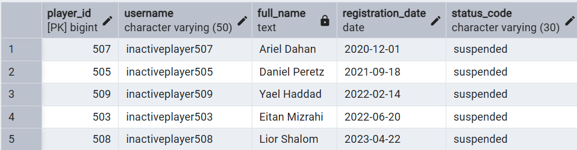

#### ההבדל בין הגרסאות
גרסה א מבצעת LEFT JOIN מלא ואז מסננת שורות ללא התאמה.  
גרסה ב (NOT EXISTS) עוצרת בהתאמה הראשונה – ברגע שנמצאת כניסה אחת, השחקן נפסל ללא המשך סריקה.

#### השוואת יעילות
גרסה ב יעילה יותר בדרך כלל – במיוחד כשיש אינדקס על `login_log.player_id`.

---

### שאילתא כפולה 8: מועדונים עם סטטיסטיקת חברים פעילים

#### מטרת השאילתא
מציגה לכל מועדון את מספר החברים הפעילים, כמה בעלים ומנהלים יש, ותאריך ההצטרפות של החבר הוותיק ביותר.

#### המסך במערכת
**Club Management Dashboard**

שתי הגרסאות מחזירות: `club_id, club_name, country_code, city, is_official, founded_date, active_members, owner_count, admin_count, oldest_member_date`

#### גרסה א – CTE

```sql
WITH club_stats AS (
    SELECT
        club_id,
        COUNT(*)                                                AS active_members,
        SUM(CASE WHEN role_code = 'owner' THEN 1 ELSE 0 END)  AS owner_count,
        SUM(CASE WHEN role_code = 'admin' THEN 1 ELSE 0 END)  AS admin_count,
        MIN(join_date)                                          AS oldest_member_date
    FROM  club_membership
    WHERE status_code = 'active'
    GROUP BY club_id
)
SELECT
    c.club_id,
    c.club_name,
    cs.active_members,
    c.country_code,
    c.city,
    c.is_official,
    c.founded_date,
    cs.owner_count,
    cs.admin_count,
    cs.oldest_member_date
FROM club c
JOIN club_stats cs ON cs.club_id = c.club_id
ORDER BY cs.active_members DESC
LIMIT 20;
```

#### גרסה ב – Inline Subquery (ללא CTE)

```sql
SELECT
    c.club_id, c.club_name,
    sub.active_members, c.country_code, c.city,
    c.is_official, c.founded_date, sub.owner_count, sub.admin_count, sub.oldest_member_date
FROM club c
JOIN (
    SELECT
        club_id,
        COUNT(*)                                                AS active_members,
        SUM(CASE WHEN role_code = 'owner' THEN 1 ELSE 0 END)  AS owner_count,
        SUM(CASE WHEN role_code = 'admin' THEN 1 ELSE 0 END)  AS admin_count,
        MIN(join_date)                                          AS oldest_member_date
    FROM  club_membership
    WHERE status_code = 'active'
    GROUP BY club_id
) sub ON sub.club_id = c.club_id
ORDER BY sub.active_members DESC
LIMIT 20;
```

#### צילום תוצאה
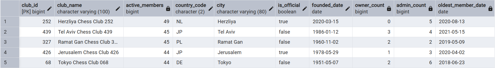

#### ההבדל בין הגרסאות
גרסה א (CTE) נותנת שם לתת-השאילתא ומשפרת קריאות.  
גרסה ב (Inline) שקולה לחלוטין פונקציונלית. ב-PostgreSQL מודרני (v12+) המנוע לרוב מבצע inlining ל-CTE ומייצר תכנית זהה.

---

## 4. שאילתות UPDATE

כל UPDATE עטוף ב-`BEGIN`/`ROLLBACK` בקובץ Queries.sql לצורך בדיקה בטוחה. להחלה קבועה – החלף `ROLLBACK` ב-`COMMIT`.

---

### UPDATE 1: השהיה של שחקנים עם לוגינים חשודים אחרונים

**תיאור:** מעדכן ל-`suspended` את כל השחקנים הפעילים שהייתה להם כניסה חשודה ב-180 הימים האחרונים.

```sql
UPDATE player
SET    status_code = 'suspended'
WHERE  status_code = 'active'
  AND  player_id IN (
           SELECT DISTINCT player_id FROM login_log
           WHERE  is_suspicious = TRUE
             AND  login_date   >= CURRENT_DATE - INTERVAL '180 days'
       );
```

#### צילום מצב לפני
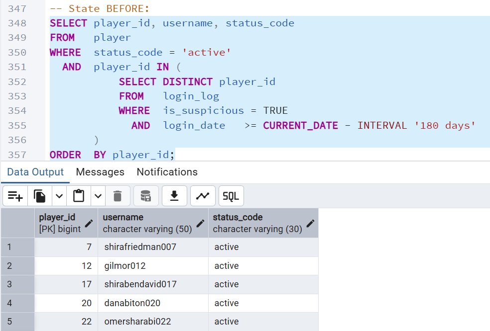

#### צילום מצב אחרי
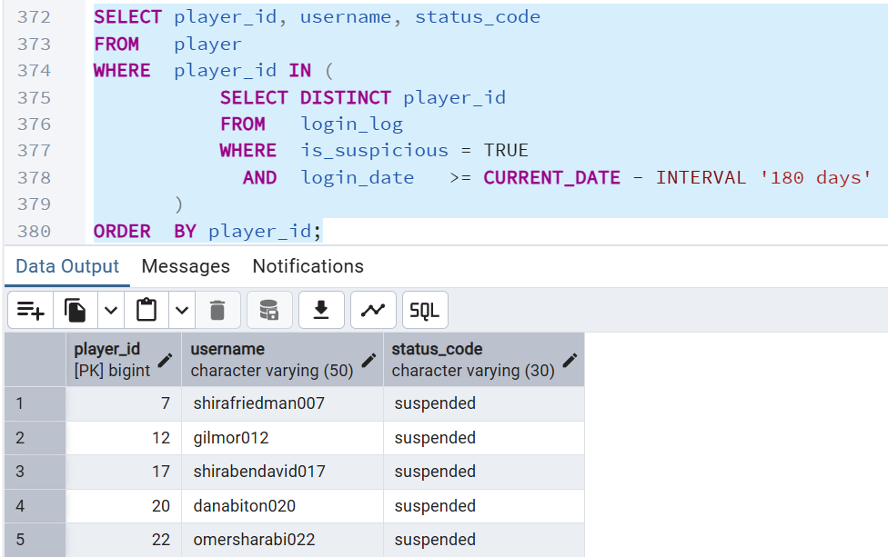

---

### UPDATE 2: ביטול מנויים שפג תוקפם

**תיאור:** מעדכן ל-`expired` מנויים שסומנו כ-`active` אך תאריך הסיום שלהם עבר.

```sql
UPDATE player_subscription
SET    status_code = 'expired',
       auto_renew  = FALSE
WHERE  status_code = 'active'
  AND  end_date   <  CURRENT_DATE;
```

#### צילום מצב לפני
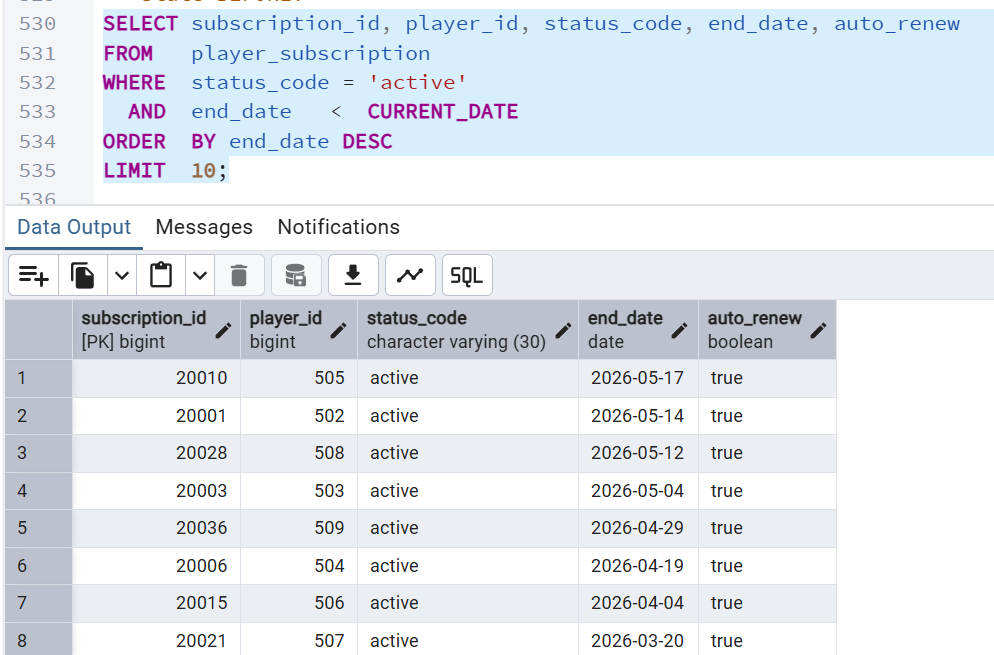

#### צילום מצב אחרי
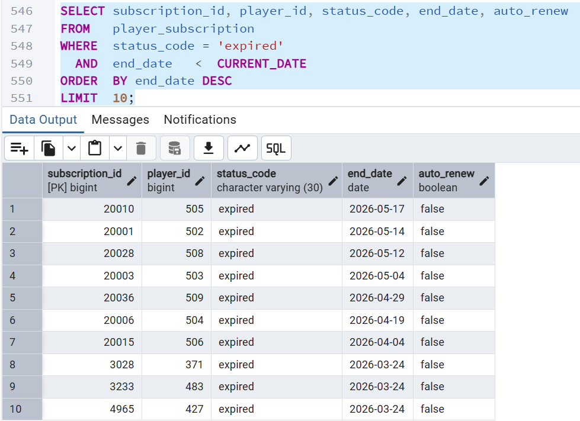

---

### UPDATE 3: קידום החבר הוותיק ביותר ל-admin במועדונים ללא מנהל

**תיאור:** בכל מועדון שאין בו חבר בתפקיד `admin`, מקדם לתפקיד זה את החבר הפעיל עם תאריך ההצטרפות הקדום ביותר.

```sql
UPDATE club_membership upd
SET    role_code = 'admin'
WHERE  upd.status_code = 'active'
  AND  upd.role_code   = 'member'
  AND  upd.membership_id = (
           SELECT inner_cm.membership_id
           FROM   club_membership inner_cm
           WHERE  inner_cm.club_id     = upd.club_id
             AND  inner_cm.status_code = 'active'
           ORDER  BY inner_cm.join_date ASC LIMIT 1
       )
  AND  NOT EXISTS (
           SELECT 1 FROM club_membership chk
           WHERE  chk.club_id     = upd.club_id
             AND  chk.status_code = 'active'
             AND  chk.role_code   = 'admin'
       );
```

#### צילום מצב לפני
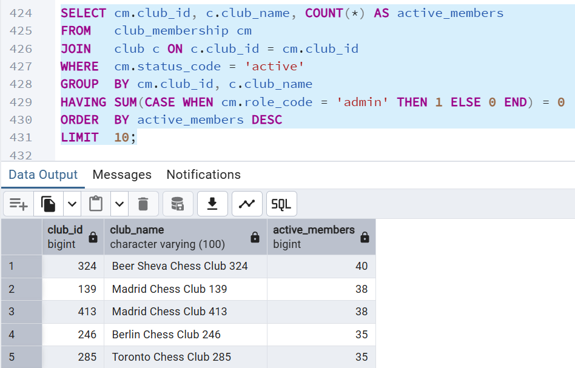

#### צילום מצב אחרי
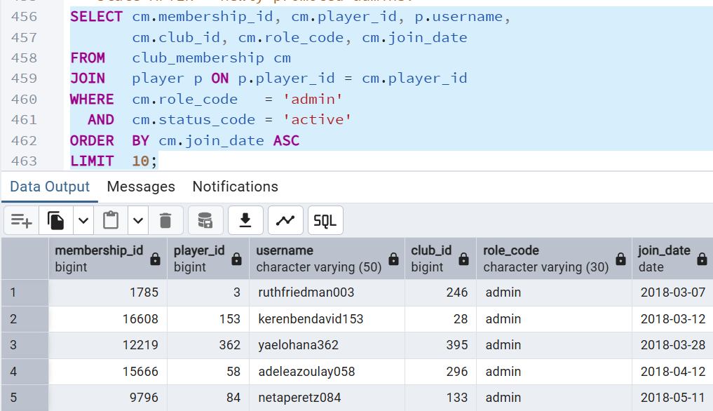

---

## 5. שאילתות DELETE

כל DELETE עטוף ב-`BEGIN`/`ROLLBACK` לבדיקה בטוחה.

---

### DELETE 1: מחיקת קשרים חברתיים שנדחו ומעל שנה ישנים

**תיאור:** מוחק קשרים חברתיים בסטטוס `declined` שנוצרו לפני יותר מ-365 ימים – ניקוי נתונים מיותרים.

```sql
DELETE FROM social_connection
WHERE  status_code  = 'declined'
  AND  created_date < CURRENT_DATE - INTERVAL '365 days';
```

#### צילום COUNT לפני
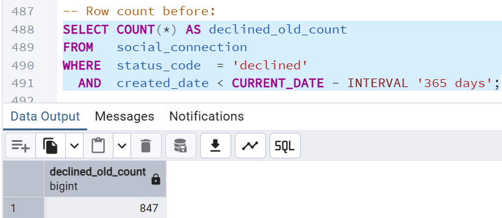

#### צילום COUNT אחרי
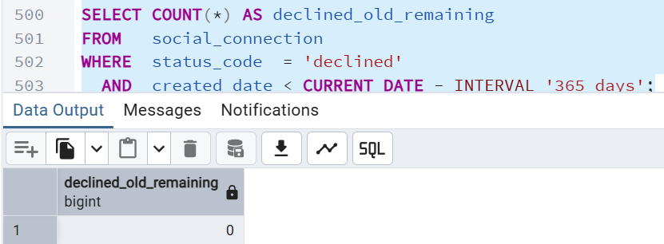

---

### DELETE 2: מחיקת לוגי כניסה כושלים ישנים (מעל שנתיים)

**תיאור:** מוחק רשומות לוג של כניסות כושלות שמעל שנתיים – שמירת גודל הטבלה סביר ועמידה בנהלי retention.

```sql
DELETE FROM login_log
WHERE  login_status_code = 'failed'
  AND  login_date        < CURRENT_DATE - INTERVAL '730 days';
```

#### צילום COUNT לפני
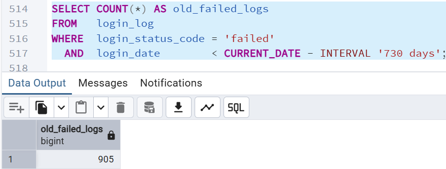

#### צילום COUNT אחרי
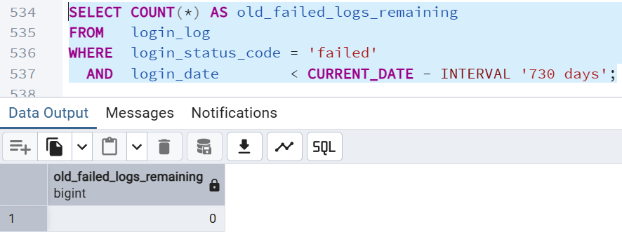

---

### DELETE 3: מחיקת בקשות חברות ממתינות של שחקנים מושעים/מורחקים

**תיאור:** מוחק בקשות הצטרפות ממתינות של שחקנים שהושעו או הורחקו – שמירת תקינות עסקית.

```sql
DELETE FROM club_membership
WHERE  status_code = 'pending'
  AND  player_id  IN (
           SELECT player_id FROM player
           WHERE  status_code IN ('suspended', 'banned')
       );
```

#### צילום COUNT לפני
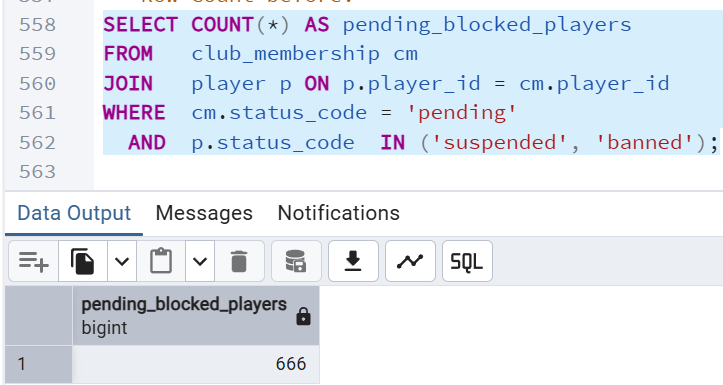

#### צילום COUNT אחרי
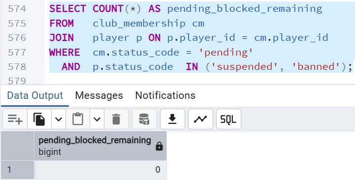

---

## 6. ROLLBACK ו-COMMIT

ראה קובץ [RollbackCommit.sql](RollbackCommit.sql).

---

### תרחיש ROLLBACK – עדכון דירוג וביטול

**מטרה:** להראות ששינוי בתוך טרנזקציה פתוחה מתבטל לחלוטין לאחר ROLLBACK.

**פעולות:**  
1. `SELECT` – מצב לפני (rating_classical של player_id=1)  
2. `BEGIN` + `UPDATE player SET rating_classical = rating_classical + 50`  
3. `SELECT` – מצב אחרי העדכון (בתוך הטרנזקציה)  
4. `ROLLBACK`  
5. `SELECT` – מצב לאחר ROLLBACK (חייב להיות זהה לשלב 1)

#### צילום שלב 1 (לפני)
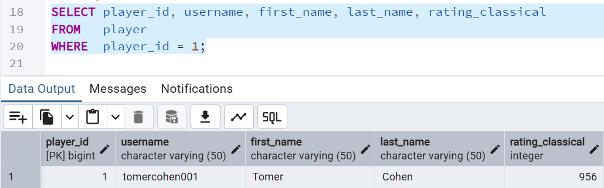

#### צילום שלב 3 (אחרי UPDATE, לפני ROLLBACK)
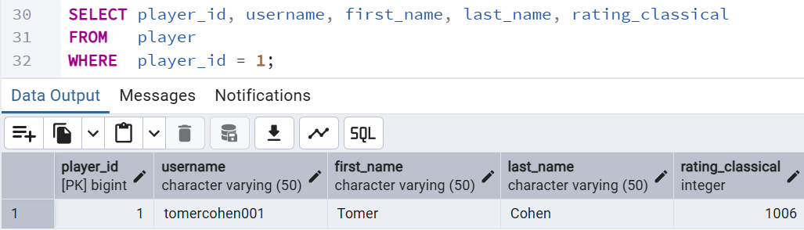

#### צילום שלב 5 (אחרי ROLLBACK)
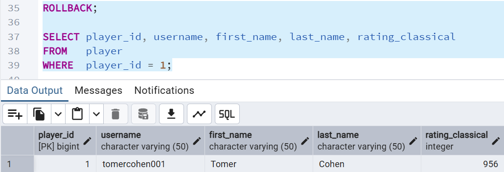

---

### תרחיש COMMIT – הפעלת auto_renew ושמירה

**מטרה:** להראות ששינוי שבוצע בטרנזקציה נשמר לצמיתות לאחר COMMIT.

**פעולות:**  
1. `SELECT` – מצב לפני (auto_renew של subscription_id=4)  
2. `BEGIN` + `UPDATE player_subscription SET auto_renew = TRUE`  
3. `SELECT` – מצב אחרי העדכון (בתוך הטרנזקציה)  
4. `COMMIT`  
5. `SELECT` – מצב לאחר COMMIT (auto_renew = TRUE נשאר)

#### צילום שלב 1 (לפני)
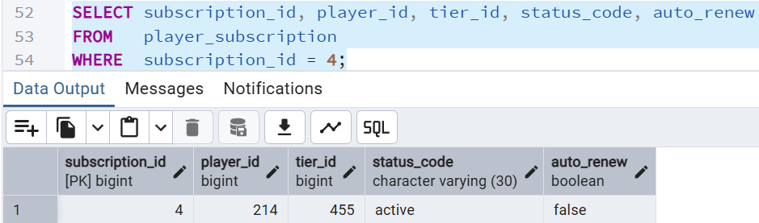

#### צילום שלב 3 (אחרי UPDATE, לפני COMMIT)
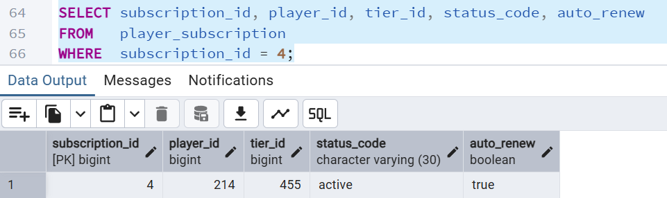

#### צילום שלב 5 (אחרי COMMIT)
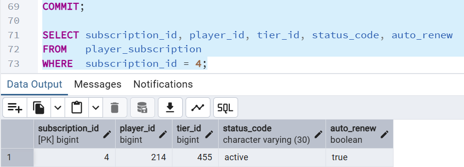

---

## 7. אילוצים

ראה קובץ [Constraints.sql](Constraints.sql).

> **חשוב:** ב-PostgreSQL, `ALTER TABLE ADD CONSTRAINT CHECK` בודק את **כל הנתונים הקיימים** כברירת מחדל. אם יש שורות שסותרות – הפקודה תיכשל. לכן לכל אילוץ מצורפת שאילתת בדיקה מקדימה.

---

### אילוץ 1: birth_date לפני registration_date

**מטרה:** מניעת הכנסת שחקן שתאריך לידתו מאוחר מתאריך ההרשמה שלו.

```sql
ALTER TABLE player
ADD CONSTRAINT chk_birth_before_registration
CHECK (birth_date IS NULL OR birth_date < registration_date);
```

**ניסיון הפרה:**
```sql
INSERT INTO player (..., birth_date, registration_date)
VALUES (..., '2025-01-01', '2020-06-01');
```

#### צילום שגיאה
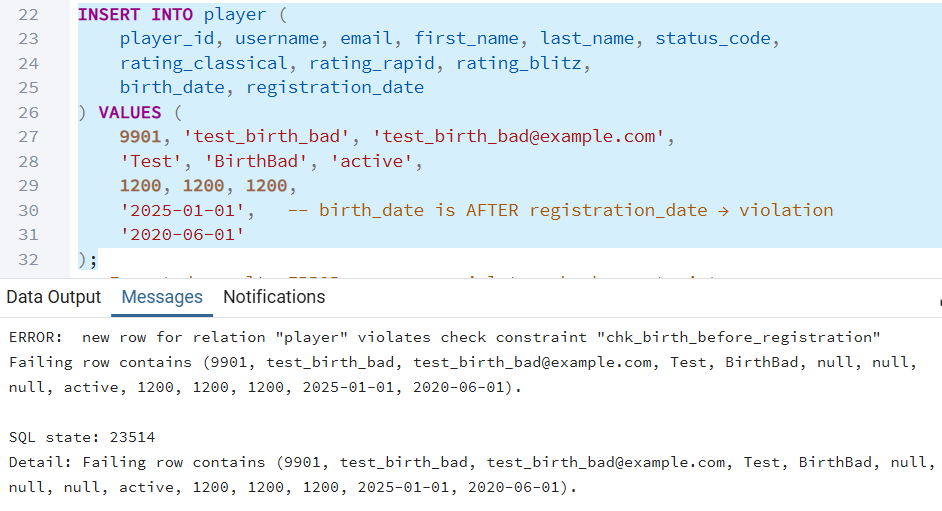

---

### אילוץ 2: session_duration_sec <= 86400 (מקסימום 24 שעות)

**מטרה:** מניעת שמירת סשן ארוך מ-24 שעות – ערך כזה הוא שגיאת נתונים.

```sql
ALTER TABLE login_log
ADD CONSTRAINT chk_session_max_duration
CHECK (session_duration_sec <= 86400);
```

**ניסיון הפרה:**
```sql
INSERT INTO login_log (..., session_duration_sec, ...)
VALUES (..., 100000, ...);
```

#### צילום שגיאה
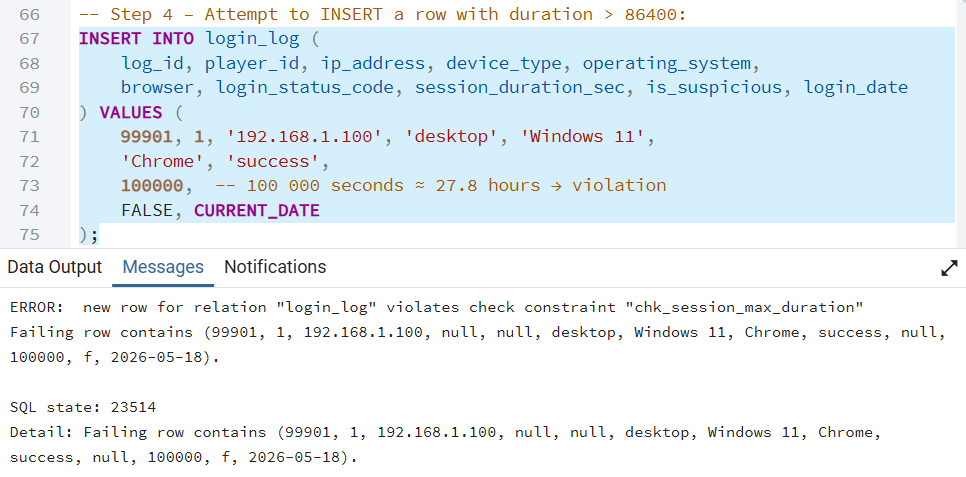

---

### אילוץ 3: price_annual >= price_monthly

**מטרה:** מניעת הגדרת תוכנית שבה מחיר שנתי נמוך ממחיר חודשי – שגיאת תמחור.

```sql
ALTER TABLE subscription_tier
ADD CONSTRAINT chk_annual_gte_monthly
CHECK (price_annual >= price_monthly);
```

**ניסיון הפרה:**
```sql
INSERT INTO subscription_tier (..., price_monthly, price_annual, ...)
VALUES (..., 100.00, 50.00, ...);
```

#### צילום שגיאה
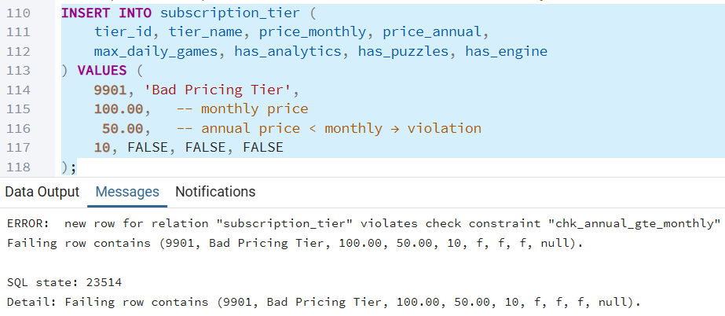

---

## 8. אינדקסים

ראה קובץ [Index.sql](Index.sql).

---

### אינדקס 1: idx_login_log_date

| פרמטר | ערך |
|---|---|
| טבלה | `login_log` |
| עמודה | `login_date` |
| שאילתא שנשפרה | Q2 – פעילות לוגין חודשית |
| סיבה | WHERE עם טווח תאריכים + GROUP BY EXTRACT(YEAR/MONTH) |

```sql
CREATE INDEX idx_login_log_date ON login_log(login_date);
```

#### זמן ריצה לפני האינדקס
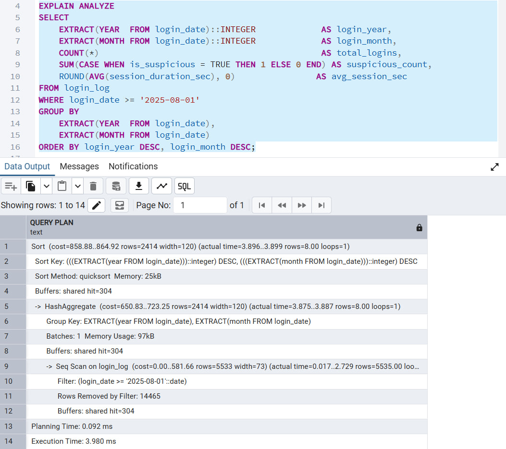

#### זמן ריצה אחרי האינדקס
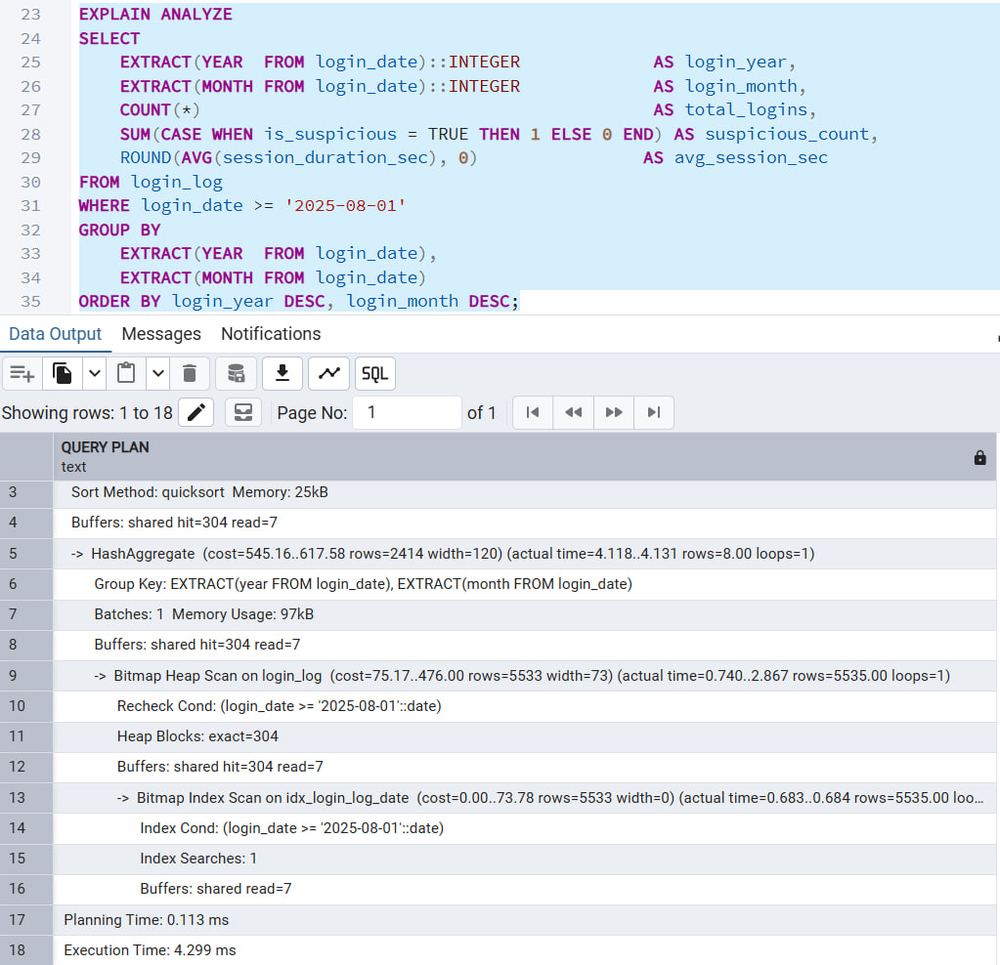

#### הסבר התוצאה
האינדקס כן נוצל אחרי ההוספה, כי התוכנית השתנתה מSeq Scan לBitmap Index Scan.

אבל זמן הריצה לא השתפר, כי עדיין חזרו 5,535 שורות, בערך 27.6% מהטבלה, ולכן עלות השימוש באינדקס דומה לסריקה רגילה.

---

### אינדקס 2: idx_player_subscription_status_tier (מורכב)

| פרמטר | ערך |
|---|---|
| טבלה | `player_subscription` |
| עמודות | `(status_code, tier_id)` |
| שאילתא שנשפרה | Q3 – טיירים פופולריים, Q6 – מנויים פעילים |
| סיבה | WHERE status_code='active' + JOIN על tier_id |

```sql
CREATE INDEX idx_player_subscription_status_tier
    ON player_subscription(status_code, tier_id);
```

#### זמן ריצה לפני האינדקס
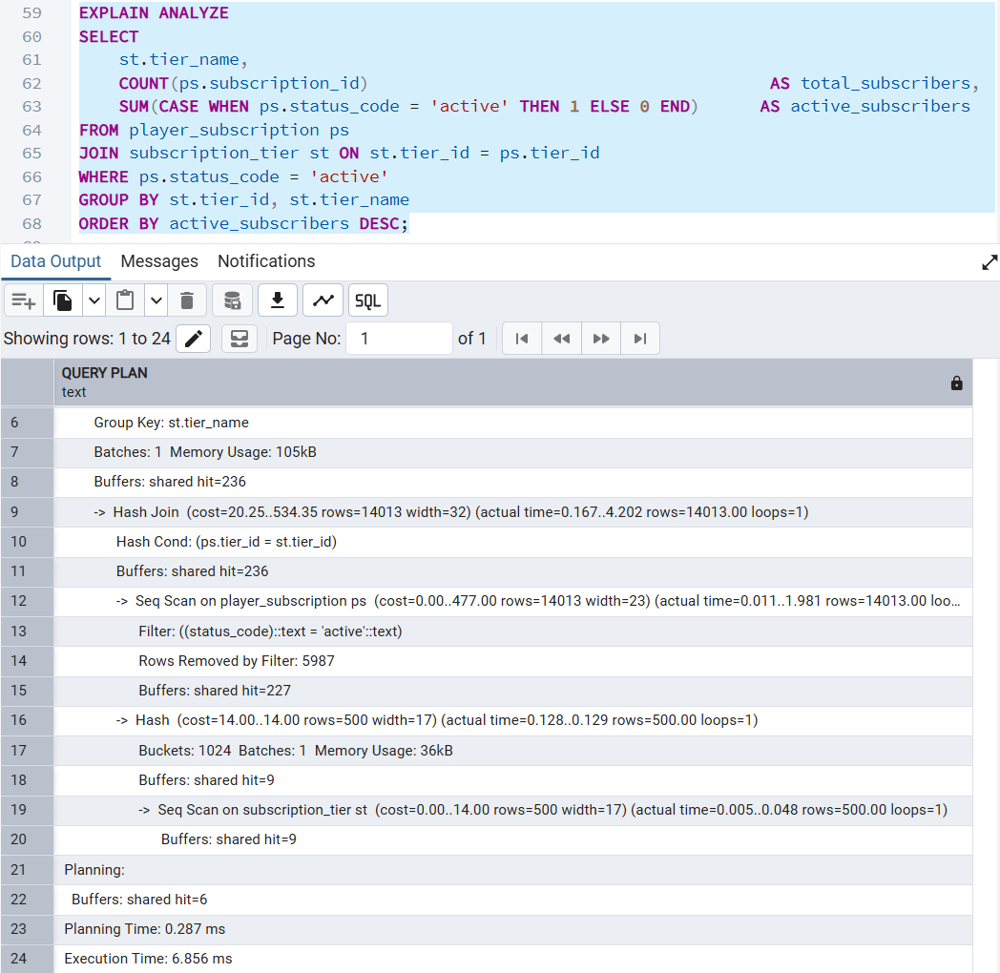

#### זמן ריצה אחרי האינדקס
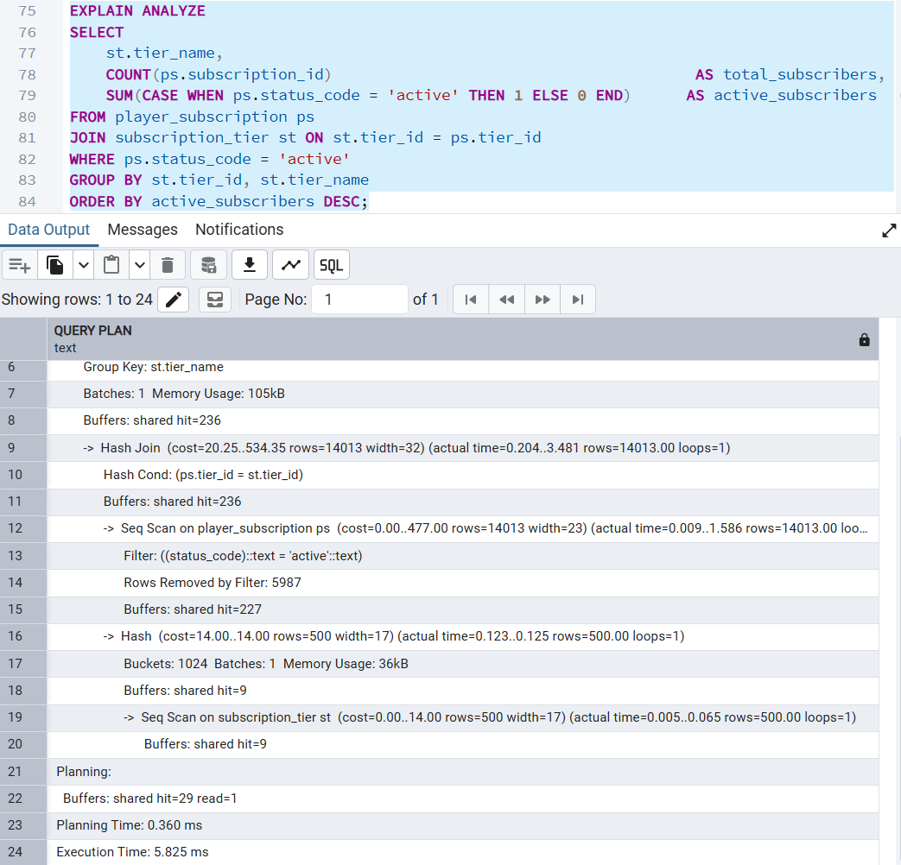

#### הסבר התוצאה
לאחר הוספת האינדקס idx_player_subscription_status_tier בדקנו את השאילתא שוב בעזרת EXPLAIN ANALYZE. למרות שזמן הריצה ירד מ־6.856ms ל5.825ms, PostgreSQL עדיין בחר להשתמש בSeq Scan ולא בIndex Scan. הסיבה היא שהתנאי status_code = 'active' מחזיר 14,013 מתוך 20,000 שורות, כלומר אחוז גבוה מהטבלה, ולכן סריקה רציפה יעילה יותר משימוש באינדקס במקרה זה.

---

### אינדקס 3: idx_social_connection_to_player (מורכב)

| פרמטר | ערך |
|---|---|
| טבלה | `social_connection` |
| עמודות | `(to_player_id, connection_type_code, status_code)` |
| שאילתא שנשפרה | Q4 – לוח מובילים חברתי |
| סיבה | JOIN על to_player_id + COUNT לפי type ו-status |

```sql
CREATE INDEX idx_social_connection_to_player
    ON social_connection(to_player_id, connection_type_code, status_code);
```

#### זמן ריצה לפני האינדקס
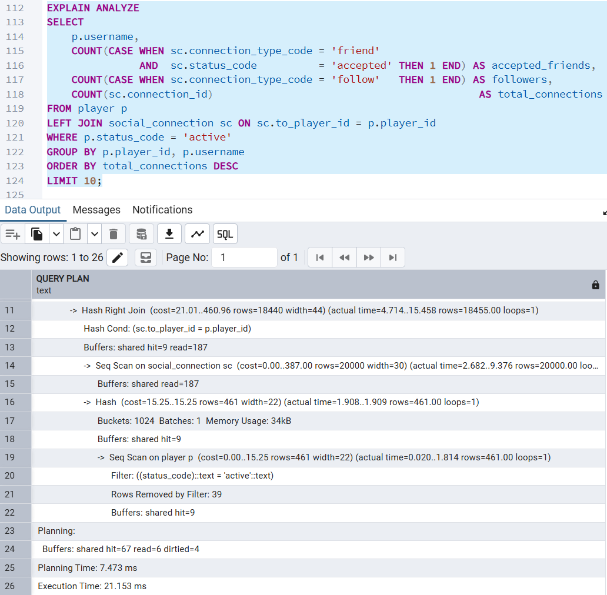

#### זמן ריצה אחרי האינדקס
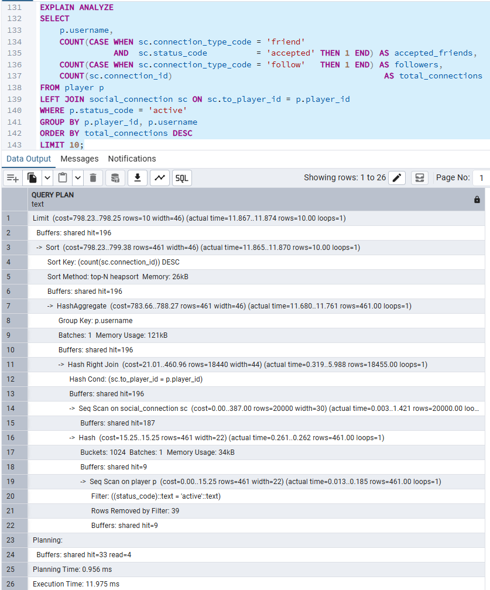

#### הסבר התוצאה
לאחר הוספת האינדקס idx_social_connection_to_player זמן הריצה ירד מ־21.153ms ל11.975ms, אך לפי EXPLAIN ANALYZE האינדקס לא נוצל בפועל, כי עדיין מופיע Seq Scan על social_connection. הסיבה היא שהשאילתא עוברת על רוב השחקנים והקשרים החברתיים, ולכן PostgreSQL העדיף סריקה רציפה של הטבלה במקום שימוש באינדקס.

---

## 9. סיכום

בשלב ב הוכחנו שבסיס הנתונים של פלטפורמת השחמט הוא כלי עבודה אמיתי ולא רק מאגר נתונים סטטי:

- **SELECT:** כתבנו 8 שאילתות שמספקות מידע עסקי אמיתי – דוחות, לוחות מובילים, ניתוח מנויים ואבטחה. 4 מתוכן נכתבו בשתי גרסאות עם הסבר השוואתי.
- **UPDATE/DELETE:** הצגנו פעולות שינוי ומחיקה מבוקרות עם תנאים עסקיים מורכבים, כולל שאילתות משנה.
- **טרנזקציות:** הדגמנו הן ROLLBACK (ביטול שינוי) והן COMMIT (שמירת שינוי).
- **אילוצים:** הוספנו 3 אילוצי CHECK שמגנים על תקינות הנתונים ברמת בסיס הנתונים.
- **אינדקסים:** יצרנו 3 אינדקסים (2 מורכבים) מיושרים לשאילתות הכבדות ביותר ומדדנו את השפעתם.
