# דוח פרויקט – שלב ג: אינטגרציה ומבטים

**מחלקה:** Chess Platform – Users and Clubs
**סטודנטים:** אלעזר קריספל (8309) · אלון גרינשטיין (7002)
**אגף שעבר אינטגרציה:** `DBProject_7783_4478` – _Chess Tournament Management_ (מנועי שחמט, בוטים, שרתי חומרה, לקוחות ממשק)
**שיטת אינטגרציה:** א' – אינטגרציה מלאה (הינדוס לאחור → ERD משולב → מיזוג לאותו בסיס נתונים בעזרת פקודות `ALTER` בלבד)

---

## 1. מבוא

בשלב ג ביצענו **אינטגרציה** של בסיס הנתונים שלנו (פלטפורמת השחמט – צד המשתמשים) עם בסיס הנתונים של זוג אחר (תשתית מנועי השחמט – צד השרת). שני הפרויקטים עוסקים בשחמט אך מתארים חצאים משלימים: אנחנו מנהלים שחקנים, מועדונים, מנויים, התחברויות וקשרים חברתיים; הם מנהלים מנועי שחמט, בוטים, שרתי חומרה והערכות עמדה.

בשלב זה:

- **קיבלנו גיבוי** של בסיס הנתונים של האגף השני ובנינו ממנו את תרשים ה-**DSD**.
- **ביצענו הינדוס לאחור** (Reverse Engineering) והפקנו ממנו **ERD** – כולל אלגוריתם מפורט.
- **עיצבנו ERD משולב** ותיעדנו את החלטות האינטגרציה.
- **מיזגנו את שתי הסכמות** לאותו בסיס נתונים (`chess_db`) בעזרת פקודות `ALTER` בלבד – מבלי לייצר מחדש אף טבלה.
- **חיברנו את שתי המערכות** דרך גשר אחד: `login_log.client_id → uiclient.client_id` (התחברות מתבצעת דרך אפליקציית לקוח).
- **הרצנו מחדש את כל שאילתות שלב ב'** על הבסיס המשולב ווידאנו שהן עדיין עובדות.
- **כתבנו 3 מבטים** (אחד לכל אגף + מבט אינטגרציה שמוכיח את הגשר) עם 2 שאילתות לכל מבט.

> **הערה על אימות:** כל פקודות ה-SQL בדוח זה הורצו ואומתו מקומית על בסיס נתונים משולב (`chess_db_test`) שנבנה מ-15 הטבלאות שלנו (כולל הנתונים) + 12 הטבלאות והנתונים מהגיבוי של הזוג. הפלטים המוצגים בדוח הם פלטים אמיתיים מההרצה.

---

## 2. האגף החדש שהתקבל

האגף השני מנהל את **התשתית הטכנולוגית** של מערכת שחמט: 12 טבלאות.

| טבלה                | תיאור                                     | סוג (לאחר הינדוס לאחור)                  |
| ------------------- | ----------------------------------------- | ---------------------------------------- |
| `Engine`            | מנוע שחמט (שם, גרסה)                      | ישות חזקה                                |
| `LocalEngine`       | מנוע מקומי (נתיב בינארי, מגבלת threads)   | תת-טיפוס של Engine (ISA)                 |
| `CloudEngine`       | מנוע ענן (כתובת API, טוקן)                | תת-טיפוס של Engine (ISA)                 |
| `Bot`               | בוט משחק המבוסס על מנוע                   | ישות חזקה (FK ל-Engine)                  |
| `UIClient`          | אפליקציית לקוח (Web/Mobile)               | ישות חזקה                                |
| `HardwareNode`      | שרת חומרה (RAM, ליבות, IP)                | ישות חזקה                                |
| `ServerComponent`   | רכיב חומרה בשרת                           | ישות חלשה (בבעלות HardwareNode)          |
| `HardwareTelemetry` | מדידת ניטור (טמפ', עומס CPU)              | ישות חלשה (תלויה ב-HardwareNode)         |
| `OpeningPosition`   | עמדת פתיחה (FEN, קוד ECO)                 | ישות חזקה                                |
| `EngineEvaluation`  | הערכת מנוע לעמדה                          | ישות חזקה (FK ל-Engine, OpeningPosition) |
| `Engine_UI_Support` | אילו מנועים נתמכים באילו לקוחות           | ישות מקשרת M:N                           |
| `Installed_On`      | אילו מנועים מקומיים מותקנים על אילו שרתים | ישות מקשרת M:N                           |

---

## 3. תרשים DSD של האגף החדש

מתוך הגיבוי של האגף השני בנינו את הסכמה הרלציונית (DSD) של 12 הטבלאות.

#### תרשים

<!-- TODO: ייבא את הקובץ שלב ג/Diagrams/NewDept_DSD.erdplus לאתר erdplus.com (Import), סדר את הטבלאות אם צריך, ויצא PNG בשם newdept_dsd.png -->

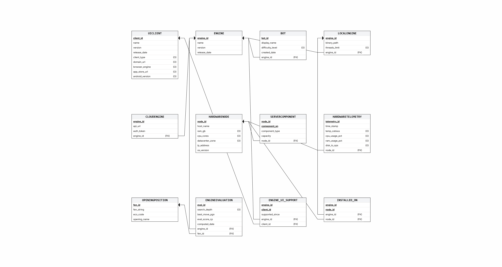

> **הוראות הפקת התמונה:** היכנס ל-[erdplus.com](https://erdplus.com) → התחבר → תפריט **Import** → בחר את `שלב ג/Diagrams/NewDept_DSD.erdplus` → הדיאגרמה תיפתח כ-Relational Schema → סדר את הטבלאות לקריאות נוחה → **Export → PNG** → שמור בשם `screenshots/newdept_dsd.png`.

---

## 4. הינדוס לאחור

שחזרנו את תרשים ה-ERD המושגי. האלגוריתם שבו השתמשנו:

1. **זיהוי ישויות חזקות:** כל טבלה שמפתח-העל (PK) שלה **אינו** מורכב כולו ממפתחות זרים (FK) → **ישות חזקה**.
   _דוגמאות:_ `Engine`, `UIClient`, `HardwareNode`, `OpeningPosition`, `Bot`, `EngineEvaluation`.

2. **זיהוי תת-טיפוסים (ISA / Specialization):** טבלה שה-PK שלה הוא **FK יחיד** ל-PK של טבלה אחרת, ושמוסיפה תכונות משלה → **תת-טיפוס** של אותה ישות.
   _דוגמאות:_ `LocalEngine` ו-`CloudEngine` שה-`engine_id` שלהן הוא PK _וגם_ FK ל-`Engine` → תתי-טיפוס של `Engine`.

3. **זיהוי ישויות מקשרות (M:N):** טבלה שה-PK שלה מורכב מ-**שני FK-ים (או יותר)** ל-PK של טבלאות אחרות → **קשר רבים-לרבים** / ישות מקשרת.
   _דוגמאות:_ `Engine_UI_Support` (PK = `engine_id` + `client_id`) → M:N בין `Engine` ל-`UIClient`; `Installed_On` (PK = `engine_id` + `node_id`) → M:N בין `LocalEngine` ל-`HardwareNode`.

4. **זיהוי ישויות חלשות:** טבלה שה-PK שלה כולל FK ל"בעלים" + מפתח חלקי מקומי, או שתלויה לחלוטין ב"בעלים" (לרוב עם `ON DELETE CASCADE`) → **ישות חלשה** עם **קשר מזהה** (Identifying).
   _דוגמאות:_ `ServerComponent` (PK = `node_id` + `component_sn`) בבעלות `HardwareNode`; `HardwareTelemetry` התלויה ב-`HardwareNode`.

5. **זיהוי קשרים רגילים (1:N):** כל FK ש**אינו** חלק מ-PK מגדיר **קשר אחד-לרבים** בין הישויות. חובה/רשות נקבעת לפי `NOT NULL` (חובה) או nullable (רשות).
   _דוגמאות:_ `Bot.engine_id → Engine`; `EngineEvaluation.engine_id → Engine`, `EngineEvaluation.fen_id → OpeningPosition`.

6. **המרת עמודות לתכונות:** כל עמודה שאינה מפתח הופכת לתכונה של הישות. עמודות `UNIQUE` מסומנות כמפתח מועמד; עמודות nullable מסומנות כתכונות רשות.

תוצאת האלגוריתם היא ה-ERD בסעיף הבא.

---

## 5. תרשים ERD של האגף החדש

#### תרשים

<!-- TODO: ייבא את שלב ג/Diagrams/NewDept_ERD.erdplus ל-erdplus.com, סדר את הישויות, ויצא PNG בשם newdept_erd.png -->

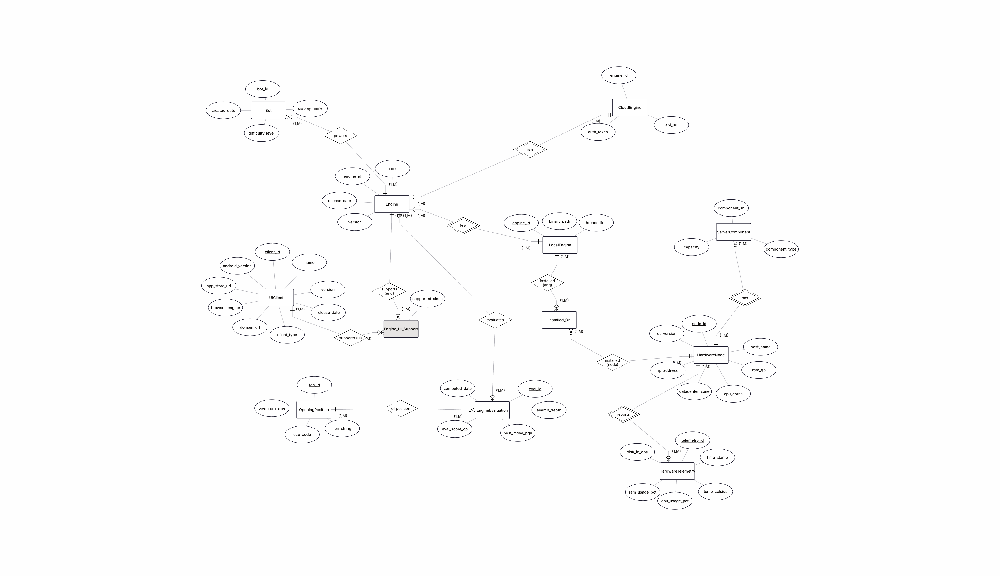

> **הוראות הפקת התמונה:** [erdplus.com](https://erdplus.com) → **Import** → `שלב ג/Diagrams/NewDept_ERD.erdplus` → הדיאגרמה תיפתח כ-ER Diagram → גרור את הישויות והתכונות לפריסה נוחה (הקובץ נוצר אוטומטית – ייתכן שיהיה צורך לסדר) → **Export → PNG** → `screenshots/newdept_erd.png`.

> **הערה על הסימון:** תתי-הטיפוס (`LocalEngine`/`CloudEngine`), הישויות החלשות (`ServerComponent`/`HardwareTelemetry`) והקשרים המזהים מסומנים בתרשים באמצעות קשרים מתאימים (קשר מזהה = `isIdentifying`). הסיווג המלא מפורט באלגוריתם בסעיף 4.

---

## 6. עיצוב האינטגרציה – ERD משולב והחלטות

זהו שלב האינטגרציה ברמת העיצוב: שילבנו את שני ה-ERD לתרשים אחד.

#### תרשים ERD משולב

<!-- TODO: ייבא את שלב ג/Diagrams/Integrated_ERD.erdplus ל-erdplus.com ויצא PNG בשם integrated_erd.png -->

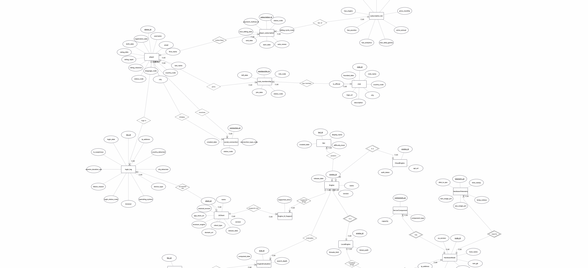

> **הוראות:** [erdplus.com](https://erdplus.com) → **Import** → `שלב ג/Diagrams/Integrated_ERD.erdplus` → סדר את הישויות (האגף שלנו משמאל, אגף התשתית מימין, הגשר באמצע) → **Export → PNG** → `screenshots/integrated_erd.png`.

### החלטות האינטגרציה (תיעוד)

1. **דו-קיום באותו בסיס נתונים.** שתי הסכמות חיות יחד ב-`chess_db` (סה"כ 27 טבלאות: 15 שלנו + 12 שלהם). בדקנו ש**אין שום התנגשות בשמות טבלאות** – ולכן ניתן למזג בלי לשנות שמות.

2. **נקודת החיבור (הגשר): `login_log → uiclient`.** בחרנו לחבר את שתי המערכות בנקודה הסמנטית הטבעית ביותר: כל התחברות למערכת מתבצעת **דרך אפליקציית לקוח**. ה-`login_log` שלנו כבר מתעד `device_type`/`browser`/`operating_system`, וה-`uiclient` שלהם הוא קטלוג אפליקציות הלקוח – לכן הוספנו עמודה `client_id` ל-`login_log` עם FK ל-`uiclient`.

3. **השתתפות אופציונלית – ללא נתונים מזויפים.** העמודה `client_id` הוגדרה `NULL` (אופציונלית), כך שכל שורות ה-`login_log` הקיימות נשארות תקפות. **לא יצרנו אף שורה מזויפת.** את הקישור מילאנו רק על סמך **נתונים קיימים** – לפי התאמת סוג המכשיר לסוג הלקוח.

4. **התאמת סוגי מפתח.** המפתחות שלנו מסוג `BIGINT` ושל האגף השני `INT`. עמודת הגשר `client_id` הוגדרה `INT` כדי להתאים בדיוק ל-`uiclient.client_id`.

5. **`ALTER` בלבד – ללא יצירה מחדש.** הטבלאות שלנו לא נוצרו מחדש; שינינו רק את `login_log` בעזרת `ALTER`. טבלאות האגף השני נטענו מהגיבוי שלהם (הן "הטבלאות הקיימות" שמגיעות מהצד השני).

6. **טבלאות lookup.** לא מיזגנו את טבלאות ה-lookup בין המערכות – התחומים שונים, ולכן כל מערכת שומרת על טבלאות הקוד שלה. (כמקובל בפרויקט, טבלאות ה-lookup אינן מופיעות בתרשימי ה-DSD/ERD אלא מיוצגות כעמודות קוד.)

---

## 7. תרשים DSD לאחר אינטגרציה

הסכמה הרלציונית של הבסיס המשולב, כולל עמודת הגשר `client_id` ב-`LOGIN_LOG` והחץ ל-`UICLIENT`.

#### תרשים

<!-- TODO: ייבא את שלב ג/Diagrams/Integrated_DSD.erdplus ל-erdplus.com ויצא PNG בשם integrated_dsd.png -->

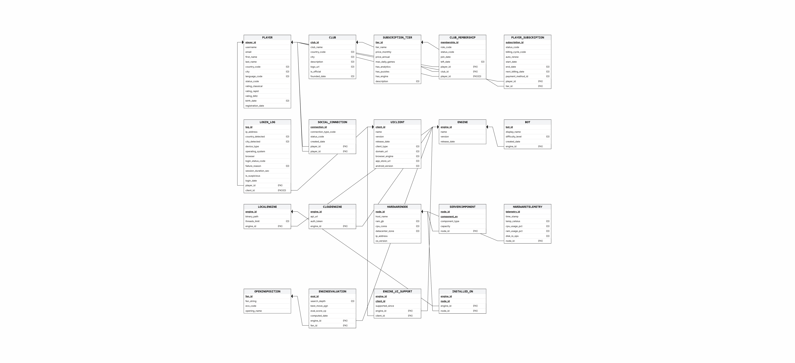

> **הוראות:** [erdplus.com](https://erdplus.com) → **Import** → `שלב ג/Diagrams/Integrated_DSD.erdplus` → **Export → PNG** → `screenshots/integrated_dsd.png`. שים לב לחץ ה-FK החדש מ-`LOGIN_LOG` אל `UICLIENT` – זהו הגשר.

---

## 8. פקודות האינטגרציה – `Integrate.sql`

לפני הרצת הקובץ, **טוענים את הטבלאות והנתונים של האגף השני** מהגיבוי שלהם לתוך `chess_db` (ראה נספח). לאחר מכן `Integrate.sql` מבצע את חיבור שתי המערכות בעזרת `ALTER` בלבד:

```sql
-- 1) הוספת עמודת הגשר (INT כדי להתאים ל-uiclient.client_id; NULL = השתתפות אופציונלית)
ALTER TABLE login_log ADD COLUMN IF NOT EXISTS client_id INT;

-- 2) הוספת המפתח הזר שמממש את הגשר
ALTER TABLE login_log DROP CONSTRAINT IF EXISTS fk_login_client;
ALTER TABLE login_log
    ADD CONSTRAINT fk_login_client
    FOREIGN KEY (client_id) REFERENCES uiclient(client_id);

-- 3) מילוי client_id ע"י קישור שורות קיימות בלבד (ללא המצאת נתונים):
--    mobile/tablet -> אפליקציית Mobile, laptop/desktop -> אפליקציית Web,
--    ופיזור בין הלקוחות מאותו סוג לפי player_id.
WITH typed AS (
    SELECT u.client_id, u.client_type,
           ROW_NUMBER() OVER (PARTITION BY u.client_type ORDER BY u.client_id) - 1 AS idx,
           COUNT(*)     OVER (PARTITION BY u.client_type)                          AS cnt
    FROM uiclient u
)
UPDATE login_log ll
SET    client_id = t.client_id
FROM   typed t
WHERE  t.client_type = CASE WHEN ll.device_type IN ('mobile','tablet')
                            THEN 'Mobile' ELSE 'Web' END
  AND  t.idx = (ll.player_id % t.cnt);
```

#### הסבר מילולי

- פקודה 1 מוסיפה את **עמודת הגשר** `client_id` לטבלת ההתחברויות.
- פקודה 2 מוסיפה את **המפתח הזר** שמקשר כל התחברות לאפליקציית הלקוח שדרכה בוצעה. ה-`DROP ... IF EXISTS` מאפשר הרצה חוזרת בטוחה.
- פקודה 3 ממלאת את העמודה **רק מתוך נתונים קיימים** – ממפה את סוג המכשיר לסוג הלקוח ומפזרת את ההתחברויות בין הלקוחות מאותו סוג. כך כל 5 הלקוחות מציגים פעילות אמיתית, מבלי להמציא נתון אחד.

#### פלט אימות (אמיתי מההרצה)

```
 total_logins | linked_logins | unlinked_logins
--------------+---------------+-----------------
        19095 |         19095 |               0

 client_id |    client_name     | client_type | logins
-----------+--------------------+-------------+--------
         4 | Blitz Mobile App   | Mobile      |   4886
         2 | Mobile Chess Pro   | Mobile      |   4663
         3 | Desktop Web Admin  | Web         |   3273
         5 | Analysis Dashboard | Web         |   3180
         1 | Chess Web Portal   | Web         |   3093
```

כל 19,095 ההתחברויות קושרו בהצלחה לאפליקציית לקוח (0 ללא קישור), והקישור מפוזר על פני כל חמש האפליקציות.

#### צילום הרצה

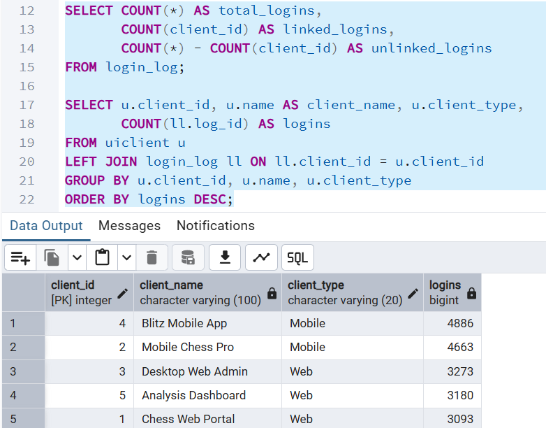

---

## 9. הרצת שאילתות שלב ב' על הבסיס המשולב

כדי לוודא שהאינטגרציה לא שברה דבר, הרצנו מחדש את **כל הקובץ `שלב ב/Queries.sql`** (8 שאילתות SELECT, 3 UPDATE, 3 DELETE, טרנזקציות) על הבסיס **המשולב**. מכיוון שהשאילתות נוגעות רק בטבלאות שלנו, והאינטגרציה רק **הוסיפה** טבלאות ועמודה אחת (nullable) – כולן רצו ללא שגיאה והחזירו תוצאות זהות.

```
PHASEB_EXIT = 0      (הקובץ רץ ללא שגיאה)
ERROR lines  = 0
```

#### צילום הרצה

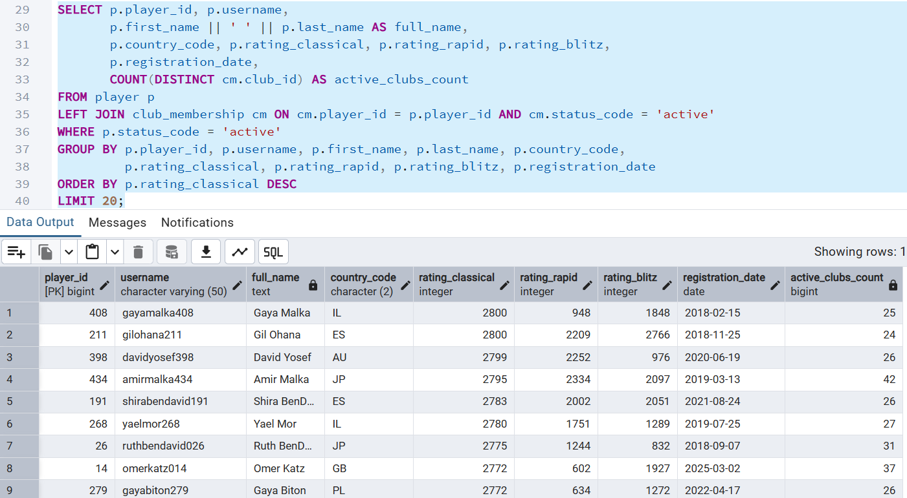

---

## 10. מבטים (Views)

כתבנו 3 מבטים: אחד מנקודת המבט של האגף שלנו, אחד מנקודת המבט של האגף החדש, ומבט שלישי שחוצה את **הגשר** ומוכיח שהאינטגרציה עובדת. כל המבטים בנויים כך שלא נוצרת מכפלה קרטזית (כל ישות מסוכמת בנפרד לפני החיבור).

---

### מבט 1: `vw_player_club_membership` (האגף שלנו – שחקנים ומועדונים)

#### תיאור מילולי

מאחד שלוש טבלאות (`player` + `club_membership` + `club`) ומציג את כל החברויות הפעילות במועדונים, יחד עם פרטי השחקן (שם, דירוג, מדינה, סטטוס), פרטי המועדון (שם, רשמי/לא) והתפקיד. זהו מידע יציב ושימושי שהמערכת קוראת תדיר (עמודי מועדון, רשימות חברים, דשבורדים).

```sql
CREATE OR REPLACE VIEW vw_player_club_membership AS
SELECT p.player_id, p.username,
       p.first_name || ' ' || p.last_name AS full_name,
       p.country_code, p.rating_classical, p.status_code AS player_status,
       c.club_id, c.club_name, c.is_official, cm.role_code, cm.join_date
FROM player p
JOIN club_membership cm ON cm.player_id = p.player_id AND cm.status_code = 'active'
JOIN club c             ON c.club_id    = cm.club_id;
```

#### שליפת נתונים מהמבט – `SELECT *` (עד 10 שורות)

```
 player_id |   full_name    | country | rating | player_status | club_id |        club_name         | is_official | role_code | join_date
-----------+----------------+---------+--------+---------------+---------+--------------------------+-------------+-----------+-----------
        16 | Neta Mizrahi   | CA      |   1685 | active        |       1 | Jerusalem Chess Club 001 | t           | member    | 2024-09-11
        25 | Roni Dahan     | CA      |   1815 | suspended     |       1 | Jerusalem Chess Club 001 | t           | member    | 2025-12-17
        27 | Michal Mizrahi | PL      |   1091 | active        |       1 | Jerusalem Chess Club 001 | t           | member    | 2025-04-07
        87 | Amir Amar      | DE      |   2605 | active        |       1 | Jerusalem Chess Club 001 | t           | admin     | 2024-09-29
       101 | Nadav BenDavid | DE      |   2573 | active        |       1 | Jerusalem Chess Club 001 | t           | member    | 2024-12-13
       ... (10 שורות)
```

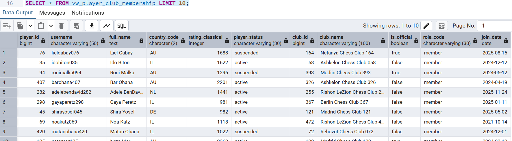

#### שאילתא 1.1 על המבט: 10 המועדונים הגדולים ביותר לפי חברים פעילים

**תיאור:** סופרת לכל מועדון את מספר החברים הפעילים ואת מספר המדינות שמהן הם מגיעים.

```sql
SELECT club_name, is_official,
       COUNT(*)                     AS active_members,
       COUNT(DISTINCT country_code) AS member_countries
FROM vw_player_club_membership
GROUP BY club_name, is_official
ORDER BY active_members DESC
LIMIT 10;
```

**פלט (אמיתי):**

```
         club_name          | is_official | active_members | member_countries
----------------------------+-------------+----------------+------------------
 Herzliya Chess Club 252    | t           |             49 |               12
 Ramat Gan Chess Club 327   | f           |             45 |               12
 Tel Aviv Chess Club 439    | f           |             45 |               12
 Jerusalem Chess Club 426   | t           |             44 |               11
 ... (10 שורות)
```

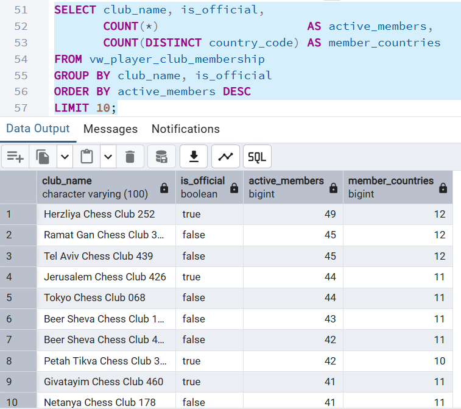

#### שאילתא 1.2 על המבט: מנהיגי מועדונים רשמיים (owner/admin) לפי דירוג

**תיאור:** מציגה את בעלי/מנהלי המועדונים הרשמיים, ממוינים לפי דירוג קלאסי.

```sql
SELECT full_name, role_code, club_name, rating_classical
FROM vw_player_club_membership
WHERE is_official = TRUE
  AND role_code IN ('owner', 'admin')
ORDER BY rating_classical DESC
LIMIT 10;
```

**פלט (אמיתי):**

```
   full_name    | role_code |        club_name        | rating_classical
----------------+-----------+-------------------------+------------------
 Amir Malka     | owner     | Sydney Chess Club 085   |             2795
 Amir Malka     | admin     | Warsaw Chess Club 462   |             2795
 Gil Berkovitz  | admin     | New York Chess Club 113 |             2790
 Shira BenDavid | admin     | Ashkelon Chess Club 483 |             2783
 ... (10 שורות)
```

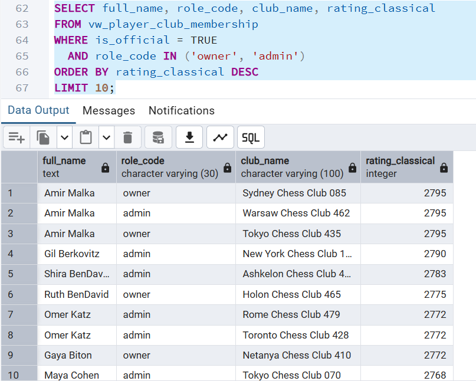

---

### מבט 2: `vw_engine_overview` (האגף החדש – מנועי שחמט)

#### תיאור מילולי

מאחד חמש טבלאות (`engine` + `localengine` + `cloudengine` + `bot` + `engineevaluation`) ומציג קטלוג של כל מנוע: סוג הפריסה שלו (Local/Cloud), כמה בוטים הוא מפעיל, וכמה הערכות עמדה בוצעו בו (כולל עומק חיפוש ממוצע). כדי להימנע ממכפלה קרטזית, כל ישות-בת (בוטים, הערכות) **מסוכמת ב-CTE נפרד** לפני החיבור למנוע – כך `avg_search_depth` נשאר נכון.

```sql
CREATE OR REPLACE VIEW vw_engine_overview AS
WITH bot_counts AS (
    SELECT engine_id, COUNT(*) AS bot_count FROM bot GROUP BY engine_id
),
eval_stats AS (
    SELECT engine_id, COUNT(*) AS evaluation_count,
           ROUND(AVG(search_depth), 1) AS avg_search_depth
    FROM engineevaluation GROUP BY engine_id
)
SELECT e.engine_id, e.name AS engine_name, e.version,
       CASE WHEN le.engine_id IS NOT NULL THEN 'Local'
            WHEN ce.engine_id IS NOT NULL THEN 'Cloud' ELSE 'Generic' END AS engine_type,
       COALESCE(bc.bot_count, 0)        AS bot_count,
       COALESCE(es.evaluation_count, 0) AS evaluation_count,
       es.avg_search_depth
FROM engine e
LEFT JOIN localengine le ON le.engine_id = e.engine_id
LEFT JOIN cloudengine ce ON ce.engine_id = e.engine_id
LEFT JOIN bot_counts  bc ON bc.engine_id = e.engine_id
LEFT JOIN eval_stats  es ON es.engine_id = e.engine_id;
```

#### שליפת נתונים מהמבט – `SELECT *` (עד 10 שורות)

```
 engine_id |   engine_name    | version | engine_type | bot_count | evaluation_count | avg_search_depth
-----------+------------------+---------+-------------+-----------+------------------+------------------
         1 | Stockfish        | v16.1   | Local       |        23 |             2488 |             22.4
         2 | Komodo Dragon    | v3.2    | Local       |        16 |             2484 |             22.4
         3 | Leela Chess Zero | v0.30   | Local       |        21 |             2510 |             22.6
         6 | AlphaZero Cloud  | v2.0    | Cloud       |        37 |             2568 |             22.5
         ... (10 שורות)
```

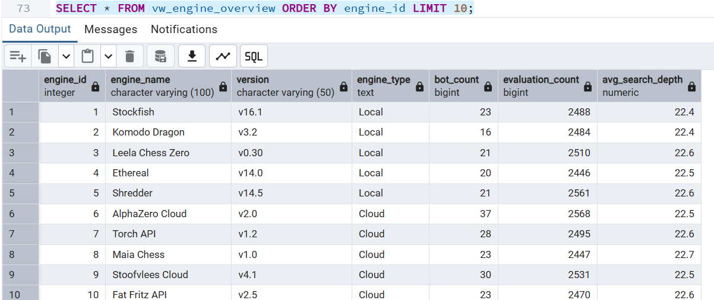

#### שאילתא 2.1 על המבט: 10 המנועים עם הכי הרבה בוטים

```sql
SELECT engine_name, version, engine_type, bot_count, evaluation_count, avg_search_depth
FROM vw_engine_overview
ORDER BY bot_count DESC, evaluation_count DESC
LIMIT 10;
```

**פלט (אמיתי):**

```
   engine_name    | version | engine_type | bot_count | evaluation_count | avg_search_depth
------------------+---------+-------------+-----------+------------------+------------------
 AlphaZero Cloud  | v2.0    | Cloud       |        37 |             2568 |             22.5
 Fat Fritz API v3 | v3.0    | Cloud       |        33 |                0 |
 Ethereal Exp...  | v14.1   | Local       |        33 |                0 |
 ... (10 שורות)
```

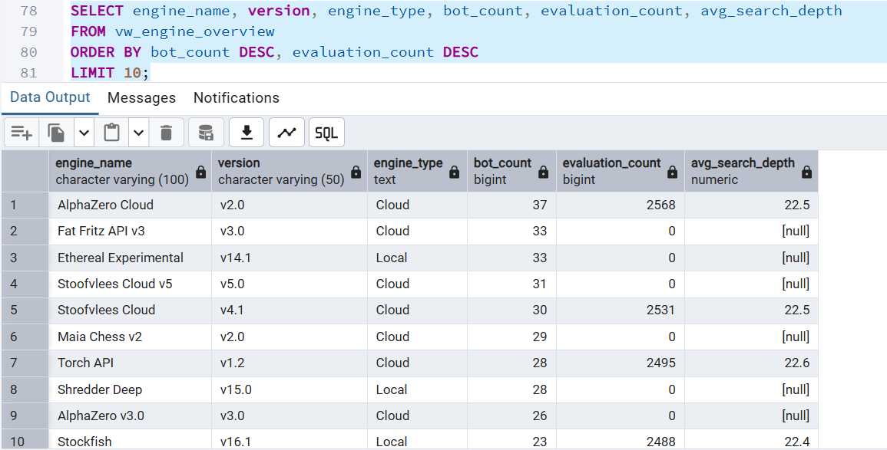

#### שאילתא 2.2 על המבט: סיכום לפי סוג פריסה (Local מול Cloud)

```sql
SELECT engine_type,
       COUNT(*)                        AS engines,
       SUM(bot_count)                  AS total_bots,
       SUM(evaluation_count)           AS total_evaluations,
       ROUND(AVG(avg_search_depth), 1) AS avg_depth
FROM vw_engine_overview
GROUP BY engine_type
ORDER BY engines DESC;
```

**פלט (אמיתי):**

```
 engine_type | engines | total_bots | total_evaluations | avg_depth
-------------+---------+------------+-------------------+-----------
 Cloud       |      10 |        280 |             12511 |      22.6
 Local       |      10 |        220 |             12489 |      22.5
```

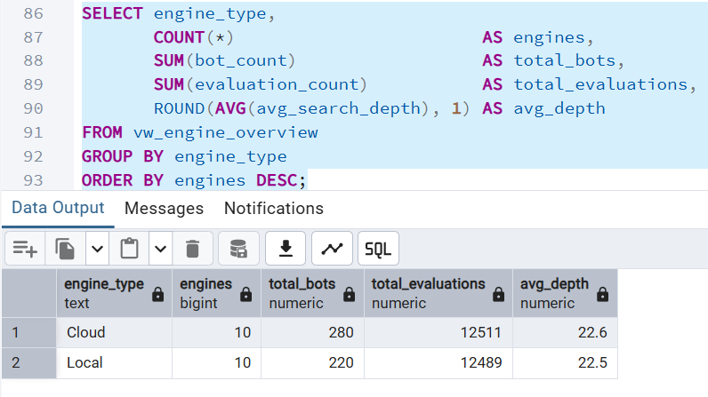

---

### מבט 3: `vw_client_login_activity` (מבט אינטגרציה – חוצה את הגשר)

#### תיאור מילולי

זהו המבט שמוכיח שהאינטגרציה עובדת: הוא חוצה את **הגשר** ומאחד טבלה של האגף השני (`uiclient`) עם הטבלאות שלנו (`login_log` + `player`), דרך עמודת ה-`client_id` החדשה. המבט מציג לכל אפליקציית לקוח כמה פעם השתמשו בה, כמה שחקנים שונים, מכמה מדינות, וכמה התחברויות חשודות בוצעו דרכה. כל המטריקות חסינות מכפלה (`COUNT`/`COUNT DISTINCT`/`SUM`/`MAX`).

```sql
CREATE OR REPLACE VIEW vw_client_login_activity AS
SELECT u.client_id, u.name AS client_name, u.client_type,
       COUNT(ll.log_id)                                  AS total_logins,
       COUNT(DISTINCT ll.player_id)                      AS distinct_players,
       COUNT(DISTINCT p.country_code)                    AS player_countries,
       SUM(CASE WHEN ll.is_suspicious THEN 1 ELSE 0 END) AS suspicious_logins,
       MAX(ll.login_date)                                AS last_login_date
FROM uiclient u
LEFT JOIN login_log ll ON ll.client_id = u.client_id     -- הגשר!
LEFT JOIN player    p  ON p.player_id  = ll.player_id
GROUP BY u.client_id, u.name, u.client_type;
```

#### שליפת נתונים מהמבט – `SELECT *`

```
 client_id |    client_name     | client_type | total_logins | distinct_players | player_countries | suspicious_logins | last_login_date
-----------+--------------------+-------------+--------------+------------------+------------------+-------------------+-----------------
         4 | Blitz Mobile App   | Mobile      |         4886 |              250 |               12 |               443 | 2026-03-24
         2 | Mobile Chess Pro   | Mobile      |         4663 |              250 |               12 |               456 | 2026-03-24
         3 | Desktop Web Admin  | Web         |         3273 |              167 |               12 |               315 | 2026-03-24
         5 | Analysis Dashboard | Web         |         3180 |              167 |               12 |               303 | 2026-03-24
         1 | Chess Web Portal   | Web         |         3093 |              166 |               12 |               308 | 2026-03-24
```

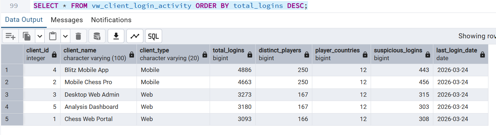

#### שאילתא 3.1 על המבט: אילו אפליקציות לקוח הכי בשימוש

```sql
SELECT client_name, client_type, total_logins, distinct_players, player_countries, suspicious_logins
FROM vw_client_login_activity
ORDER BY total_logins DESC;
```

**פלט:** (זהה לטבלה שלמעלה – חמש האפליקציות ממוינות לפי מספר התחברויות).
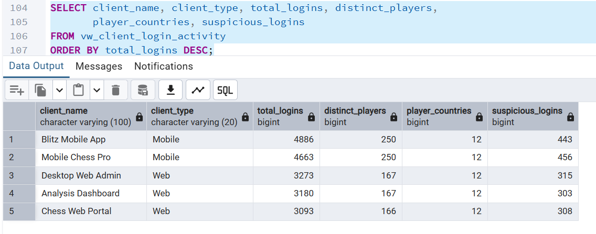

#### שאילתא 3.2 על המבט: סיכום פעילות לפי סוג לקוח (Web מול Mobile)

**תיאור:** שאילתא אחת ש**מסכמת מידע משתי המערכות יחד** – פעילות התחברות (המערכת שלנו) מקובצת לפי סוג אפליקציה (המערכת שלהם).

```sql
SELECT client_type,
       COUNT(*)               AS client_apps,
       SUM(total_logins)      AS logins,
       SUM(distinct_players)  AS players,
       SUM(suspicious_logins) AS suspicious
FROM vw_client_login_activity
GROUP BY client_type
ORDER BY logins DESC;
```

**פלט (אמיתי):**

```
 client_type | client_apps | logins | players | suspicious
-------------+-------------+--------+---------+------------
 Mobile      |           2 |   9549 |     500 |        899
 Web         |           3 |   9546 |     500 |        926
```

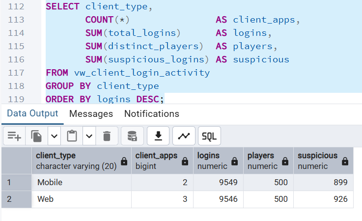

---

## 11. סיכום

בשלב ג ביצענו אינטגרציה מלאה (שיטה א') של פלטפורמת השחמט שלנו עם מערכת תשתית מנועי השחמט של האגף השני. בנינו את ה-DSD וה-ERD של האגף החדש (כולל אלגוריתם הינדוס לאחור), עיצבנו ERD ו-DSD משולבים, ומיזגנו את 27 הטבלאות לבסיס נתונים אחד **בעזרת `ALTER` בלבד ומבלי לייצר מחדש אף טבלה או נתון**. חיברנו את שתי המערכות דרך גשר טבעי (`login_log → uiclient`), אימתנו שכל שאילתות שלב ב' ממשיכות לעבוד, וכתבנו 3 מבטים – כולל מבט שמוכיח את האינטגרציה הלכה למעשה.
