# דוח פרויקט – שלב ד: תכנות ב-PL/pgSQL

**מחלקה:** Chess Platform – Users and Clubs
**סטודנטים:** אלעזר קריספל (8309) · אלון גרינשטיין (7002)
**נקודת הפתיחה:** `שלב ג/backup3.sql` – הבסיס המשולב של שלב ג (27 טבלאות, 3 מבטים, הגשר `login_log.client_id → uiclient`)

---

## תוכן עניינים

1. [מבוא](#1-מבוא)
2. [הרצת הסביבה](#2-הרצת-הסביבה)
3. [שינויי סכמה](#3-שינויי-סכמה)
4. [פונקציה 1 – fn_player_activity_score](#4-פונקציה-1--fn_player_activity_score)
5. [פונקציה 2 – fn_club_report (REF CURSOR)](#5-פונקציה-2--fn_club_report-ref-cursor)
6. [פרוצדורה 1 – sp_process_billing_cycle](#6-פרוצדורה-1--sp_process_billing_cycle)
7. [פרוצדורה 2 – sp_security_review](#7-פרוצדורה-2--sp_security_review)
8. [טריגר 1 – trg_player_update (UPDATE)](#8-טריגר-1--trg_player_update-update)
9. [טריגר 2 – trg_login_log_insert (INSERT)](#9-טריגר-2--trg_login_log_insert-insert)
10. [תוכנית ראשית 1](#10-תוכנית-ראשית-1--main1_billingandactivity)
11. [תוכנית ראשית 2](#11-תוכנית-ראשית-2--main2_securityandclubs)
12. [טבלת כיסוי דרישות](#12-טבלת-כיסוי-דרישות)
13. [סיכום](#13-סיכום)

---

## 1. מבוא

בשלב ד כתבנו תוכניות PL/pgSQL על הבסיס המשולב שנבנה בשלב ג. סך הכול:

- **2 פונקציות** – אחת מחזירה ערך מחושב, אחת מחזירה `REF CURSOR`
- **2 פרוצדורות** – מחזור חיוב מנויים, וסריקת אבטחה
- **2 טריגרים** – אחד בזמן `UPDATE` (הנדרש) ואחד בזמן `INSERT`
- **2 תוכניות ראשיות** – כל אחת מזמנת פונקציה אחת ופרוצדורה אחת

### קבצים

| קובץ | תוכן |
|---|---|
| `Function1_PlayerActivityScore.sql` | פונקציה 1 |
| `Function2_ClubReportCursor.sql` | פונקציה 2 |
| `Procedure1_BillingCycle.sql` | פרוצדורה 1 |
| `Procedure2_SecurityReview.sql` | פרוצדורה 2 |
| `Trigger1_PlayerUpdate.sql` | טריגר 1 |
| `Trigger2_LoginLogInsert.sql` | טריגר 2 |
| `Main1_BillingAndActivity.sql` | תוכנית ראשית 1 |
| `Main2_SecurityAndClubs.sql` | תוכנית ראשית 2 |
| `Verification.sql` | תרחישי אימות מרוכזים לפונקציות, לפרוצדורות ולטריגרים |
| `backup4.sql` | גיבוי מעודכן |

### שיטת ההוכחה

תוכניות שמשנות נתונים הודגמו בתוך טרנזקציה: שאילתות לפני/אחרי מוכיחות את השינוי, ולאחר מכן `ROLLBACK` מחזיר את נתוני הבסיס למצבם המקורי כדי לאפשר הרצה חוזרת של ההדגמה.

### התקנת התוכניות

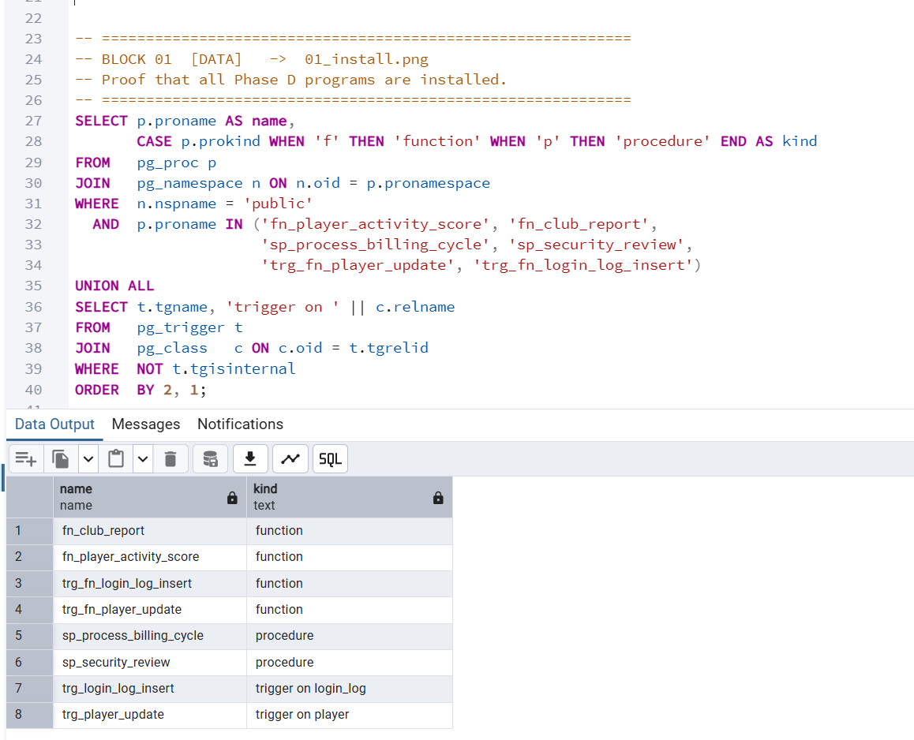

---

## 2. הרצת הסביבה

`docker compose up -d` מעלה את בסיס הנתונים המצטבר: הסכמה והאינטגרציה של שלב ג יחד עם הרוטינות של שלב ד.

```bash
docker compose up -d
```

`backup4.sql` מכיל את בסיס הנתונים המצטבר (27 טבלאות, 3 מבטים, פונקציות, פרוצדורות וטריגרים). Docker טוען אותו בעת אתחול של volume ריק. תרחישי ההדגמה מרוכזים ב-`Verification.sql`, ושתי התוכניות הראשיות נמצאות בקבצים הנפרדים שלהן.

### בדיקות שבוצעו

| בדיקה | תוצאה |
|---|---|
| טבלאות / מבטים | 27 / 3 |
| פונקציות ופרוצדורות / טריגרים | 6 / 2 |
| אילוצי שלב ב / אינדקסי שלב ב | 3 / 3 |
| `uiclient` + עמודת הגשר | 5 שורות + קיימת |
| שחקנים / התחברויות | 510 / 19,095 |
| שלושת המבטים של שלב ג | מספרים זהים לדוח שלב ג |
| `שלב ב/Queries.sql` | רץ ללא שגיאה עם הטריגרים מותקנים |
| כל בלוקי `Verification.sql` | 6 שגיאות בלבד – כולן החריגות המכוונות |
| `Main1` ו-`Main2` | רצות מקצה לקצה ללא שגיאה |
| הנתונים אחרי כל ההרצות | ללא שינוי (296/14/200 שחקנים, 14,013 מנויים, 14,945 חברויות) |

---

## 3. שינויי סכמה

לא בוצעו שינויי סכמה בשלב ד, ולכן לא נדרש `AlterTable.sql`. כל התוכניות פועלות ישירות על הסכמה המשולבת של שלב ג.

---

## 4. פונקציה 1 – `fn_player_activity_score`

**קובץ:** [Function1_PlayerActivityScore.sql](Function1_PlayerActivityScore.sql)

### תיאור מילולי

הפונקציה מחשבת **ציון פעילות בטווח 0–100** לשחקן בודד, משלושה מקורות: היסטוריית ההתחברויות שלו, החברויות הפעילות שלו במועדונים, והחברים המאושרים שלו.

הציון נבנה כך: הפונקציה פותחת קורסור מפורש על ההתחברויות של השחקן בחלון זמן, ועוברת עליהן בלולאה. התחברות מוצלחת מוסיפה נקודה, סשן ארוך מ-30 דקות מוסיף חצי נקודה נוספת, נסיון כושל או חסום כמעט לא נחשב פעילות, והתחברות חשודה מורידה חצי נקודה. לאחר מכן נספרות החברויות הפעילות והחברויות המאושרות.

**כל אחד משלושת הרכיבים חסום בנפרד** (התחברויות עד 40 נקודות, מועדונים עד 30, חברים עד 30) כדי שאף רכיב לא ישלוט בתוצאה. החסמים נבחרו לפי ההתפלגות האמיתית בנתונים שלנו – שחקן טיפוסי מתחבר כ-15 פעמים בשנה, חבר בכ-30 מועדונים ויש לו כ-16 חברים – ולכן שחקן ממוצע נוחת סביב 50 ורק הפעילים ביותר מגיעים ל-100.

חלון הזמן נמדד לאחור מהתאריך האחרון בטבלת ההתחברויות ולא מ-`CURRENT_DATE`, אחרת כל חלון היה יוצא ריק.

### אלמנטים

| אלמנט | היכן |
|---|---|
| Cursor מרומז | `SELECT * INTO v_player`, ספירת מועדונים, ספירת חברים, `MAX(login_date)` |
| Cursor מפורש | `cur_logins` – עם פרמטרים |
| לולאה | `LOOP / FETCH / EXIT WHEN NOT FOUND` |
| הסתעפויות | ניקוד שונה לפי `login_status_code`, `session_duration_sec`, `is_suspicious` |
| רשומות | `v_player player%ROWTYPE` + `v_log RECORD` |
| Exception | פרמטר שלילי, שחקן לא קיים |

### קוד

```sql
CREATE OR REPLACE FUNCTION fn_player_activity_score(
    p_player_id BIGINT,
    p_days_back INT DEFAULT 365
)
RETURNS NUMERIC
LANGUAGE plpgsql
STABLE
AS $$
DECLARE
    v_player        player%ROWTYPE;

    cur_logins CURSOR (c_player_id BIGINT, c_from DATE) FOR
        SELECT login_status_code, is_suspicious, session_duration_sec
        FROM   login_log
        WHERE  player_id  = c_player_id
          AND  login_date >= c_from;

    v_log           RECORD;
    v_ref_date      DATE;
    v_from_date     DATE;
    v_login_points  NUMERIC := 0;
    v_clubs         INT     := 0;
    v_friends       INT     := 0;
    v_score         NUMERIC;
BEGIN
    IF p_days_back <= 0 THEN
        RAISE EXCEPTION 'p_days_back must be positive (got %)', p_days_back
            USING ERRCODE = 'invalid_parameter_value';
    END IF;

    SELECT * INTO v_player FROM player WHERE player_id = p_player_id;
    IF NOT FOUND THEN
        RAISE EXCEPTION 'Player % does not exist', p_player_id
            USING ERRCODE = 'no_data_found';
    END IF;

    SELECT MAX(login_date) INTO v_ref_date FROM login_log;
    v_from_date := v_ref_date - p_days_back;

    OPEN cur_logins(p_player_id, v_from_date);
    LOOP
        FETCH cur_logins INTO v_log;
        EXIT WHEN NOT FOUND;

        IF v_log.login_status_code = 'success' THEN
            v_login_points := v_login_points + 1;
            IF v_log.session_duration_sec >= 1800 THEN
                v_login_points := v_login_points + 0.5;
            END IF;
        ELSE
            v_login_points := v_login_points + 0.1;
        END IF;

        IF v_log.is_suspicious THEN
            v_login_points := v_login_points - 0.5;
        END IF;
    END LOOP;
    CLOSE cur_logins;

    IF v_login_points < 0 THEN
        v_login_points := 0;
    END IF;

    SELECT COUNT(*) INTO v_clubs
    FROM   club_membership
    WHERE  player_id = p_player_id AND status_code = 'active';

    SELECT COUNT(*) INTO v_friends
    FROM   social_connection
    WHERE  to_player_id = p_player_id
      AND  connection_type_code = 'friend'
      AND  status_code = 'accepted';

    v_score := LEAST(v_login_points, 50) * 0.8      -- 0 .. 40
             + LEAST(v_clubs,        40) * 0.75     -- 0 .. 30
             + LEAST(v_friends,      30) * 1.0;     -- 0 .. 30

    RETURN ROUND(LEAST(v_score, 100), 2);
END;
$$;
```

### הוכחת הרצה

**הרצה תקינה** – שחקנים שונים מקבלים ציונים שונים:

```sql
SELECT p.player_id, p.username, p.rating_classical,
       fn_player_activity_score(p.player_id) AS activity_score
FROM   player p
WHERE  p.status_code = 'active'
ORDER  BY p.rating_classical DESC, p.player_id
LIMIT  10;
```

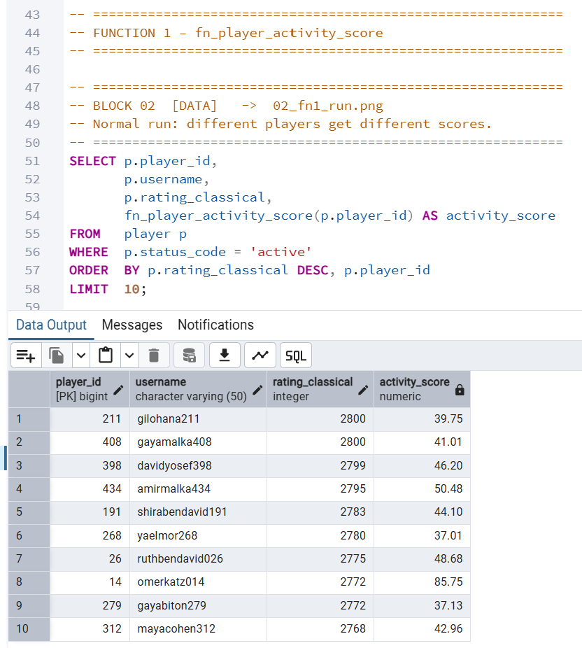

הציונים על כל השחקנים הפעילים נעים בין **26.20 ל-85.75**, בממוצע **48.0** – כלומר הפונקציה אכן מבדילה בין שחקנים ולא מחזירה ערך אחיד.

**חריגה 1 – שחקן שאינו קיים:**

```sql
SELECT fn_player_activity_score(999999);
```

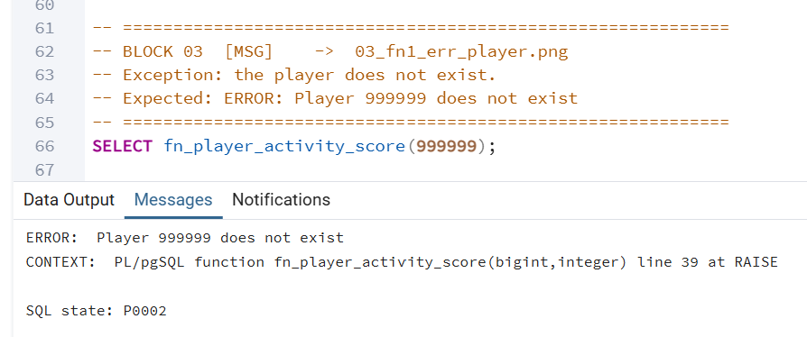

**חריגה 2 – פרמטר שלילי:**

```sql
SELECT fn_player_activity_score(1, -10);
```

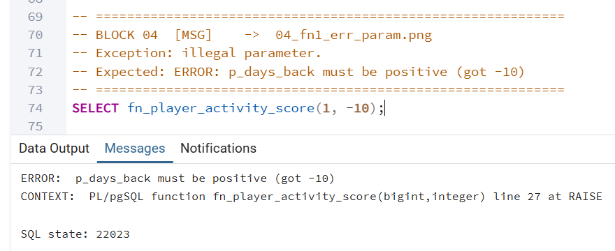

---

## 5. פונקציה 2 – `fn_club_report` (REF CURSOR)

**קובץ:** [Function2_ClubReportCursor.sql](Function2_ClubReportCursor.sql)

### תיאור מילולי

הפונקציה מחזירה **`REF CURSOR`** על דוח מועדונים: שם המועדון, מדינה, האם רשמי, מספר החברים הפעילים, הדירוג הקלאסי הממוצע של החברים, ומספר המנהיגים (`owner` + `admin`).

החזרת קורסור – ולא טבלה – מאפשרת לקורא לצרוך את הדוח שורה-שורה במקום להחזיק את כולו בזיכרון. התוכנית הראשית 2 עושה בדיוק זאת: היא מקבלת את הקורסור ומבצעת עליו `FETCH` בלולאה.

הפונקציה מדגימה הסתעפות בבניית הקורסור: אם לא הועברה מדינה, הקורסור נפתח על כל המועדונים; אם הועברה, הוא נפתח על שאילתה מסוננת. לפני הפתיחה מתבצעת בדיקה מקדימה שמדפיסה כמה מועדונים ייכללו בדוח.

לקורסור ניתן שם קבוע (`club_report_cur`) כדי שניתן יהיה לשלוף ממנו ישירות גם מ-pgAdmin באמצעות `FETCH ALL IN club_report_cur`.

### אלמנטים

| אלמנט | היכן |
|---|---|
| **REF CURSOR** | מוצהר, נפתח ומוחזר |
| הסתעפויות | שתי פקודות `OPEN` שונות לפי `p_country` |
| Cursor מרומז | `SELECT COUNT(*) INTO` בבדיקה המקדימה |
| Exception | `p_min_members` שלילי |

### קוד

```sql
CREATE OR REPLACE FUNCTION fn_club_report(
    p_country     CHAR(2),
    p_min_members INT
)
RETURNS REFCURSOR
LANGUAGE plpgsql
AS $$
DECLARE
    v_cur   REFCURSOR := 'club_report_cur';
    v_count INT;
BEGIN
    IF p_min_members < 0 THEN
        RAISE EXCEPTION 'p_min_members cannot be negative (got %)', p_min_members
            USING ERRCODE = 'invalid_parameter_value';
    END IF;

    SELECT COUNT(*) INTO v_count
    FROM (
        SELECT cm.club_id
        FROM   club_membership cm
        JOIN   club c ON c.club_id = cm.club_id
        WHERE  cm.status_code = 'active'
          AND (p_country IS NULL OR c.country_code = p_country)
        GROUP  BY cm.club_id
        HAVING COUNT(*) >= p_min_members
    ) s;

    IF v_count = 0 THEN
        RAISE NOTICE 'No club matches country=%, min_members=% - returning an empty cursor',
                     COALESCE(p_country, 'ALL'), p_min_members;
    ELSE
        RAISE NOTICE '% club(s) match country=%, min_members=%',
                     v_count, COALESCE(p_country, 'ALL'), p_min_members;
    END IF;

    IF p_country IS NULL THEN
        OPEN v_cur FOR
            SELECT c.club_id, c.club_name, c.country_code, c.is_official,
                   COUNT(*)::INT                           AS active_members,
                   ROUND(AVG(p.rating_classical))::INT     AS avg_rating,
                   COUNT(*) FILTER (WHERE cm.role_code IN ('owner','admin'))::INT AS leaders
            FROM   club c
            JOIN   club_membership cm ON cm.club_id = c.club_id
                                     AND cm.status_code = 'active'
            JOIN   player p           ON p.player_id = cm.player_id
            GROUP  BY c.club_id, c.club_name, c.country_code, c.is_official
            HAVING COUNT(*) >= p_min_members
            ORDER  BY active_members DESC, c.club_name;
    ELSE
        OPEN v_cur FOR
            SELECT c.club_id, c.club_name, c.country_code, c.is_official,
                   COUNT(*)::INT                           AS active_members,
                   ROUND(AVG(p.rating_classical))::INT     AS avg_rating,
                   COUNT(*) FILTER (WHERE cm.role_code IN ('owner','admin'))::INT AS leaders
            FROM   club c
            JOIN   club_membership cm ON cm.club_id = c.club_id
                                     AND cm.status_code = 'active'
            JOIN   player p           ON p.player_id = cm.player_id
            WHERE  c.country_code = p_country
            GROUP  BY c.club_id, c.club_name, c.country_code, c.is_official
            HAVING COUNT(*) >= p_min_members
            ORDER  BY active_members DESC, c.club_name;
    END IF;

    RETURN v_cur;
END;
$$;
```

### הוכחת הרצה

**עם סינון מדינה** – הקורסור מחזיר 35 מועדונים בישראל עם 25 חברים לפחות:

```sql
BEGIN;
SELECT fn_club_report('IL', 25);
FETCH ALL IN club_report_cur;
COMMIT;
```

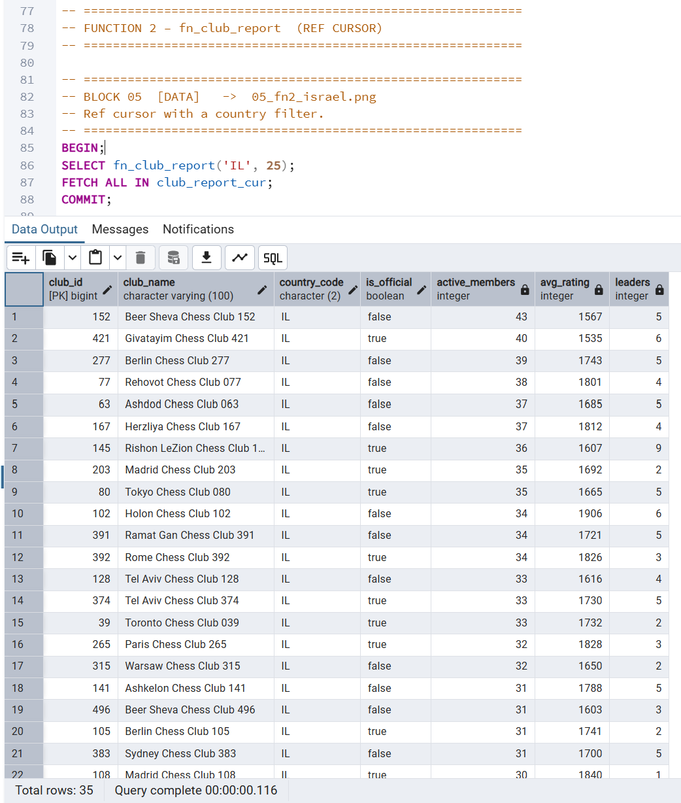

**בלי סינון מדינה** – הענף השני של ה-`IF`, 19 מועדונים עם 40 חברים לפחות:

```sql
BEGIN;
SELECT fn_club_report(NULL, 40);
FETCH ALL IN club_report_cur;
COMMIT;
```

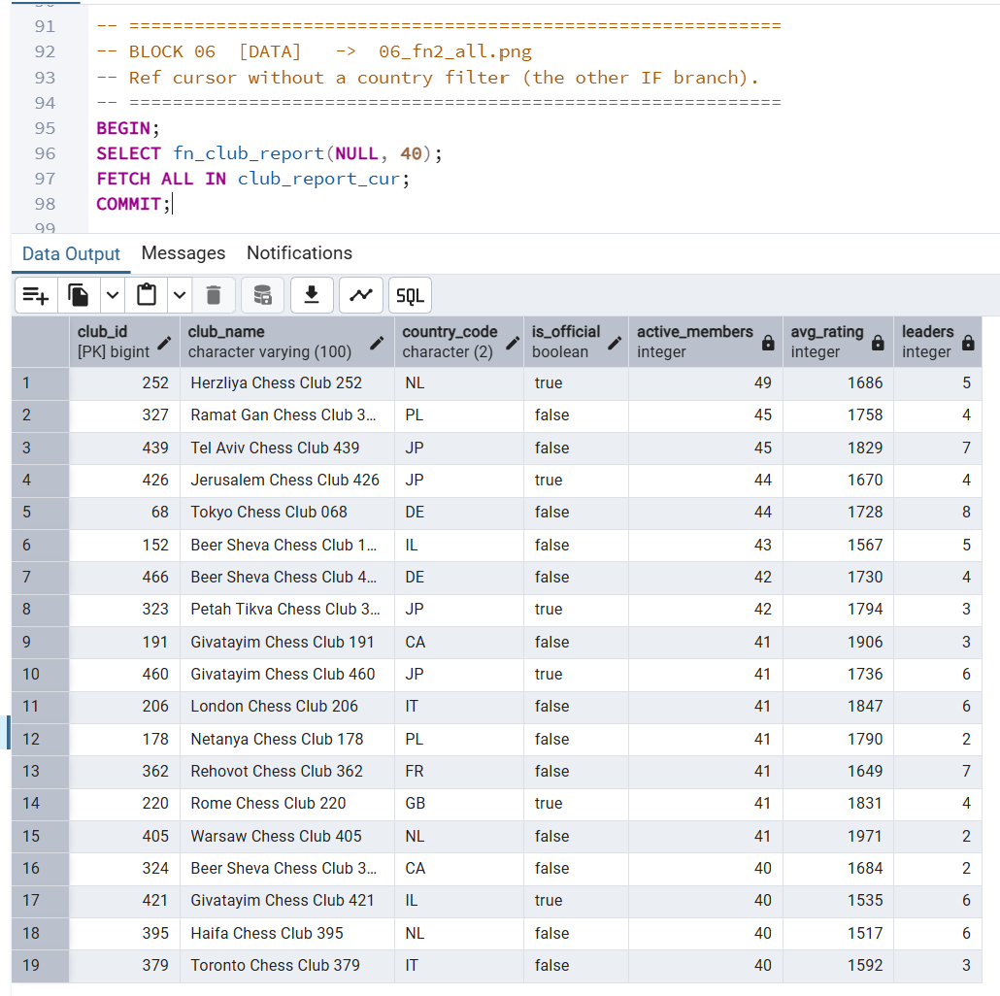

**חריגה – סף שלילי:**

```sql
SELECT fn_club_report('IL', -5);
```

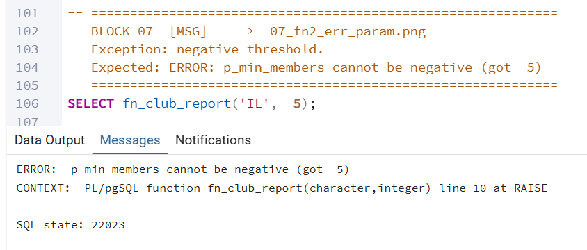

---

## 6. פרוצדורה 1 – `sp_process_billing_cycle`

**קובץ:** [Procedure1_BillingCycle.sql](Procedure1_BillingCycle.sql)

### תיאור מילולי

הפרוצדורה מריצה **מחזור חיוב** על המנויים שתאריך החיוב הבא שלהם כבר עבר. היא פותחת קורסור מפורש עם `FOR UPDATE` על המנויים הפעילים שהגיע מועד חיובם, מהוותיק ביותר, ועוברת עליהם בלולאה. לכל מנוי:

- אם `auto_renew = TRUE` – המנוי מתחדש: `next_billing_date` נדחף קדימה בחודש או בשנה, לפי `billing_cycle_code` שלו.
- אם `auto_renew = FALSE` – המנוי פוקע: הסטטוס עובר ל-`expired` וה-`auto_renew` נסגר.

**למה `next_billing_date` ולא `end_date`:** בדקנו את הנתונים של שלב ג ומצאנו ש-`end_date` הוא `NULL` בכל 14,013 המנויים הפעילים, בעוד `next_billing_date` מלא ורובו בעבר. זו העמודה היחידה שיכולה להניע מחזור חיוב אמיתי.

כל שורה מטופלת בתוך בלוק `EXCEPTION` משלה, כך ששורה בעייתית מדווחת ב-`RAISE WARNING` והלולאה ממשיכה. הפרמטר `p_limit` מאפשר לעבד את המנויים במנות מבוקרות.

### אלמנטים

| אלמנט | היכן |
|---|---|
| Cursor מפורש | `cur_due` – עם `FOR UPDATE` |
| לולאה | `LOOP / FETCH / EXIT WHEN NOT FOUND` |
| הסתעפויות | `IF auto_renew` + `CASE billing_cycle_code` מקונן |
| DML | שני `UPDATE` שונים – חידוש ופקיעה |
| Exception | בלוק per-row בתוך הלולאה |
| רשומות | `v_sub RECORD` |
| פרמטרי INOUT | `p_renewed`, `p_expired` |

### קוד

```sql
CREATE OR REPLACE PROCEDURE sp_process_billing_cycle(
    p_as_of         DATE,
    p_limit         INT,
    INOUT p_renewed INT,
    INOUT p_expired INT
)
LANGUAGE plpgsql
AS $$
DECLARE
    cur_due CURSOR FOR
        SELECT subscription_id, player_id, billing_cycle_code,
               auto_renew, next_billing_date
        FROM   player_subscription
        WHERE  status_code       = 'active'
          AND  next_billing_date IS NOT NULL
          AND  next_billing_date <= p_as_of
        ORDER  BY next_billing_date
        LIMIT  p_limit
        FOR UPDATE;

    v_sub      RECORD;
    v_new_date DATE;
    v_errors   INT := 0;
BEGIN
    p_renewed := 0;
    p_expired := 0;

    RAISE NOTICE 'Billing run starting, as of %, limit % subscription(s)', p_as_of, p_limit;

    OPEN cur_due;
    LOOP
        FETCH cur_due INTO v_sub;
        EXIT WHEN NOT FOUND;

        BEGIN
            IF v_sub.auto_renew THEN
                v_new_date := CASE v_sub.billing_cycle_code
                                  WHEN 'monthly' THEN v_sub.next_billing_date + INTERVAL '1 month'
                                  WHEN 'annual'  THEN v_sub.next_billing_date + INTERVAL '1 year'
                                  ELSE                v_sub.next_billing_date + INTERVAL '1 month'
                              END;

                UPDATE player_subscription
                   SET next_billing_date = v_new_date
                 WHERE subscription_id = v_sub.subscription_id;

                p_renewed := p_renewed + 1;
            ELSE
                UPDATE player_subscription
                   SET status_code = 'expired',
                       auto_renew  = FALSE
                 WHERE subscription_id = v_sub.subscription_id;

                p_expired := p_expired + 1;
            END IF;

        EXCEPTION
            WHEN OTHERS THEN
                v_errors := v_errors + 1;
                RAISE WARNING 'subscription % skipped: %', v_sub.subscription_id, SQLERRM;
        END;
    END LOOP;
    CLOSE cur_due;

    RAISE NOTICE 'Billing run finished: % renewed, % expired, % error(s)',
                 p_renewed, p_expired, v_errors;
END;
$$;
```

### הוכחת הרצה

**הוכחה ישירה שבסיס הנתונים התעדכן.** צילמנו את מצב 50 המנויים לפני ההרצה לטבלה זמנית, הרצנו את הפרוצדורה, והצגנו את שני המצבים באותה טבלת תוצאה:

```sql
BEGIN;

DROP TABLE IF EXISTS snap_sub;
CREATE TEMP TABLE snap_sub AS
SELECT subscription_id, billing_cycle_code, auto_renew,
       next_billing_date AS date_before, status_code AS status_before
FROM   player_subscription
WHERE  status_code = 'active'
  AND  next_billing_date IS NOT NULL
  AND  next_billing_date <= DATE '2026-08-18'
ORDER  BY next_billing_date, subscription_id
LIMIT  50;

CALL sp_process_billing_cycle(DATE '2026-08-18', 50, 0, 0);

SELECT s.subscription_id, s.billing_cycle_code, s.auto_renew,
       s.date_before, ps.next_billing_date AS date_after,
       s.status_before, ps.status_code AS status_after
FROM   snap_sub s
JOIN   player_subscription ps ON ps.subscription_id = s.subscription_id
ORDER  BY s.date_before, s.subscription_id
LIMIT  15;

ROLLBACK;
```

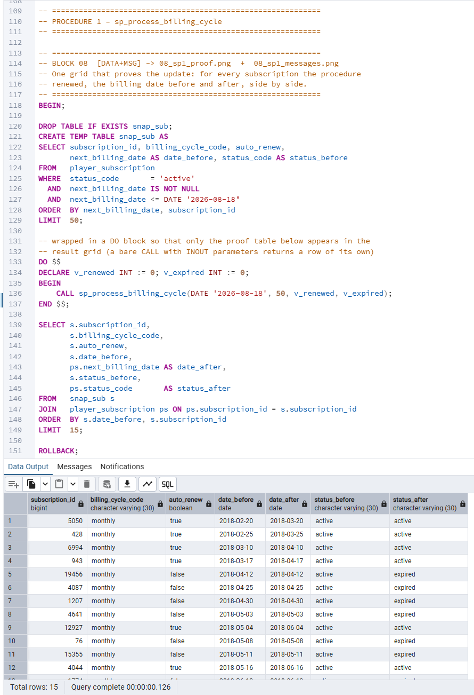

הצילום מציג את שני ענפי הפרוצדורה: במנויים עם `auto_renew = TRUE` תאריך החיוב מתקדם לפי מחזור החיוב, ובאחרים הסטטוס משתנה ל-`expired`.

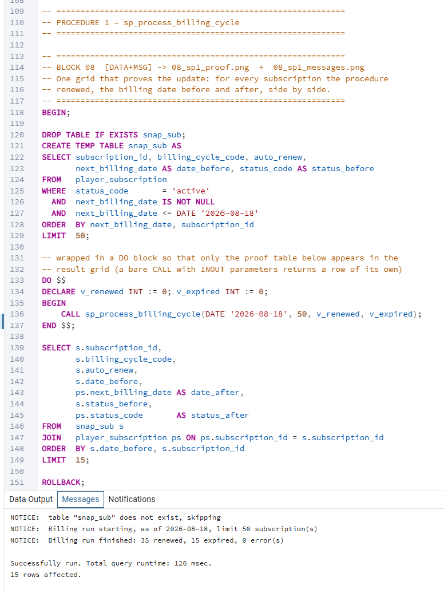

**סיכום כמותי של השינוי בסטטוסים:**

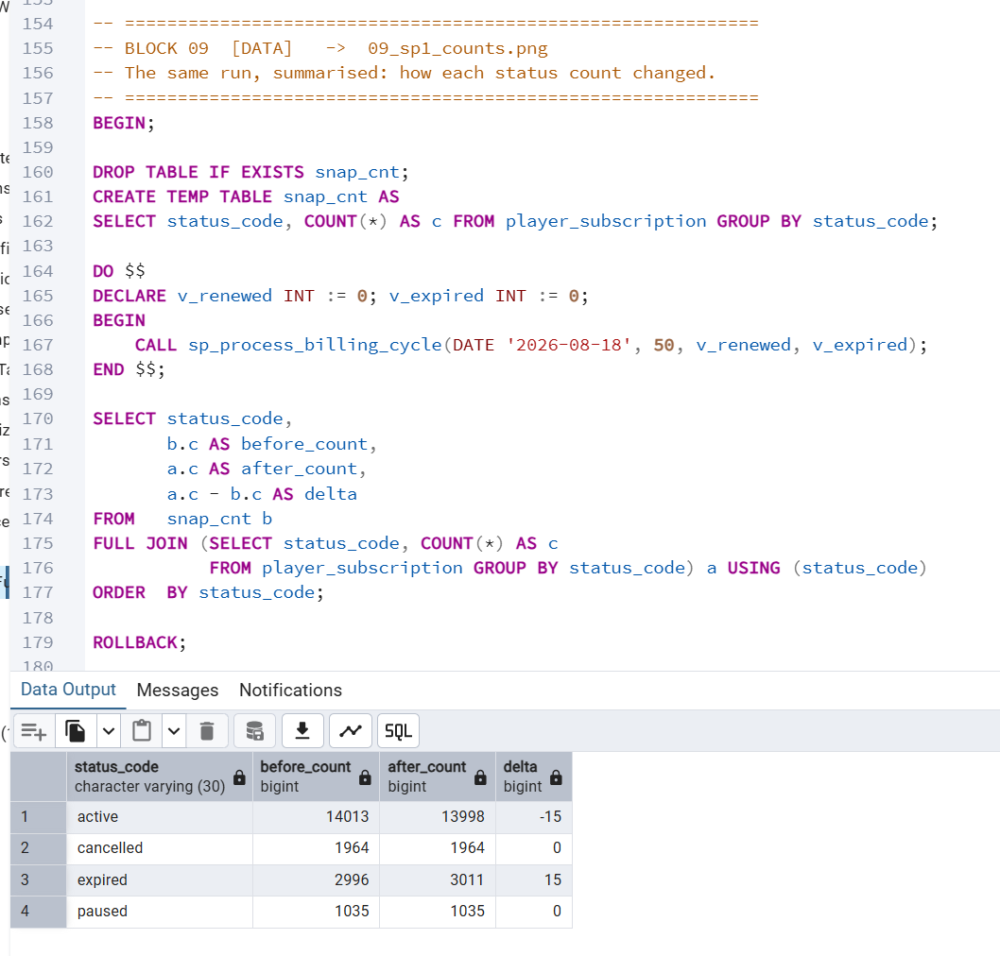

ההרצה חידשה 35 מנויים והעבירה 15 מנויים מ-`active` ל-`expired`, ללא שגיאות.

---

## 7. פרוצדורה 2 – `sp_security_review`

**קובץ:** [Procedure2_SecurityReview.sql](Procedure2_SecurityReview.sql)

### תיאור מילולי

הפרוצדורה מבצעת **סריקת אבטחה**. היא פותחת קורסור מפורש על שאילתת אגרגציה שמחשבת לכל שחקן פעיל את מספר ההתחברויות שלו בחלון הזמן ואת אחוז ההתחברויות החשודות מתוכן, ומסננת שחקנים עם מספר התחברויות מינימלי (אין טעם לשפוט שחקן על סמך שתי התחברויות). לכל שחקן שעבר את הסינון מתקבלת החלטה בשלוש רמות:

- אחוז חשוד ≥ הסף × 1.5 → השחקן **נחסם** (`banned`)
- אחוז חשוד ≥ הסף → השחקן **מושעה** (`suspended`)
- אחרת → נספר בלבד, שום דבר לא משתנה

לשחקנים שננקטה נגדם פעולה, הפרוצדורה שולפת גם את **אפליקציית הלקוח שדרכה הם התחברו בעיקר** – שאילתה שחוצה את הגשר של שלב ג (`login_log.client_id → uiclient`) – ומדפיסה אותה כחלק מדוח האבטחה. שחקנים שמתחת לסף אינם מודפסים, כי הסריקה עוברת על מאות שחקנים.

חלון הזמן נבנה מהנתונים עצמם: `MAX(login_date)` פחות `p_days_back`.

בנוסף לעדכון הסטטוס, שחקן שהושעה או נחסם **מאבד את בקשות החברות שלו במועדונים שעדיין ממתינות לאישור** (`club_membership.status_code = 'pending'`). זהו חוק עסקי שכבר נוסח בשלב ב (שאילתת המחיקה D3 ב-`Queries.sql`), ואנחנו מיישמים אותו כאן ברגע החסימה עצמו במקום כניקוי תקופתי. מספר השורות שנמחקו נקרא ב-`GET DIAGNOSTICS` ומדווח גם לכל שחקן וגם בסיכום.

**האינטראקציה עם טריגר 1:** הפרוצדורה מעדכנת ב-`player` **רק** את `status_code`. את ההמשך – סימון החברויות ה**פעילות** של שחקן שנחסם – מבצע טריגר 1. זו בדיוק הסיבה שהטריגר קיים, וזה נראה בבירור בהוכחה למטה. שתי הפעולות משלימות זו את זו: הטריגר מטפל בחברויות `active`, וה-`DELETE` שבפרוצדורה בחברויות `pending`.

### אלמנטים

| אלמנט | היכן |
|---|---|
| Cursor מפורש | `cur_risky` – פרמטרי, על שאילתת אגרגציה |
| Cursor מרומז | `MAX(login_date)`, ושליפת אפליקציית הלקוח דרך הגשר |
| לולאה | `LOOP / FETCH / EXIT WHEN NOT FOUND` |
| הסתעפויות | החלטה תלת-רמתית |
| DML | `UPDATE player` + `DELETE club_membership` (בקשות ממתינות) |
| Exception | ולידציית פרמטרים |
| רשומות | `v_row RECORD` |

### קוד

```sql
CREATE OR REPLACE PROCEDURE sp_security_review(
    p_days_back     INT,
    p_min_logins    INT,
    p_threshold_pct NUMERIC
)
LANGUAGE plpgsql
AS $$
DECLARE
    cur_risky CURSOR (c_from DATE, c_min INT) FOR
        SELECT ll.player_id,
               p.username,
               COUNT(*)                                 AS total_logins,
               COUNT(*) FILTER (WHERE ll.is_suspicious) AS suspicious_logins,
               ROUND(100.0 * COUNT(*) FILTER (WHERE ll.is_suspicious)
                           / COUNT(*), 2)               AS suspicious_pct
        FROM   login_log ll
        JOIN   player p ON p.player_id = ll.player_id
        WHERE  ll.login_date >= c_from
          AND  p.status_code  = 'active'
        GROUP  BY ll.player_id, p.username
        HAVING COUNT(*) >= c_min
        ORDER  BY 5 DESC;

    v_row        RECORD;
    v_ref_date   DATE;
    v_from_date  DATE;
    v_client     VARCHAR(100);
    v_new_status VARCHAR(30);
    v_checked    INT := 0;
    v_clean      INT := 0;
    v_suspended  INT := 0;
    v_banned     INT := 0;
    v_del_rows   INT := 0;
    v_deleted    INT := 0;
BEGIN
    IF p_days_back <= 0 OR p_min_logins <= 0 OR p_threshold_pct <= 0 THEN
        RAISE EXCEPTION
            'invalid parameters: days_back=%, min_logins=%, threshold=%',
            p_days_back, p_min_logins, p_threshold_pct
            USING ERRCODE = 'invalid_parameter_value';
    END IF;

    SELECT MAX(login_date) INTO v_ref_date FROM login_log;
    v_from_date := v_ref_date - p_days_back;

    RAISE NOTICE 'Security review window: % .. %  (threshold % percent)',
                 v_from_date, v_ref_date, p_threshold_pct;

    OPEN cur_risky(v_from_date, p_min_logins);
    LOOP
        FETCH cur_risky INTO v_row;
        EXIT WHEN NOT FOUND;

        v_checked := v_checked + 1;

        IF v_row.suspicious_pct >= p_threshold_pct * 1.5 THEN
            v_new_status := 'banned';
        ELSIF v_row.suspicious_pct >= p_threshold_pct THEN
            v_new_status := 'suspended';
        ELSE
            v_new_status := NULL;
        END IF;

        IF v_new_status IS NULL THEN
            v_clean := v_clean + 1;
        ELSE
            -- crosses the Phase C bridge
            SELECT u.name INTO v_client
            FROM   login_log ll
            JOIN   uiclient  u ON u.client_id = ll.client_id
            WHERE  ll.player_id  = v_row.player_id
              AND  ll.login_date >= v_from_date
            GROUP  BY u.name
            ORDER  BY COUNT(*) DESC
            LIMIT  1;

            UPDATE player
               SET status_code = v_new_status
             WHERE player_id = v_row.player_id;

            -- second DML: a blocked player cannot keep waiting for club
            -- approval, so the pending requests are removed (Phase B rule D3)
            DELETE FROM club_membership
             WHERE player_id   = v_row.player_id
               AND status_code = 'pending';

            GET DIAGNOSTICS v_del_rows = ROW_COUNT;
            v_deleted := v_deleted + v_del_rows;

            IF v_new_status = 'banned' THEN
                v_banned := v_banned + 1;
            ELSE
                v_suspended := v_suspended + 1;
            END IF;

            RAISE NOTICE '  player % (%) -> % : % of % logins suspicious (% percent), main client: %, % pending membership(s) removed',
                         v_row.player_id, v_row.username, v_new_status,
                         v_row.suspicious_logins, v_row.total_logins,
                         v_row.suspicious_pct, COALESCE(v_client, 'unknown'),
                         v_del_rows;
        END IF;
    END LOOP;
    CLOSE cur_risky;

    RAISE NOTICE 'Security review finished: % player(s) checked, % below threshold, % suspended, % banned, % pending membership(s) deleted',
                 v_checked, v_clean, v_suspended, v_banned, v_deleted;
END;
$$;
```

### הוכחת הרצה

בהדגמה נבדק חלון של 3000 ימים, נדרשו לפחות 20 התחברויות, וסף הפעילות החשודה נקבע ל-15%.

```sql
BEGIN;

DROP TABLE IF EXISTS snap_pl;
DROP TABLE IF EXISTS snap_cm;
CREATE TEMP TABLE snap_pl AS
SELECT status_code, COUNT(*) AS c FROM player GROUP BY status_code;
CREATE TEMP TABLE snap_cm AS
SELECT status_code, COUNT(*) AS c FROM club_membership GROUP BY status_code;

CALL sp_security_review(3000, 20, 15.0);

SELECT 'player' AS table_name, status_code,
       b.c AS before_count, a.c AS after_count, a.c - b.c AS delta
FROM   snap_pl b
FULL JOIN (SELECT status_code, COUNT(*) AS c FROM player GROUP BY status_code) a
       USING (status_code)
UNION ALL
SELECT 'club_membership', status_code, b.c, a.c, a.c - b.c
FROM   snap_cm b
FULL JOIN (SELECT status_code, COUNT(*) AS c FROM club_membership GROUP BY status_code) a
       USING (status_code)
ORDER  BY table_name, status_code;

ROLLBACK;
```

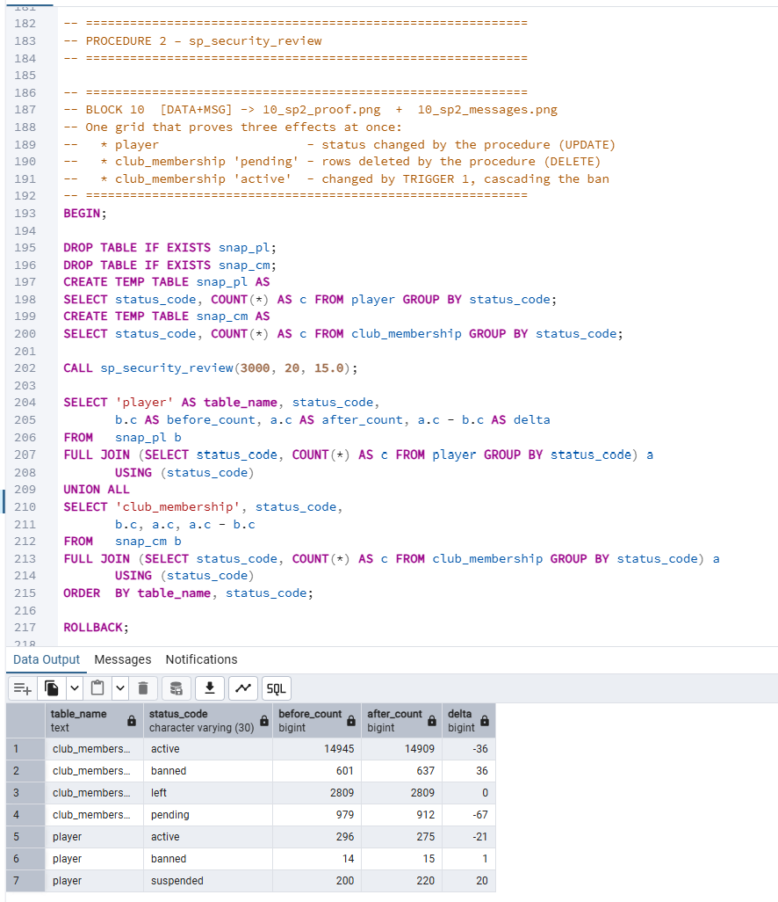

הצילום מוכיח שני אפקטים מרכזיים:

1. **הפרוצדורה עבדה** – 21 שחקנים עזבו את `active`: 20 הושעו ואחד נחסם, ו-67 בקשות חברות `pending` של אותם 21 שחקנים נמחקו על ידי ה-`DELETE`.
2. **טריגר 1 עבד** – שינוי סטטוס השחקן ל-`banned` הפעיל את הטריגר, שסנכרן 36 חברויות פעילות ל-`banned`. הפרוצדורה עצמה אינה מעדכנת חברויות פעילות.

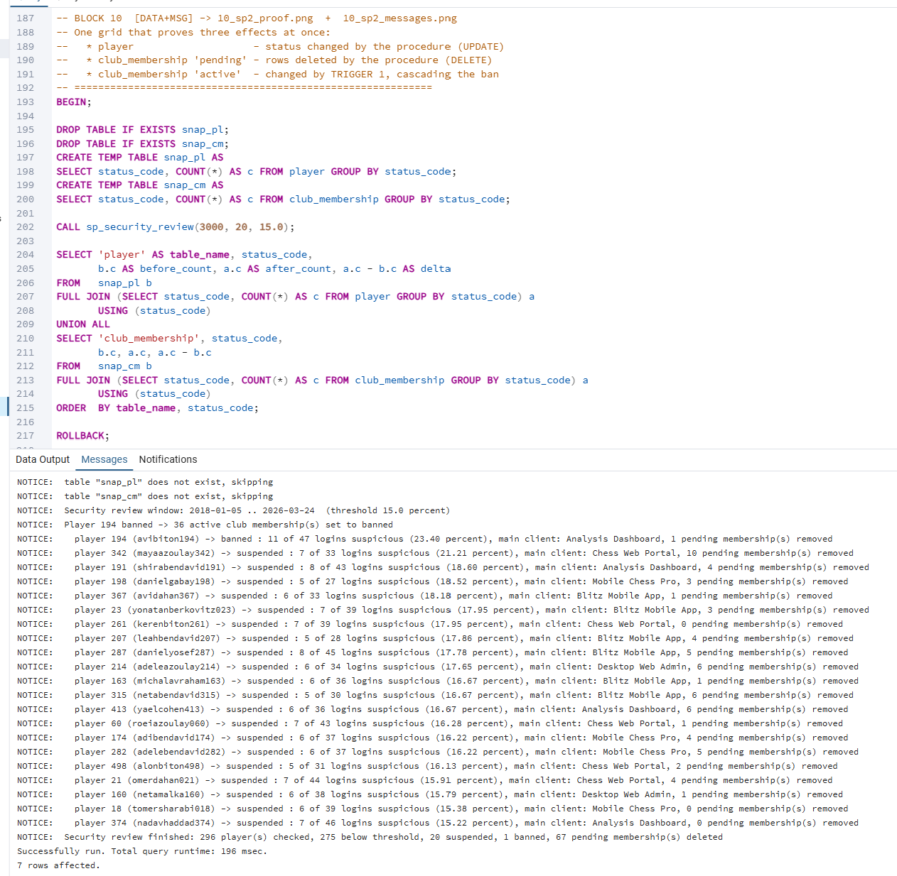

בסך הכול נבדקו 296 שחקנים: 20 הושעו, שחקן אחד נחסם ו-67 בקשות חברות ממתינות נמחקו.

**חריגה – פרמטרים לא חוקיים:**

```sql
CALL sp_security_review(0, 20, 15.0);
```

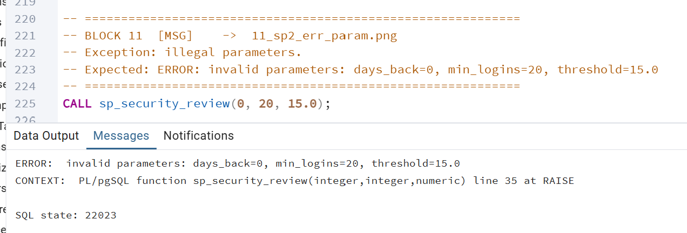

---

## 8. טריגר 1 – `trg_player_update` (UPDATE)

**קובץ:** [Trigger1_PlayerUpdate.sql](Trigger1_PlayerUpdate.sql)

### תיאור מילולי

טריגר **`BEFORE UPDATE ON player`** – זהו הטריגר בזמן `UPDATE` הנדרש במטלה. שני תפקידים, שניהם נובעים משינוי בשורת שחקן:

1. **שמירה (Guard):** דירוג לא יכול לזוז ביותר מ-400 נקודות בעדכון בודד. קפיצה כזו היא שגיאת הקלדה או שגיאת ייבוא, ולכן העדכון נדחה עם חריגה. הבדיקה מתבצעת על שלושת הדירוגים – קלאסי, מהיר ובזק.
2. **קסקייד:** כששחקן הופך ל-`banned`, החברויות הפעילות שלו במועדונים מסומנות `banned` גם הן. שחקן חסום לא יכול להישאר חבר פעיל במועדון.

הטריגר משתמש ב-`GET DIAGNOSTICS` כדי לדעת כמה שורות הקסקייד נגע בהן, ומדפיס את המספר – זו ההוכחה שהקסקייד באמת פעל וכמה רשומות הוא שינה.

### אלמנטים

| אלמנט | היכן |
|---|---|
| רשומות | `OLD` ו-`NEW` |
| הסתעפויות | בדיקת שלושת הדירוגים + בדיקת מעבר סטטוס |
| DML | `UPDATE club_membership` |
| Exception | `RAISE EXCEPTION` שדוחה את כל העדכון |
| GET DIAGNOSTICS | ספירת השורות שדורדרו |

### קוד

```sql
CREATE OR REPLACE FUNCTION trg_fn_player_update()
RETURNS TRIGGER
LANGUAGE plpgsql
AS $$
DECLARE
    v_affected INT;
BEGIN
    -- 1. guard: no rating may jump by more than 400 points at once
    IF ABS(NEW.rating_classical - OLD.rating_classical) > 400
       OR ABS(NEW.rating_rapid  - OLD.rating_rapid)     > 400
       OR ABS(NEW.rating_blitz  - OLD.rating_blitz)     > 400 THEN

        RAISE EXCEPTION
            'Rating change too large for player % (max 400 points per update): classical %->%, rapid %->%, blitz %->%',
            OLD.player_id,
            OLD.rating_classical, NEW.rating_classical,
            OLD.rating_rapid,     NEW.rating_rapid,
            OLD.rating_blitz,     NEW.rating_blitz
            USING ERRCODE = 'check_violation';
    END IF;

    -- 2. cascade: a newly banned player loses his active memberships
    IF NEW.status_code = 'banned' AND OLD.status_code <> 'banned' THEN

        UPDATE club_membership
           SET status_code = 'banned'
         WHERE player_id   = NEW.player_id
           AND status_code = 'active';

        GET DIAGNOSTICS v_affected = ROW_COUNT;

        RAISE NOTICE 'Player % banned -> % active club membership(s) set to banned',
                     NEW.player_id, v_affected;
    END IF;

    RETURN NEW;
END;
$$;

DROP TRIGGER IF EXISTS trg_player_update ON player;

CREATE TRIGGER trg_player_update
    BEFORE UPDATE ON player
    FOR EACH ROW
    EXECUTE FUNCTION trg_fn_player_update();
```

### הוכחת הרצה

**תרחיש א – קפיצת דירוג נדחית.** הדירוג של שחקן 1 הוא 956; ניסיון להוסיף 500 נדחה:

```sql
BEGIN;
UPDATE player SET rating_classical = rating_classical + 500 WHERE player_id = 1;
ROLLBACK;
```

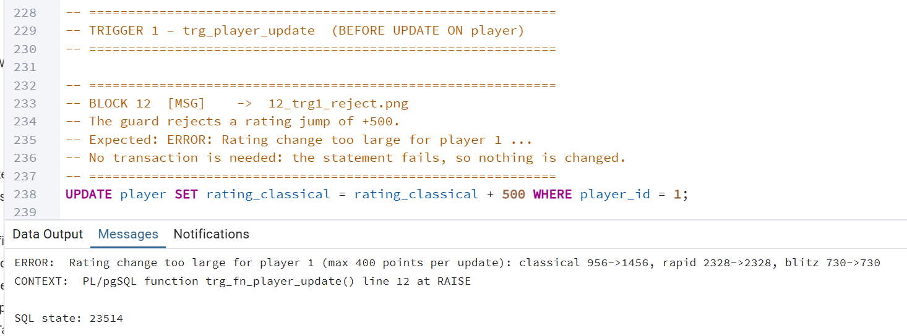

הטריגר זרק חריגה והשינוי לא בוצע.

**תרחיש ב – שינוי חוקי עובר.** אותו שחקן, תוספת של 50 נקודות:

```sql
BEGIN;
DROP TABLE IF EXISTS snap_rating;
CREATE TEMP TABLE snap_rating AS
SELECT player_id, username, rating_classical AS value_before
FROM   player WHERE player_id = 1;

UPDATE player SET rating_classical = rating_classical + 50 WHERE player_id = 1;

SELECT s.player_id, s.username, s.value_before, p.rating_classical AS value_after
FROM   snap_rating s JOIN player p ON p.player_id = s.player_id;
ROLLBACK;
```

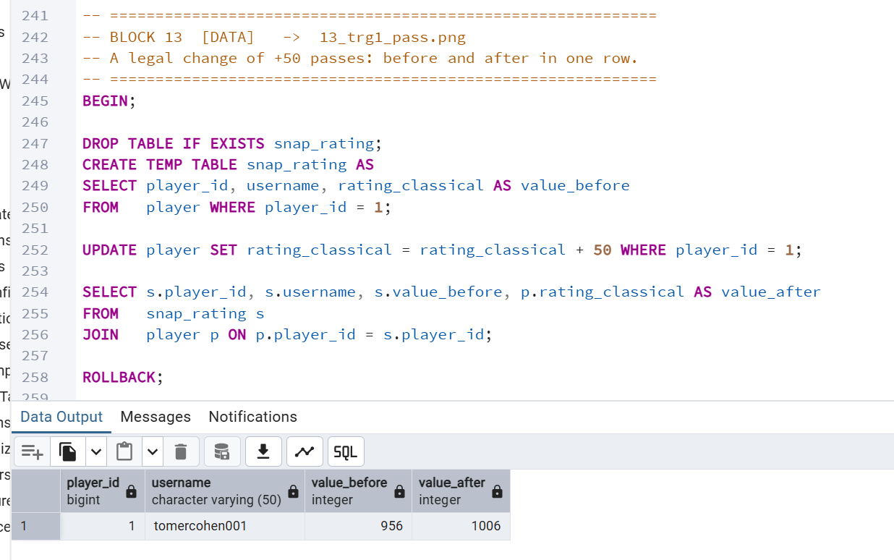

הדירוג השתנה מ-956 ל-1006, ולכן שינוי חוקי של 50 נקודות עבר בהצלחה.

**תרחיש ג – הקסקייד.** בוחרים את השחקן הפעיל עם מספר החברויות הפעילות הגדול ביותר, חוסמים אותו, ומשווים את מצב החברויות שלו:

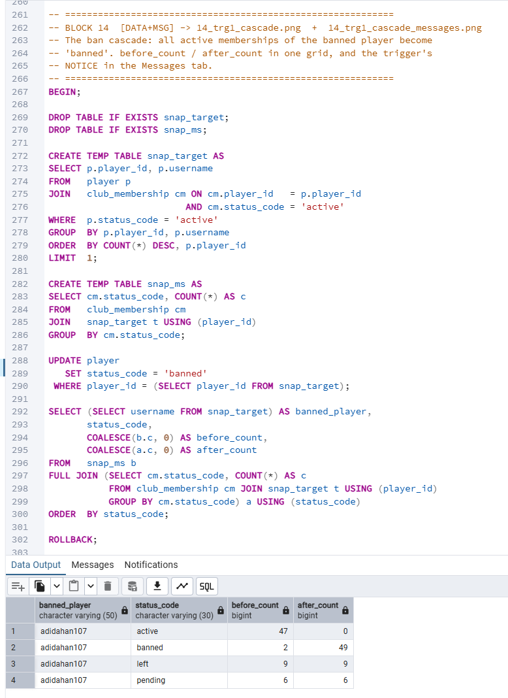

כל 47 החברויות הפעילות של השחקן עברו ל-`banned`, בעוד חברויות בסטטוסים אחרים לא השתנו.

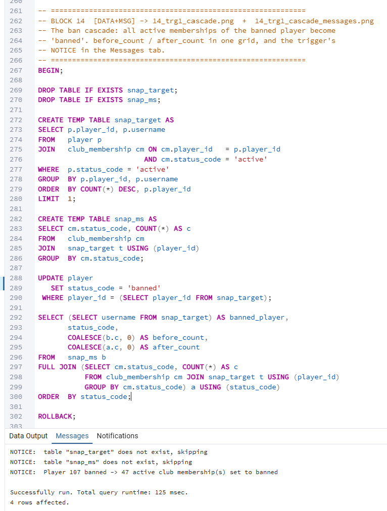

---

## 9. טריגר 2 – `trg_login_log_insert` (INSERT)

**קובץ:** [Trigger2_LoginLogInsert.sql](Trigger2_LoginLogInsert.sql)

### תיאור מילולי

טריגר **`BEFORE INSERT ON login_log`** שמשלים ומאמת שורת התחברות חדשה לפני שהיא נשמרת:

1. **דחייה:** שחקן במצב `banned` לא יכול לרשום התחברות בכלל. גם `player_id` שאינו קיים נדחה.
2. **השלמה:** אם `client_id` לא סופק, הוא נגזר מ-`device_type` באותו מיפוי בדיוק שהגדרנו באינטגרציה של שלב ג – `mobile`/`tablet` מקבלים אפליקציית Mobile, `desktop`/`laptop` מקבלים אפליקציית Web. כך עמודת הגשר לא נשארת ריקה.
3. **ניקוי:** התחברות מוצלחת לא יכולה לשאת `failure_reason`. הטריגר מאפס אותו, מה ששומר על עקביות עם אילוץ `chk_login_failure_reason` שהוספנו בשלב ב.

**הערה חשובה:** הטריגר **אינו** מייצר `log_id`. בסכמה אין sequence, וחישוב `MAX(log_id)+1` בתוך טריגר אינו בטוח כשיש הכנסות במקביל – שתי פעולות עלולות לקבל אותו מזהה. לכן ה-`log_id` מסופק על ידי הקורא, בדיוק כפי שהסכמה דורשת.

### אלמנטים

| אלמנט | היכן |
|---|---|
| Cursor מרומז | שליפת סטטוס השחקן, שליפת `client_id` מ-`uiclient` |
| הסתעפויות | שלושה תנאים בלתי תלויים |
| Exception | שחקן חסום / שחקן לא קיים |
| רשומות | `NEW` משתנה ומוחזר |

### קוד

```sql
CREATE OR REPLACE FUNCTION trg_fn_login_log_insert()
RETURNS TRIGGER
LANGUAGE plpgsql
AS $$
DECLARE
    v_player_status VARCHAR(30);
BEGIN
    -- 1. a banned player may not log in
    SELECT status_code INTO v_player_status
    FROM   player
    WHERE  player_id = NEW.player_id;

    IF NOT FOUND THEN
        RAISE EXCEPTION 'Unknown player % - login cannot be recorded', NEW.player_id
            USING ERRCODE = 'foreign_key_violation';
    END IF;

    IF v_player_status = 'banned' THEN
        RAISE EXCEPTION 'Player % is banned - login cannot be recorded', NEW.player_id
            USING ERRCODE = 'check_violation';
    END IF;

    -- 2. complete the Phase C bridge column when it was not supplied
    IF NEW.client_id IS NULL THEN
        SELECT client_id INTO NEW.client_id
        FROM   uiclient
        WHERE  client_type = CASE
                                 WHEN NEW.device_type IN ('mobile', 'tablet') THEN 'Mobile'
                                 ELSE 'Web'
                             END
        ORDER  BY client_id
        LIMIT  1;

        RAISE NOTICE 'login_log: client_id filled with % for device_type %',
                     NEW.client_id, NEW.device_type;
    END IF;

    -- 3. a successful login has no failure reason
    IF NEW.login_status_code = 'success' AND NEW.failure_reason IS NOT NULL THEN
        RAISE NOTICE 'login_log: failure_reason cleared for successful login of player %',
                     NEW.player_id;
        NEW.failure_reason := NULL;
    END IF;

    RETURN NEW;
END;
$$;

DROP TRIGGER IF EXISTS trg_login_log_insert ON login_log;

CREATE TRIGGER trg_login_log_insert
    BEFORE INSERT ON login_log
    FOR EACH ROW
    EXECUTE FUNCTION trg_fn_login_log_insert();
```

### הוכחת הרצה

**תרחיש א – השלמה וניקוי.** ה-`INSERT` מספק `log_id`, משאיר את `client_id` ריק, ומציב בטעות `failure_reason` על התחברות מוצלחת:

```sql
BEGIN;
INSERT INTO login_log
    (log_id, player_id, ip_address, country_detected, city_detected,
     device_type, operating_system, browser, login_status_code,
     failure_reason, session_duration_sec, is_suspicious, login_date)
SELECT
    (SELECT MAX(log_id) + 1 FROM login_log),
    (SELECT MIN(player_id) FROM player WHERE status_code = 'active'),
    '10.0.0.7', 'IL', 'Jerusalem',
    'mobile', 'Android 14', 'Chrome', 'success',
    'wrong password',
    900, FALSE, DATE '2026-03-25';

SELECT log_id, player_id, device_type, client_id, login_status_code,
       failure_reason, session_duration_sec, login_date
FROM   login_log ORDER BY log_id DESC LIMIT 1;
ROLLBACK;
```

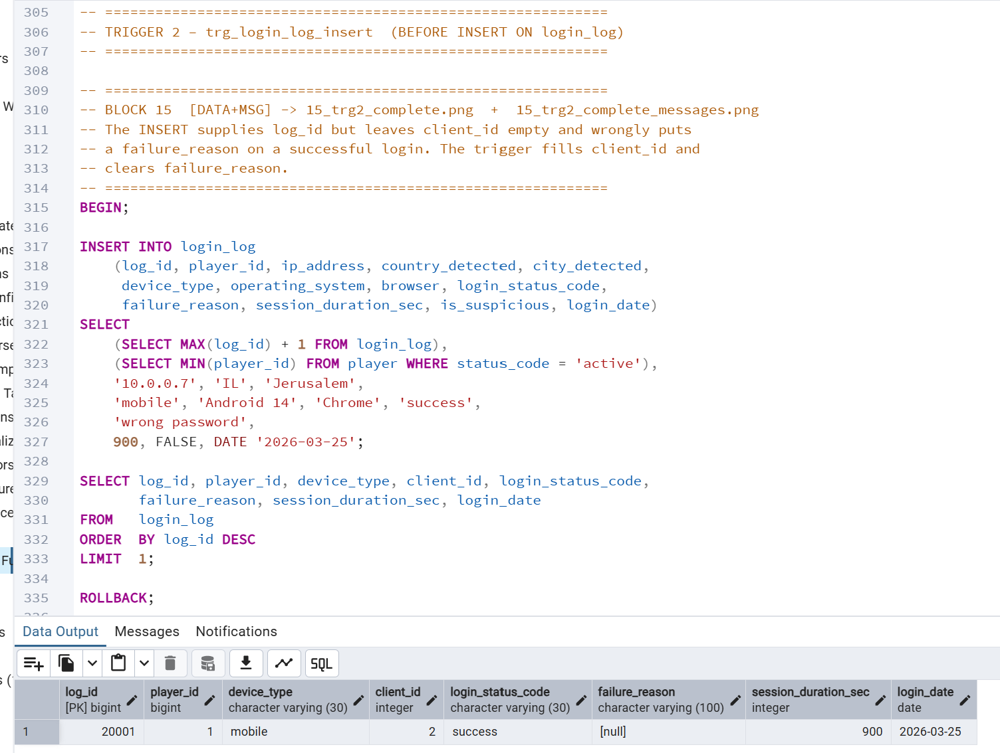

`client_id` הושלם ל-2 בהתאם למכשיר `mobile`, ו-`failure_reason` נוקה משום שההתחברות הצליחה.

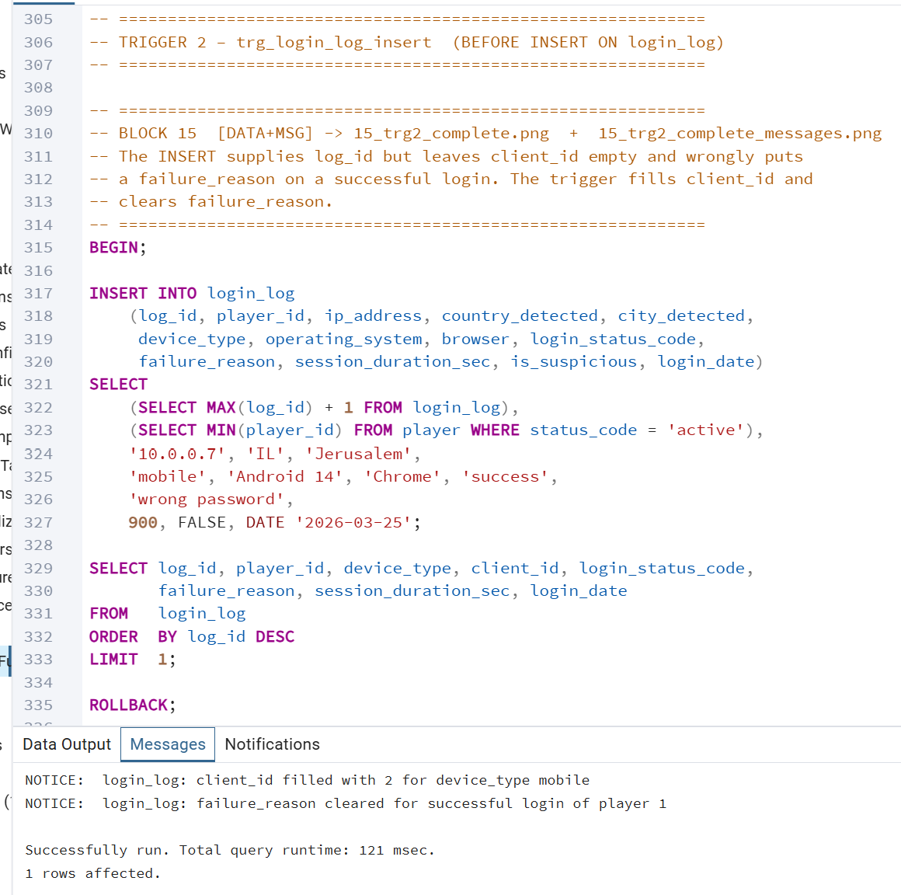

**תרחיש ב – דחיית שחקן חסום:**

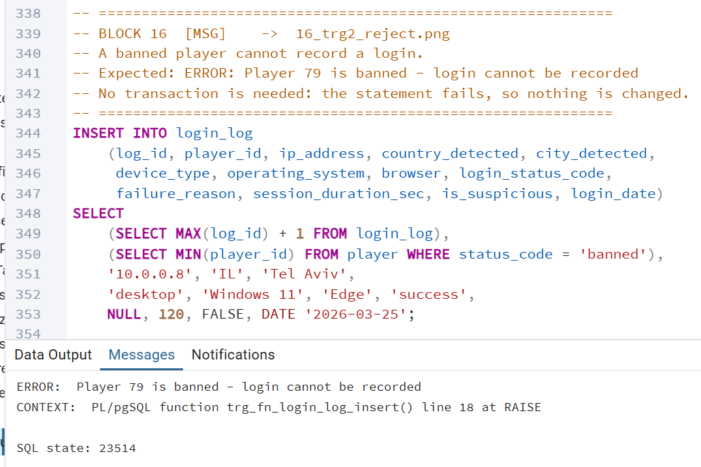

הטריגר זרק חריגה ולא נוצרה רשומת התחברות עבור השחקן החסום.

---

## 10. תוכנית ראשית 1 – `Main1_BillingAndActivity`

**קובץ:** [Main1_BillingAndActivity.sql](Main1_BillingAndActivity.sql)

### תיאור מילולי

תרחיש **"סוף חודש"**. בלוק `DO` אחד שמזמן:

1. **פרוצדורה** `sp_process_billing_cycle` – מריץ את מחזור החיוב ומדפיס את המונים שהוחזרו בפרמטרי ה-`INOUT`.
2. **פונקציה** `fn_player_activity_score` – בלולאה על 5 השחקנים הפעילים המדורגים ביותר, מחשב לכל אחד ציון פעילות ומדפיס אותו.

הבלוק עטוף ב-`EXCEPTION WHEN OTHERS` שמדפיס הודעה מזהה ואז זורק מחדש, כך שכישלון לא נעלם בשקט. כל התסריט רץ בתוך טרנזקציה שנסגרת ב-`ROLLBACK`.

### קוד הבלוק הראשי

```sql
DO $$
DECLARE
    v_renewed INT := 0;
    v_expired INT := 0;
    v_rec     RECORD;
    v_score   NUMERIC;
BEGIN
    -- part 1: call the PROCEDURE
    CALL sp_process_billing_cycle(DATE '2026-08-18', 50, v_renewed, v_expired);

    RAISE NOTICE '';
    RAISE NOTICE 'Procedure returned: renewed=%, expired=%', v_renewed, v_expired;
    RAISE NOTICE '';

    -- part 2: call the FUNCTION for the top rated active players
    RAISE NOTICE 'Activity score of the 5 highest rated active players:';

    FOR v_rec IN
        SELECT player_id, username, rating_classical
        FROM   player
        WHERE  status_code = 'active'
        ORDER  BY rating_classical DESC, player_id
        LIMIT  5
    LOOP
        v_score := fn_player_activity_score(v_rec.player_id, 365);

        RAISE NOTICE '  % (id=%, rating %) -> activity score %',
                     v_rec.username, v_rec.player_id, v_rec.rating_classical, v_score;
    END LOOP;

EXCEPTION
    WHEN OTHERS THEN
        RAISE NOTICE 'MAIN 1 FAILED: % (%)', SQLERRM, SQLSTATE;
        RAISE;
END $$;
```

### הוכחת הרצה

**פלט התוכנית** – הפרוצדורה החזירה את ספירות החידוש והפקיעה, ולאחריה הודפס ציון הפעילות של חמשת השחקנים בעלי הדירוג הגבוה ביותר:

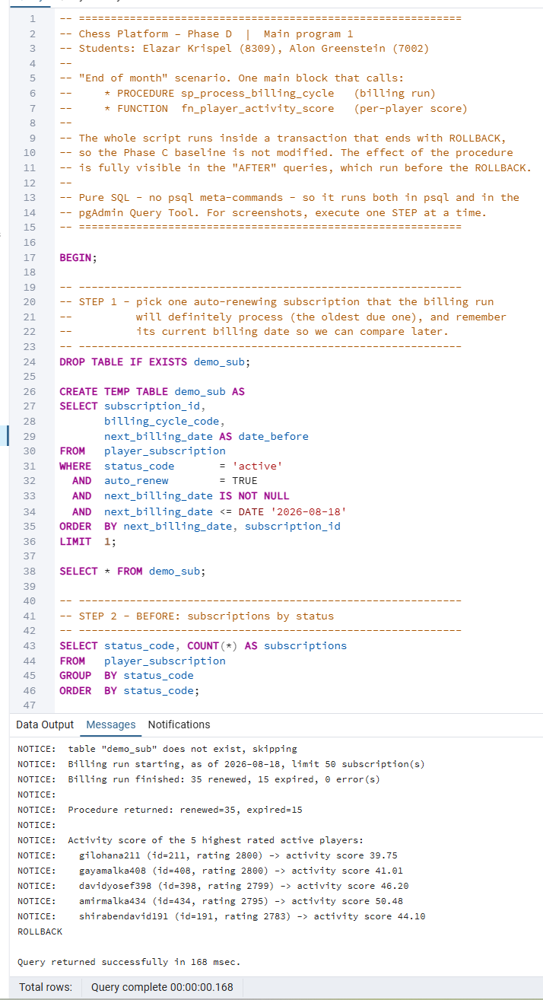

**הוכחה שבסיס הנתונים התעדכן** – התוכנית שומרת מנוי אחד עם `auto_renew = TRUE` בטבלה זמנית ומציגה את התאריך שלו לפני ואחרי:

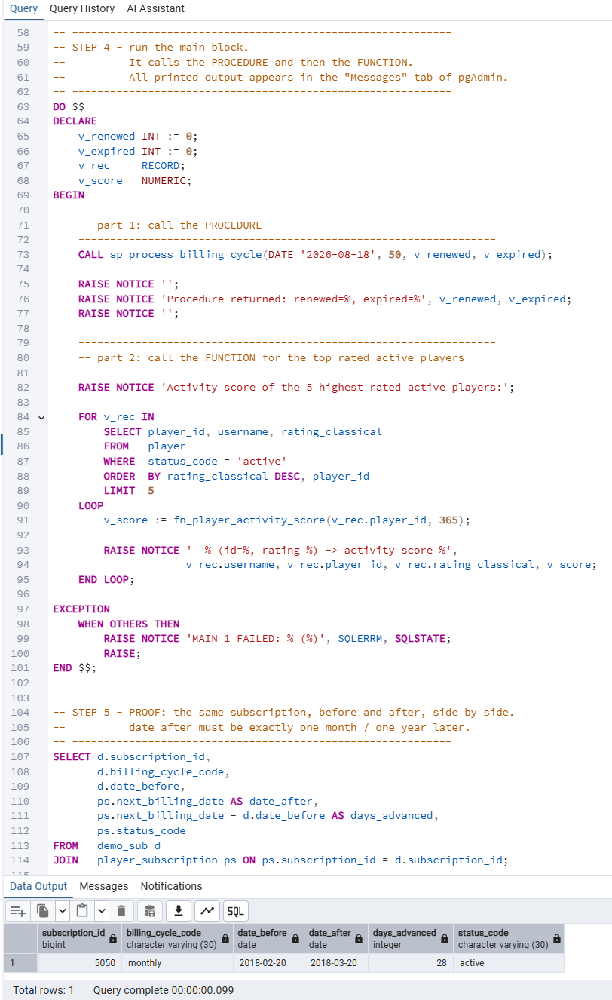

תאריך החיוב של המנוי שנבחר התקדם בחודש קלנדרי אחד, כפי שמגדיר ה-`CASE` על `billing_cycle_code`.

---

## 11. תוכנית ראשית 2 – `Main2_SecurityAndClubs`

**קובץ:** [Main2_SecurityAndClubs.sql](Main2_SecurityAndClubs.sql)

### תיאור מילולי

תרחיש **"ביקורת אבטחה"**. בלוק `DO` אחד שמזמן:

1. **פרוצדורה** `sp_security_review` – מריץ את סריקת האבטחה (ובעקיפין מפעיל את טריגר 1).
2. **פונקציה** `fn_club_report` – מקבל ממנה `REF CURSOR`, ואז **צורך אותו בלולאה**: `FETCH` שורה-שורה, סיווג כל מועדון ל-Large / Medium / Small לפי מספר החברים, והדפסה. בסוף `CLOSE`.

החלק השני הוא מה שמדגים refcursor כמו שצריך: לא רק החזרת קורסור, אלא גם צריכה שלו בקוד – בדיוק מה שתוכנית לקוח אמיתית הייתה עושה.

### קוד הבלוק הראשי

```sql
DO $$
DECLARE
    v_cur  REFCURSOR;
    v_rec  RECORD;
    v_size TEXT;
    v_n    INT := 0;
BEGIN
    -- part 1: call the PROCEDURE (also fires Trigger 1)
    CALL sp_security_review(3000, 20, 15.0);

    RAISE NOTICE '';

    -- part 2: call the FUNCTION that returns a REF CURSOR, then fetch from it
    v_cur := fn_club_report(NULL, 40);

    RAISE NOTICE 'Club report (first 10 rows of the returned cursor):';

    LOOP
        FETCH v_cur INTO v_rec;
        EXIT WHEN NOT FOUND;

        v_n := v_n + 1;
        EXIT WHEN v_n > 10;

        IF v_rec.active_members >= 45 THEN
            v_size := 'Large';
        ELSIF v_rec.active_members >= 42 THEN
            v_size := 'Medium';
        ELSE
            v_size := 'Small';
        END IF;

        RAISE NOTICE '  % [%] - % members, avg rating %, % leader(s), country %',
                     v_rec.club_name, v_size, v_rec.active_members,
                     v_rec.avg_rating, v_rec.leaders, v_rec.country_code;
    END LOOP;

    CLOSE v_cur;

EXCEPTION
    WHEN OTHERS THEN
        RAISE NOTICE 'MAIN 2 FAILED: % (%)', SQLERRM, SQLSTATE;
        RAISE;
END $$;
```

### הוכחת הרצה

**פלט התוכנית** – הפרוצדורה מדווחת על פעולות סקירת האבטחה, ולאחריה התוכנית שולפת ומדפיסה עשר רשומות מה-`REF CURSOR` שהחזירה הפונקציה:

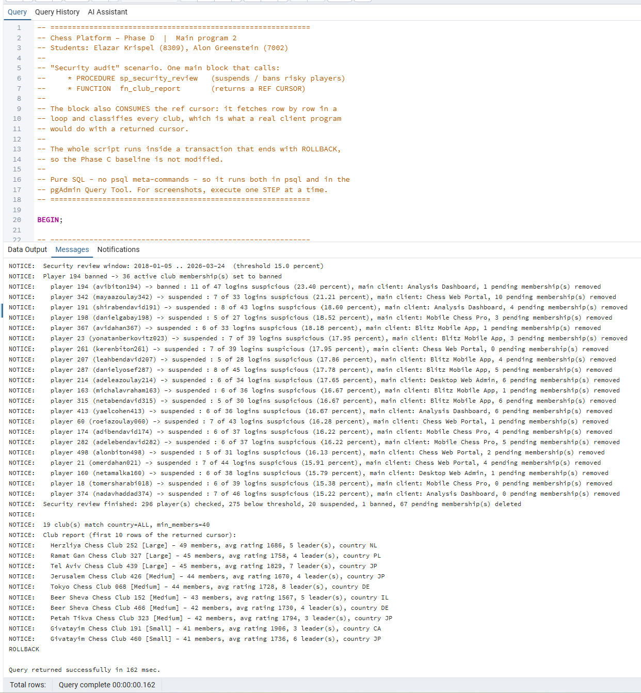

**הוכחה שבסיס הנתונים התעדכן** – מצב החברויות אחרי ההרצה:

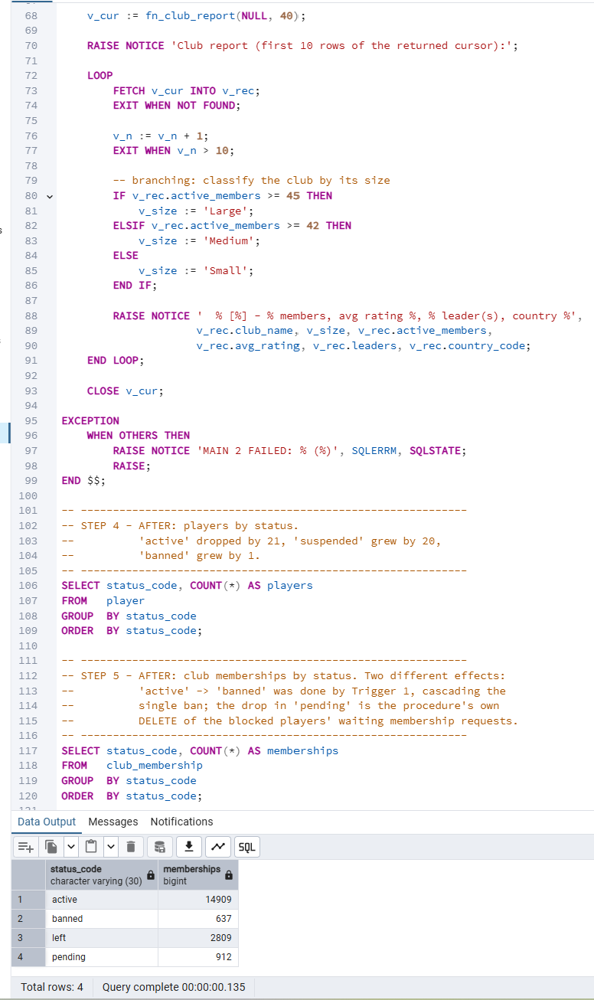

הצילום מציג הן את מחיקת החברויות הממתינות על ידי הפרוצדורה והן את שינוי החברויות הפעילות בעקבות הטריגר.

---

## 12. טבלת כיסוי דרישות

### אלמנטי PL/pgSQL

| אלמנט | Fn1 | Fn2 | Sp1 | Sp2 | Trg1 | Trg2 | Main1 | Main2 |
|---|:-:|:-:|:-:|:-:|:-:|:-:|:-:|:-:|
| **a.** Cursor מרומז | ✔ | ✔ | | ✔ | | ✔ | | |
| **a.** Cursor מפורש | ✔ | | ✔ | ✔ | | | | |
| **b.** החזרת Ref Cursor | | ✔ מחזירה | | | | | | ✔ צורכת |
| **c.** פקודות DML מרובות | | | ✔✔ UPDATE | ✔✔ UPDATE + DELETE | ✔ UPDATE | ✔ UPDATE על NEW | | |
| **d.** הסתעפויות | ✔ | ✔ | ✔ מקונן | ✔ תלת-רמתי | ✔ | ✔ | | ✔ |
| **e.** לולאות | ✔ | | ✔ | ✔ | | | ✔ | ✔ |
| **f.** Exception | ✔ זריקה | ✔ זריקה | ✔ תפיסה | ✔ זריקה | ✔ זריקה | ✔ זריקה | ✔ תפיסה | ✔ תפיסה |
| **g.** רשומות | ✔ ROWTYPE | | ✔ RECORD | ✔ RECORD | ✔ OLD/NEW | ✔ NEW | ✔ | ✔ |

### דרישות מבניות

| דרישה | מימוש |
|---|---|
| 2 פונקציות | `fn_player_activity_score`, `fn_club_report` |
| 2 פרוצדורות | `sp_process_billing_cycle`, `sp_security_review` |
| 2 טריגרים, לפחות אחד ב-UPDATE | `trg_player_update` (**BEFORE UPDATE**), `trg_login_log_insert` (BEFORE INSERT) |
| 2 תוכניות ראשיות, כל אחת פונקציה + פרוצדורה | Main1 = Sp1 + Fn1 · Main2 = Sp2 + Fn2 |
| שינויי סכמה | לא בוצעו, ולכן לא נדרש `AlterTable.sql` |
| `backup4` | `backup4.sql` – נבדק בשחזור לבסיס נקי: 6 רוטינות, 2 טריגרים, 27 טבלאות, 3 מבטים, 510 שחקנים |
| דוח שלב ד | קובץ זה |

---

## 13. סיכום

בשלב ד כתבנו 8 תוכניות PL/pgSQL על הבסיס המשולב של שלב ג, **בלי לשנות את הסכמה בכלל** ובלי לגעת באף קובץ משלבים א'-ג'.

מה שהוכח:

- **הפונקציות** מחזירות ערכים מובחנים (ציוני פעילות בטווח 26–86) ו-`REF CURSOR` שנצרך הן מ-SQL והן מתוך קוד PL/pgSQL.
- **הפרוצדורות** משנות נתונים באמת: מחזור החיוב הזיז 35 מנויים קדימה והפקיע 15, וסריקת האבטחה השעתה 20 שחקנים, חסמה אחד ומחקה 67 בקשות חברות ממתינות.
- **הטריגרים** גם דוחים נתונים לא חוקיים (קפיצת דירוג, התחברות של שחקן חסום) וגם משלימים ומדרדרים נתונים (השלמת `client_id`, קסקייד של 47 חברויות).
- **האינטראקציה בין הרכיבים** מוכחת: פרוצדורה 2 מעדכנת רק את `player`, וטבלת `club_membership` משתנה בעקבותיה – 36 שורות שטריגר 1 שינה.
- **המשכיות מול שלב ג:** שתי תוכניות משתמשות בגשר `login_log.client_id → uiclient` שנבנה בשלב ג. הרצנו מחדש את `שלב ב/Queries.sql` על הבסיס עם הטריגרים המותקנים – רץ ללא שגיאות – ושלושת המבטים של שלב ג מחזירים בדיוק את אותם מספרים שבדוח שלב ג.

כל ההדגמות שמשנות נתונים בוצעו בתוך טרנזקציות שנסגרו ב-`ROLLBACK`, ולכן ה-baseline של שלב ג נשמר במלואו.
