# דוח פרויקט - שלב ה: ממשק גרפי לעבודה מול בסיס הנתונים

**מחלקה:** Chess Platform - Users and Clubs
**סטודנטים:** אלעזר קריספל (8309) · אלון גרינשטיין (7002)
**נקודת הפתיחה:** בסיס הנתונים המשולב של שלב ג עם תוכניות שלב ד (`שלב ד/backup4.sql`: 27 טבלאות, 3 מבטים, 2 פונקציות, 2 פרוצדורות, 2 טריגרים)

---

## תוכן עניינים

1. [מבוא ומטרות](#1-מבוא-ומטרות)
2. [הוראות התקנה והפעלה](#2-הוראות-התקנה-והפעלה)
3. [כלים ודרך העבודה](#3-כלים-ודרך-העבודה)
4. [ארכיטקטורה](#4-ארכיטקטורה)
5. [מסכי המערכת](#5-מסכי-המערכת)
6. [יישום דרישות שלב ה](#6-יישום-דרישות-שלב-ה)
7. [מיפוי למסכי שלב א](#7-מיפוי-למסכי-שלב-א)
8. [טבלת כיסוי דרישות](#8-טבלת-כיסוי-דרישות)
9. [סיכום](#9-סיכום)

---

## 1. מבוא ומטרות

בשלב ה בנינו אפליקציית ניהול (admin console) שרצה בדפדפן ועובדת ישירות מול `chess_db`, בסיס הנתונים המצטבר של שלבים א-ד. האפליקציה מחליפה את pgAdmin כדרך העבודה היומיומית מול הבסיס: כל טבלה, כל מבט, כל שאילתה משלב ב וכל תת-תוכנית משלב ד נגישים ממסך אחד עם כניסה.

המטרות שהצבנו לעצמנו:

- **מסך לכל טבלה** - 27 הטבלאות ו-3 המבטים, עם ארבע פעולות CRUD (שליפה, הכנסה, עדכון, מחיקה) על כל טבלה.
- **הפעלת שאילתות שלב ב** - כל 8 שאילתות ה-SELECT (כולל שתי הגרסאות של Q5-Q8) ו-6 פקודות ה-UPDATE/DELETE, עם פרמטרים, מתוך המסכים.
- **הפעלת תוכניות שלב ד** - שתי הפונקציות, שתי הפרוצדורות ושני הטריגרים, עם תצוגה של ההודעות (`RAISE NOTICE`), הערכים המוחזרים וההשפעה על הטבלאות.
- **עדכון לפי מפתח** - המשתמש מקליד את המפתח, המערכת מביאה את שאר השדות, ומשם מעדכנים.
- **מפתחות זרים כשמות** - בשום מסך לא רואים ID של מפתח זר אלא את השם שהוא מצביע עליו.
- **תצוגה נוחה** - מסך כניסה, ניווט לכל המסכים, חיפוש מהיר, מצב כהה.

עיקרון מנחה: **בסיס הנתונים הוא מקור האמת.** האפליקציה לא משכפלת לוגיקה עסקית. האילוצים, הטריגרים והפרוצדורות רצים ב-PostgreSQL, והאפליקציה מציגה את התוצאה שלהם: הודעות, שגיאות מילוליות של הבסיס, ומצב לפני/אחרי.

שפת הממשק היא אנגלית (השמות במסכים זהים לשמות הטבלאות והעמודות בבסיס), והתיעוד בעברית.

### קבצים

| קובץ / תיקייה | תוכן |
|---|---|
| `backend/` | שרת FastAPI: מנוע CRUD גנרי, קטלוג השאילתות, הפעלת התוכניות, קונסולת SQL |
| `frontend/` | אפליקציית React: המסכים, הטפסים, הגרפים |
| `screenshots/` | 20 צילומי מסך של המערכת |
| `start.ps1` | סקריפט הפעלה בפקודה אחת |
| `הוראות הפעלה.md` | הוראות התקנה, הפעלה וכניסה מקוצרות |
| `README.md` | דוח זה |

---

## 2. הוראות התקנה והפעלה

### דרישות מוקדמות

| רכיב | גרסה | הערה |
|---|---|---|
| Docker Desktop | עדכני | מריץ את PostgreSQL 18 ו-pgAdmin |
| Python | 3.11 ומעלה | פותח עם 3.13 |
| Node.js + npm | 20 ומעלה | נדרש רק לבניית ה-frontend |
| קובץ `.env` | בשורש המאגר | `DB_USER_SECRET`, `DB_PASSWORD_SECRET`, `DB_NAME_SECRET`, `PGADMIN_EMAIL`, `PGADMIN_PASSWORD` |

השרת קורא את אותו `.env` שבו משתמש `docker-compose.yml`, כך שאין צורך להגדיר פרטי חיבור פעמיים. אופציונלי: `APP_USER` ו-`APP_PASSWORD` למשתמש הכניסה לאפליקציה (ברירת מחדל `admin` / `admin`), ו-`DB_HOST` / `DB_PORT` אם הבסיס לא רץ על `localhost:5432`.

### שלב 1: הרמת בסיס הנתונים

```powershell
cd <repo-root>
docker compose up -d
```

בעליית volume ריק, Docker טוען אוטומטית את `שלב ד/backup4.sql`. אם על המחשב קיים כבר volume ישן (למשל מהרצה של שלב א), הבסיס לא ייטען מחדש. הדרך הפשוטה היא למחוק את ה-volume ולהעלות מחדש:

```powershell
docker compose down -v
docker compose up -d
```

לחלופין, שחזור ידני בלי למחוק את ה-volume (כאשר האפליקציה לא רצה):

```powershell
docker cp "שלב ד/backup4.sql" PostgreSQL_DB:/tmp/backup4.sql
docker exec PostgreSQL_DB psql -U admin_chess -d postgres -c "DROP DATABASE IF EXISTS chess_db;" -c "CREATE DATABASE chess_db;"
docker exec PostgreSQL_DB psql -U admin_chess -d chess_db -f /tmp/backup4.sql
```

(`admin_chess` הוא הערך של `DB_USER_SECRET` ב-`.env`.)

### שלב 2א: הפעלה בפקודה אחת

```powershell
powershell -ExecutionPolicy Bypass -File "שלב ה/start.ps1"
```

הסקריפט בונה את ה-frontend אם עדיין לא נבנה (`npm install` + `npm run build`), מתקין את תלויות ה-backend (`pip install -r requirements.txt`), מרים את השרת על `http://localhost:8000` ופותח את הדפדפן.

### שלב 2ב: הפעלה ידנית

```powershell
cd "שלב ה/frontend"
npm install
npm run build

cd "../backend"
pip install -r requirements.txt
python -m uvicorn app.main:app --port 8000
```

### שלב 3: כניסה

פותחים `http://localhost:8000` ונכנסים עם `admin` / `admin`. תיעוד ה-API האוטומטי של FastAPI זמין ב-`http://localhost:8000/docs`.

### מצב פיתוח

```powershell
cd "שלב ה/frontend"
npm run dev
```

Vite מרים שרת פיתוח על `http://localhost:5173` עם טעינה חמה, ומעביר כל קריאה ל-`/api` אל ה-backend על 8000 (שצריך לרוץ במקביל).

### פתרון תקלות

| תופעה | סיבה ופתרון |
|---|---|
| `address already in use` בעליית השרת | פורט 8000 תפוס. `netstat -ano \| findstr :8000` ולסגור את התהליך, או להריץ עם `--port 8001` |
| מסך הכניסה מציג שגיאת חיבור לבסיס | הקונטיינר לא רץ: `docker ps` צריך להציג `PostgreSQL_DB`; אם לא, `docker compose up -d` |
| `password authentication failed` | ערכי `.env` לא תואמים לקונטיינר. הקונטיינר קובע את הסיסמה רק ביצירת volume חדש |
| Dashboard מציג "Stage 4 objects missing" | volume ישן בלי הרוטינות של שלב ד. לבצע שחזור לפי שלב 1 |
| `frontend not built yet` בפתיחת הכתובת | ה-frontend לא נבנה. `npm run build` בתיקיית `frontend` |
| `npm install` נכשל בגלל הנתיב | נתיב עם עברית ורווח. לשכפל את המאגר לנתיב באנגלית בלי רווחים |
| `python` לא מזוהה | ב-Windows להשתמש ב-`py -3` במקום `python` |

---

## 3. כלים ודרך העבודה

### הכלים ולמה בחרנו בהם

| שכבה | כלי | למה |
|---|---|---|
| Frontend | React 19 + TypeScript + Vite 8 | מודל קומפוננטות, טיפוסים שנגזרים מחוזה ה-API, שרת פיתוח מהיר עם proxy |
| רכיבי UI | Mantine 8 | סט שלם: טבלאות, מודלים, בוחרי תאריך, התראות, Spotlight, גרפים, מצב כהה מובנה. חסך לנו כתיבת רכיבים בסיסיים |
| גרפים | Recharts דרך `@mantine/charts` | גרפי קו, עמודות ודונאט עם עיצוב אחיד לשאר הממשק |
| אייקונים | Tabler Icons | אייקון לכל טבלה וכל מסך בסרגל הניווט |
| מצב שרת | TanStack Query | מטמון תוצאות וביטול אוטומטי אחרי כל הכנסה/עדכון/מחיקה, כך שהטבלה מתרעננת מיד |
| ניתוב | React Router | כתובת קבועה לכל מסך (`/tables/player`, `/players/42`, `/reports`) |
| Backend | Python 3.13 + FastAPI | ולידציה של קלט, תיעוד OpenAPI אוטומטי ב-`/docs`, מעט קוד לכל endpoint |
| גישה לבסיס | psycopg 3 + connection pool | דרייבר PostgreSQL עם פרמטרים בצד השרת (בלי הדבקת מחרוזות), לכידת `RAISE NOTICE`, וטרנזקציות מפורשות |
| בסיס נתונים | PostgreSQL 18 ב-Docker | אותה סביבה משלבים א-ד, ללא שינוי |
| טיפוגרפיה | Manrope + JetBrains Mono | גופן קריא לטקסט, גופן monospace למזהים ול-SQL |

### דרך העבודה

1. **שחזור הבסיס ואימות.** התחלנו משחזור `backup4.sql` לתוך הקונטיינר ואימות שכל אובייקטי שלב ד קיימים (27 טבלאות, 3 מבטים, 4 רוטינות, 2 טריגרים). ה-Dashboard מציג את הבדיקה הזו כל הזמן (Stage 4 health).
2. **חוזה API קודם לקוד.** כתבנו תחילה את חוזה ה-API (הנתיבים, הפרמטרים וצורת התשובה של כל endpoint), ורק אז פיתחנו את ה-backend ואת ה-frontend במקביל מולו. הטיפוסים ב-`src/api/types.ts` הם תרגום ישיר של החוזה.
3. **מנוע CRUD מונחה מטא-נתונים.** במקום לכתוב 30 מסכים, כתבנו מנוע אחד: ה-backend קורא את הסכמה מ-`information_schema` (מפתחות ראשיים, מפתחות זרים, טיפוסים, NULL) ומשלים אותה מרשימת רישום (`registry.py`) עם תוויות, קיבוץ לקבוצות, אייקון, עמודת התצוגה של כל טבלה ועמודות החיפוש. ה-frontend מקבל את המטא-נתונים ומרנדר כל טבלה מהם: עמודות, טפסים, בוחרי FK, פילטרים.
4. **בדיקות איטרטיביות מול הבסיס החי.** כל endpoint נבדק מול הבסיס האמיתי (כניסה, שליפה, הכנסה, עדכון, מחיקה של רשומת בדיקה, כל 8 השאילתות, 4 התוכניות, הדגמות הטריגרים). אחרי כל תיקון עברנו שוב על המסכים בדפדפן.
5. **צילומי מסך ותיעוד.** בסוף צילמנו כל מסך במצב עבודה אמיתי וכתבנו את הדוח הזה ואת הוראות ההפעלה.

### שתי החלטות תכנון שכדאי להכיר

- **מזהים.** בסכמה אין sequences; כל מפתח ראשי הוא `bigint`/`integer` רגיל. לכן בהכנסה של רשומה חדשה השרת מחשב `COALESCE(MAX(pk), 0) + 1` באותה טרנזקציה של ה-INSERT. בטבלאות עם מפתח מורכב (`servercomponent`, `engine_ui_support`, `installed_on`) או מפתח מחרוזתי (טבלאות ה-lookup) המשתמש מזין את המפתח בעצמו.
- **שורות ריפוד ב-lookup.** כל טבלת lookup מכילה 500 שורות, אבל רק 2-5 מהן אמיתיות (`active`, `banned`, `monthly` וכו'); השאר ריפוד משלב א (`ps0007`, `Tier 042`). בוחרי ה-FK מסננים את הריפוד ומציגים את הקודים האמיתיים תחילה, ורק חיפוש מפורש מגיע לשורות הריפוד.

---

## 4. ארכיטקטורה

### זרימת בקשה

```
+-----------------------+        HTTP /api/*         +----------------------------+
|  דפדפן                |  ------------------------> |  FastAPI  (localhost:8000) |
|  React + Mantine      |  Authorization: Bearer     |  routers/: auth, meta,     |
|  TanStack Query       |  <------------------------ |  crud, queries, programs,  |
|  (frontend/dist)      |  JSON + notices[]          |  dashboard, sql            |
+-----------------------+                            +-------------+--------------+
                                                                   |  psycopg 3
                                                                   |  connection pool
                                                                   |  notice handler
                                                                   v
                                                     +----------------------------+
                                                     |  PostgreSQL 18 (Docker)    |
                                                     |  chess_db: 27 tables,      |
                                                     |  3 views, fn_*, sp_*, trg_*|
                                                     +----------------------------+
```

- אותו תהליך משרת גם את ה-API וגם את ה-frontend הבנוי (`frontend/dist`), ולכן כתובת אחת מספיקה.
- כל בקשה מקבלת חיבור מה-pool, רושמת `notice handler` שאוסף `RAISE NOTICE` / `WARNING`, מריצה את ה-SQL בטרנזקציה מפורשת, ומחזירה את ההודעות בשדה `notices` של התשובה. אם לא בוצע `COMMIT`, החיבור עושה `ROLLBACK` אוטומטית - זה הבסיס למצב Preview.
- שגיאת PostgreSQL (אילוץ, טריגר, FK) הופכת לתשובת 400 עם `message`, `code`, `hint` ו-`constraint`, וה-UI מציג את ההודעה של הבסיס כלשונה.
- הכניסה מבוססת bearer token שנשמר בזיכרון השרת; כל `/api/*` חוץ מ-`/api/auth/login` דורש אותו.

### מבנה התיקיות

```
שלב ה/
  backend/
    app/
      main.py            FastAPI: routers, טיפול בשגיאות psycopg, הגשת ה-SPA
      config.py          קריאת .env (פרטי חיבור, משתמש האפליקציה)
      db.py              connection pool, get_conn(), לכידת notices, error_payload()
      security.py        bearer token: הנפקה, אימות, ביטול
      registry.py        רישום 27 הטבלאות ו-3 המבטים: תוויות, קבוצות, אייקון, תצוגת FK
      routers/
        auth.py          POST /api/auth/login, logout
        meta.py          GET /api/meta/tables
        crud.py          שליפה/הכנסה/עדכון/מחיקה גנריים + options לבוחרי FK
        queries.py       קטלוג שאילתות שלב ב והרצתן (preview/apply)
        programs.py      פונקציות, פרוצדורות והדגמות טריגרים של שלב ד
        dashboard.py     KPI וגרפים
        sql.py           קונסולת SQL
    requirements.txt
  frontend/
    src/
      api/               client.ts (fetch + token), types.ts (חוזה ה-API)
      components/
        shell/           AppShell: סרגל ניווט, כותרת, Spotlight, מצב כהה
        ui/              PageHeader, KpiCard, SqlBlock, NoticeConsole, ErrorAlert, EmptyState
        data/            DataTable, RecordForm, UpdateByKey, FkSelect, CellValue
        reports/         כרטיסי שאילתות, טופס פרמטרים, מתג A/B, לפני/אחרי
        programs/        כרטיסי התוכניות, הדגמות הטריגרים
        detail/          רכיבי Player 360 ו-Club detail
      pages/             Login, Dashboard, TablePage, PlayerDetail, ClubDetail, Reports, Programs, SqlConsole
      nav.ts             קבוצות הניווט והאייקונים
      routes.tsx         הנתיבים
      theme.ts           ערכת הצבעים והגופנים
    package.json, vite.config.ts (proxy ל-/api)
  screenshots/           NN_name.png
  start.ps1
  README.md
  הוראות הפעלה.md
```

### נקודות הקצה של ה-API

| Method | נתיב | תפקיד |
|---|---|---|
| POST | `/api/auth/login` | כניסה; מחזיר token |
| GET | `/api/meta/tables` | מטא-נתונים של 30 הישויות: עמודות, טיפוסים, מפתחות, FK, קבוצה |
| GET | `/api/tables/{t}` | שליפה עם חיפוש, מיון, עימוד וסינון; לכל FK מצורף `_labels` עם השם המתורגם |
| GET | `/api/tables/{t}/row?pk=..` | שורה בודדת לפי מפתח (הבסיס ל"עדכון לפי מפתח") |
| POST | `/api/tables/{t}` | הכנסה; מפתח מספרי בודד מחושב `MAX+1` |
| PUT | `/api/tables/{t}?pk=..` | עדכון חלקי |
| DELETE | `/api/tables/{t}?pk=..` | מחיקה |
| GET | `/api/tables/{t}/options?q=` | אפשרויות לבוחר FK (ריפוד מסונן) |
| GET | `/api/queries` | קטלוג Q1-Q8, U1-U3, D1-D3 עם פרמטרים וגרסאות |
| POST | `/api/queries/{id}/run` | הרצה; ל-DML מצב `preview` (ROLLBACK) או `apply` (COMMIT) עם לפני/אחרי |
| GET | `/api/programs/health` | האם אובייקטי שלב ד מותקנים |
| POST | `/api/programs/activity-score` | `fn_player_activity_score` |
| POST | `/api/programs/club-report` | `fn_club_report` + `FETCH ALL` מה-REF CURSOR |
| POST | `/api/programs/billing-cycle` | `sp_process_billing_cycle` עם ערכי ה-INOUT |
| POST | `/api/programs/security-review` | `sp_security_review` עם ההודעות ולפני/אחרי |
| POST | `/api/programs/trigger/*` | הדגמות `trg_player_update` ו-`trg_login_log_insert` |
| GET | `/api/dashboard` | KPI וסדרות לגרפים |
| POST | `/api/sql` | קונסולת SQL חופשית |
| GET | `/api/health` | חיות השרת |

---

## 5. מסכי המערכת

### 5.1 מסך כניסה

הכניסה למערכת. שם משתמש וסיסמה נבדקים מול `APP_USER` / `APP_PASSWORD`, ובהצלחה מתקבל token שמצורף לכל בקשה. מהמסך הזה, דרך סרגל הניווט, מגיעים לכל מסך אחר במערכת.

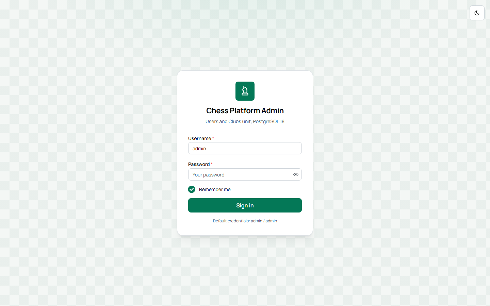

### 5.2 Dashboard

מסך הבית אחרי הכניסה. מציג KPI (שחקנים, שחקנים פעילים, מועדונים, חברויות פעילות, מנויים פעילים, התחברויות, אחוז התחברויות חשודות, מנועים, שרתים), גרפים (התחברויות לפי חודש, התפלגות דירוגים, תוכניות המנוי הפופולריות, שחקנים לפי מדינה וסטטוס), כרטיסי ניווט מהיר לכל מודול, ותג **Stage 4 health** שמאמת שכל הפונקציות, הפרוצדורות והטריגרים מותקנים. הנתונים נשלפים ב-`GET /api/dashboard` מהטבלאות `player`, `club`, `club_membership`, `player_subscription`, `login_log`, `engine`, `hardwarenode`.

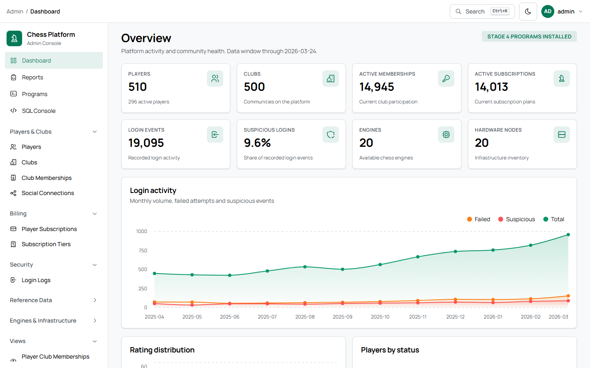

### 5.3 מסכי הטבלאות (27 טבלאות + 3 מבטים)

מסך אחד גנרי, `/tables/:key`, משרת את כל הישויות. בסרגל הניווט הן מקובצות: **Players & Clubs** (`player`, `club`, `club_membership`, `social_connection`), **Billing** (`player_subscription`, `subscription_tier`), **Security** (`login_log`, `uiclient`), **Reference Data** (8 טבלאות ה-lookup), **Engines & Infrastructure** (12 טבלאות האגף השותף) ו-**Views** (3 המבטים, לקריאה בלבד).

מה אפשר לעשות בכל טבלה:

- **שליפה** - חיפוש טקסט חופשי בעמודות הרלוונטיות, מיון לפי כל עמודה, עימוד, וסינון לפי ערכי FK ו-lookup.
- **מפתחות זרים כשמות** - `status_code` מוצג כ-"Active" ולא `active`, `player_id` מוצג כשם המשתמש, `club_id` כשם המועדון, `engine_id` כשם המנוע וגרסתו. ה-ID עצמו נשאר זמין בתג monospace קטן.
- **הכנסה** - כפתור New record פותח טופס שנבנה מהמטא-נתונים: בוחר FK עם חיפוש, בוחר תאריך, מתג לבוליאני, שדה מספרי, שדה מוסתר לעמודות סודיות (`cloudengine.auth_token`). המפתח מחושב אוטומטית.
- **עדכון** - עריכה משורת הטבלה, או דרך פאנל **Update by key** (5.4).
- **מחיקה** - עם חלון אישור; אם הבסיס מסרב (הפרת FK) ההודעה שלו מוצגת.

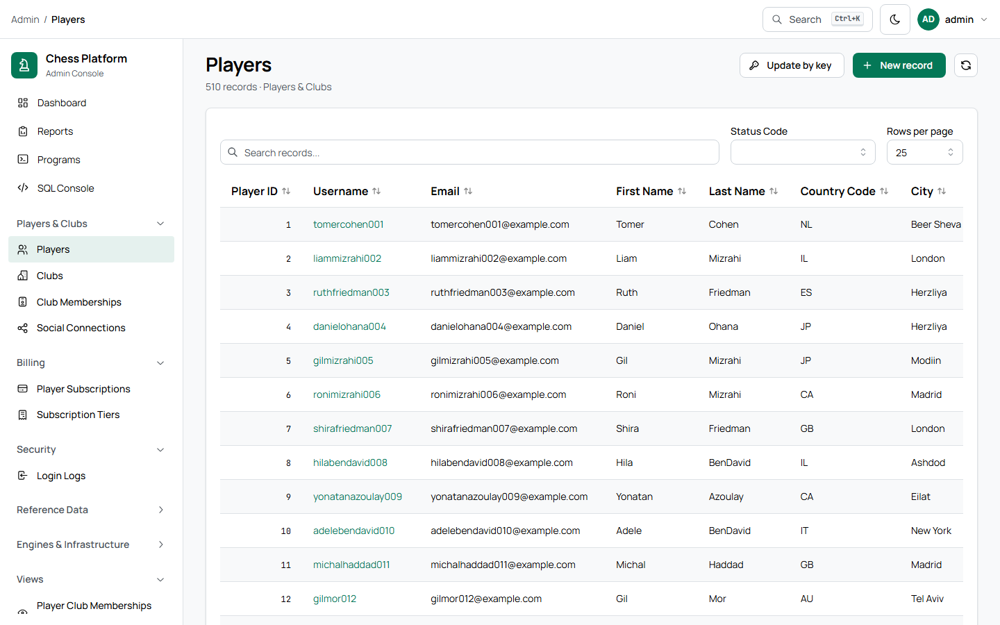

טופס הרשומה, כאן הכנסת חברות חדשה במועדון עם בוחרי FK לשחקן, למועדון, לתפקיד ולסטטוס:

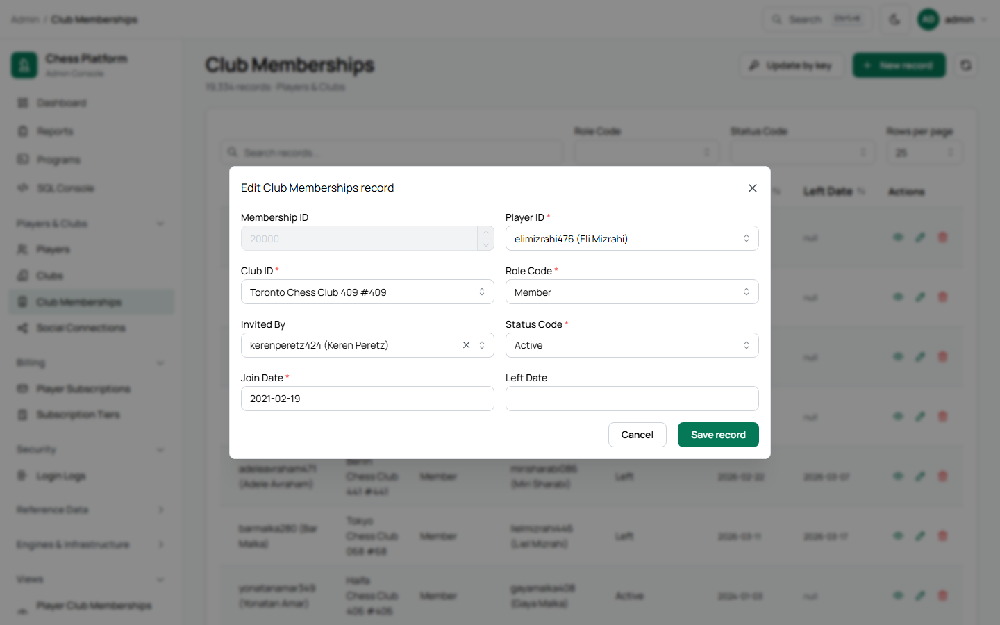

הטבלאות של האגף השותף מוצגות באותו מנוע, כולל טבלה עם מפתח מורכב (`servercomponent`) וטבלה עם עמודת `timestamp` (`hardwaretelemetry`):

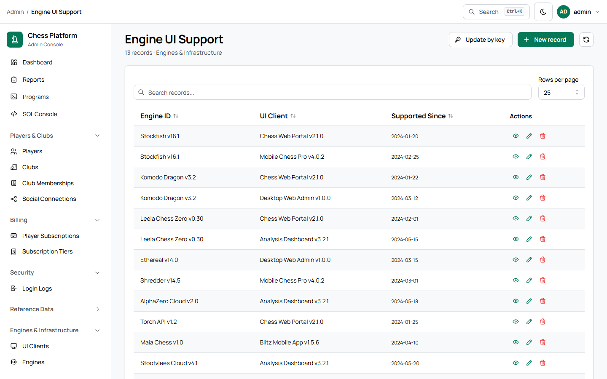

### 5.4 עדכון לפי מפתח

הדרישה המפורשת של שלב ה: המשתמש ממלא את המפתח, המערכת מביאה את יתר השדות, ומשם מעדכנים. בכל מסך טבלה יש פאנל **Update by key**: מקלידים את ערך המפתח (או כמה ערכים בטבלה עם מפתח מורכב), לוחצים Fetch, השרת מחזיר את השורה מ-`GET /api/tables/{t}/row`, הטופס מתמלא, המשתמש משנה מה שצריך ולוחץ Save. אם המפתח לא קיים מוצגת הודעה ברורה.

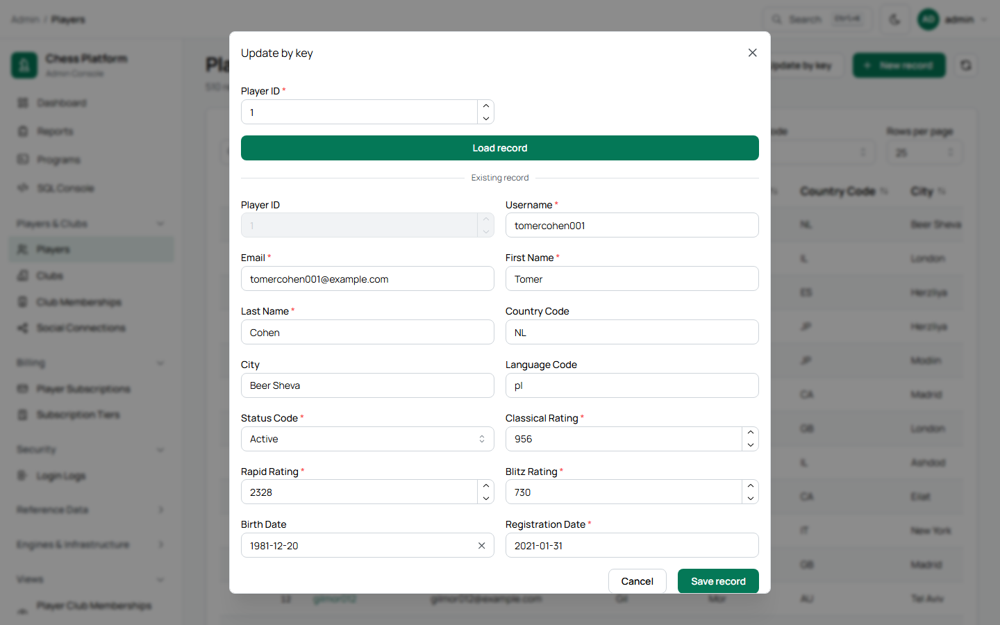

מחיקה עם אישור:

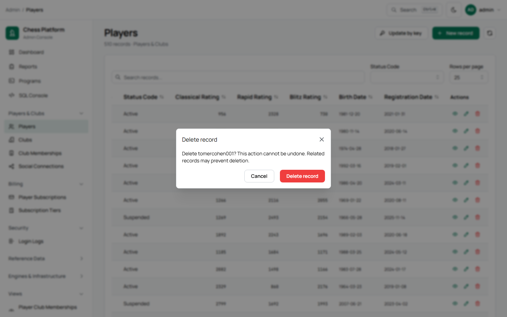

### 5.5 Player 360

`/players/:id`. מסך פרופיל לשחקן בודד: כותרת עם שם וסטטוס, שלושה כרטיסי דירוג (Classical / Rapid / Blitz), החברויות שלו במועדונים (מהמבט `vw_player_club_membership`), המנויים, ההתחברויות האחרונות, ספירת הקשרים החברתיים, ומד **Activity score** שקורא ל-`fn_player_activity_score` עם חלון ימים לבחירה. פעולות מהירות: עריכה, רישום התחברות (מפעיל את `trg_login_log_insert`), וחסימה (מפעילה את הקסקייד של `trg_player_update`).

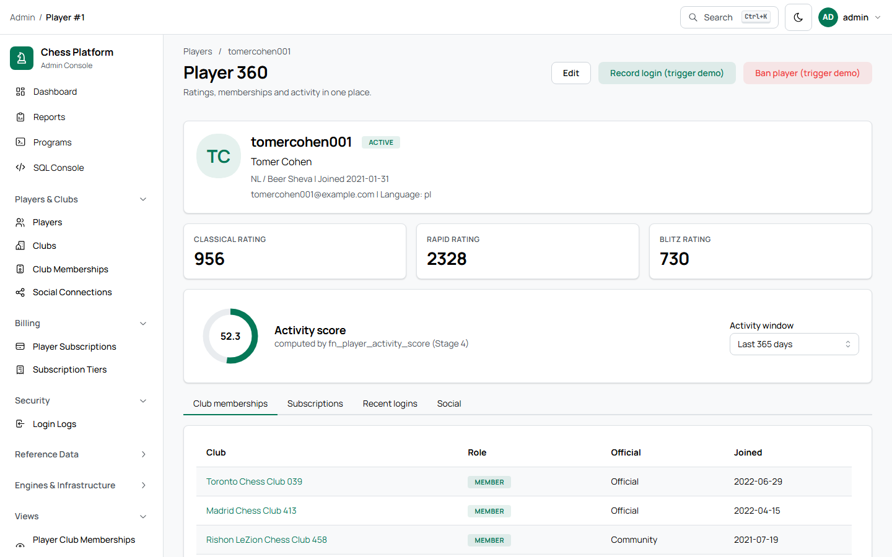

### 5.6 Club detail

`/clubs/:id`. כותרת המועדון (מדינה, עיר, רשמי/לא רשמי, תאריך הקמה), טבלת החברים עם התפקיד והסטטוס של כל אחד (מ-`club_membership` בצירוף `player`, `membership_role`, `membership_status`), וסטטיסטיקה: חברים פעילים, מספר בעלים ומנהלים, דירוג ממוצע.

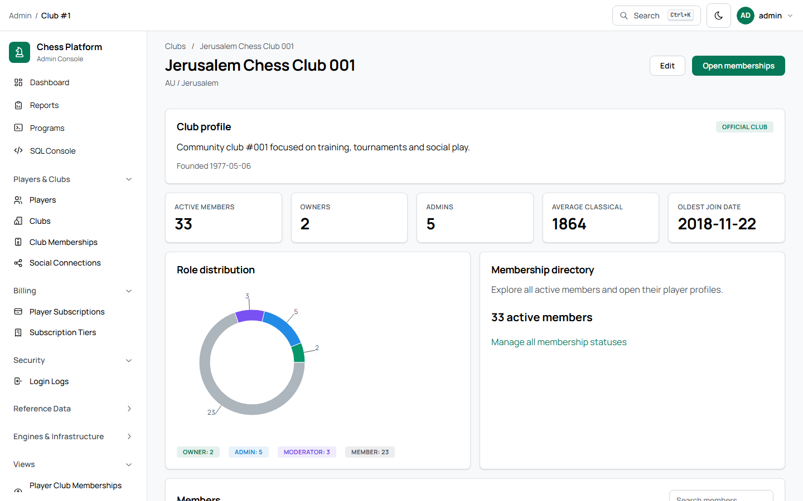

### 5.7 Reports: שאילתות שלב ב

`/reports`. קטלוג של 14 כרטיסים: Q1-Q8 (SELECT), U1-U3 (UPDATE), D1-D3 (DELETE). לכל שאילתה טופס פרמטרים (למשל `min_clubs` ב-Q5, טווח שנים ב-Q2, מספר ימים ב-D1), הצגת ה-SQL, טבלת תוצאות עם זמן ריצה, וגרף היכן שזה טבעי (Q2 קו לפי חודש, Q3 עמודות לפי תוכנית). ב-Q5-Q8, שנכתבו בשלב ב בשתי גרסאות, מתג **A/B** מציג את שתי הגרסאות זו לצד זו עם הסבר היעילות:

| שאילתה | גרסה A | גרסה B | היעילה יותר |
|---|---|---|---|
| Q5 שחקנים ב-N מועדונים | JOIN + GROUP BY + HAVING | IN + תת-שאילתה מתואמת | A: סריקה אחת של `club_membership` |
| Q6 שחקנים עם מנוי פעיל | JOIN + DISTINCT | EXISTS | B: עוצר בהתאמה הראשונה, בלי DISTINCT |
| Q7 שחקנים שמעולם לא התחברו | LEFT JOIN ... IS NULL | NOT EXISTS | B: לא בונה צירוף מלא ומסנן אחריו |
| Q8 סטטיסטיקת מועדונים | CTE | טבלה נגזרת ב-FROM | זהות: PostgreSQL מטמיע CTE לא-מוחשי |

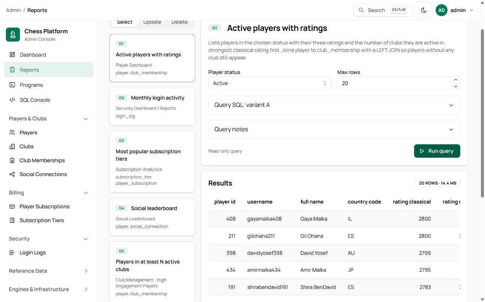

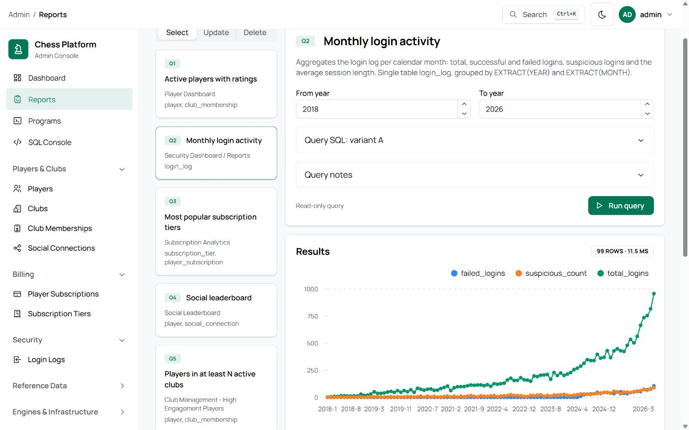

פקודות ה-UPDATE וה-DELETE רצות בטרנזקציה עם צילום לפני/אחרי. מתג **Preview / Apply** קובע אם הטרנזקציה מסתיימת ב-`ROLLBACK` (ברירת המחדל: מציגים את ההשפעה בלי לשנות נתונים) או ב-`COMMIT`. U1 (השעיית שחקנים עם התחברויות חשודות) מפעיל את `trg_player_update`, כך שגם כאן רואים את הטריגר בפעולה.

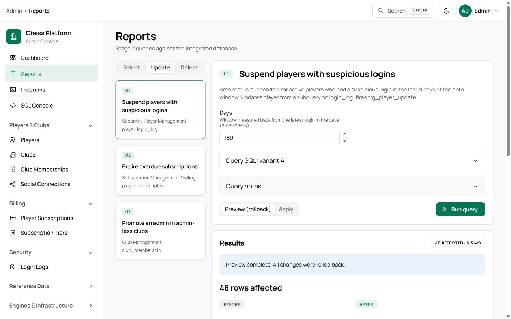

### 5.8 Programs: תוכניות שלב ד

`/programs`. ארבעה כרטיסים, אחד לכל תת-תוכנית, עם טופס פרמטרים שברירות המחדל שלו יחסיות לנתונים (ההתחברות האחרונה בבסיס היא 2026-03-24):

| תוכנית | פרמטרים | מה רואים |
|---|---|---|
| `fn_player_activity_score` | `player_id`, `days_back` | הציון 0-100, או השגיאה (`Player % does not exist`, `p_days_back must be positive`) |
| `fn_club_report` (REF CURSOR) | `country` (או NULL לכולן), `min_members` | ה-NOTICE עם מספר ההתאמות, וטבלת השורות שנשלפו מהקורסור ב-`FETCH ALL` באותה טרנזקציה |
| `sp_process_billing_cycle` | `as_of` (2026-08-18), `limit` | ערכי ה-INOUT `p_renewed` / `p_expired`, ההודעות, ולפני/אחרי על `player_subscription` |
| `sp_security_review` | `days_back` 3000, `min_logins` 20, `threshold_pct` 15.0 | קונסולת ההודעות של הפרוצדורה (שורה לכל שחקן שנבדק), ומצב הסטטוסים והחברויות לפני/אחרי |

לשתי הפרוצדורות יש מתג Preview / Apply כמו בדוחות.

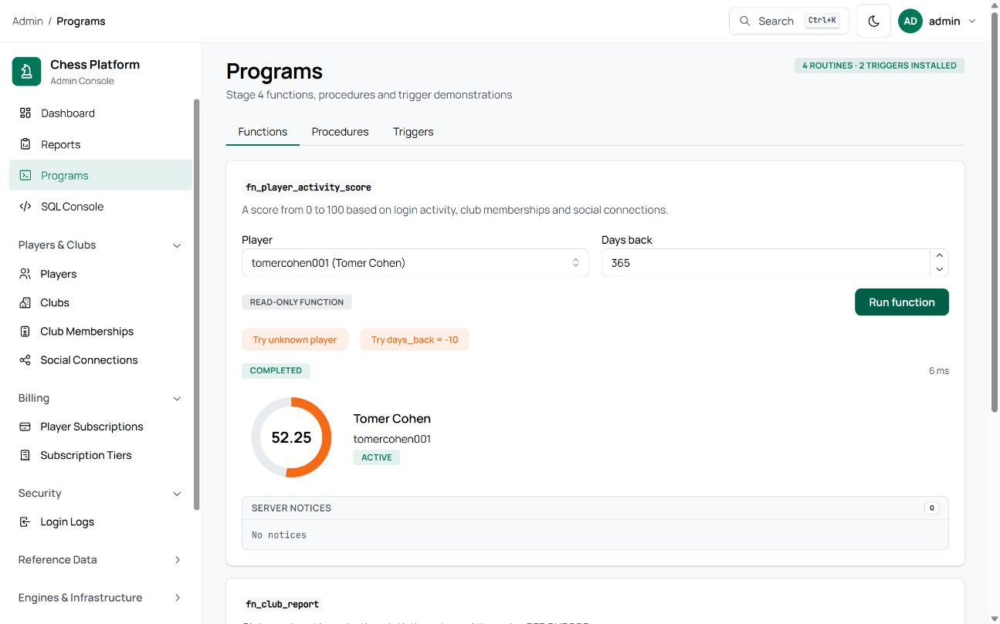

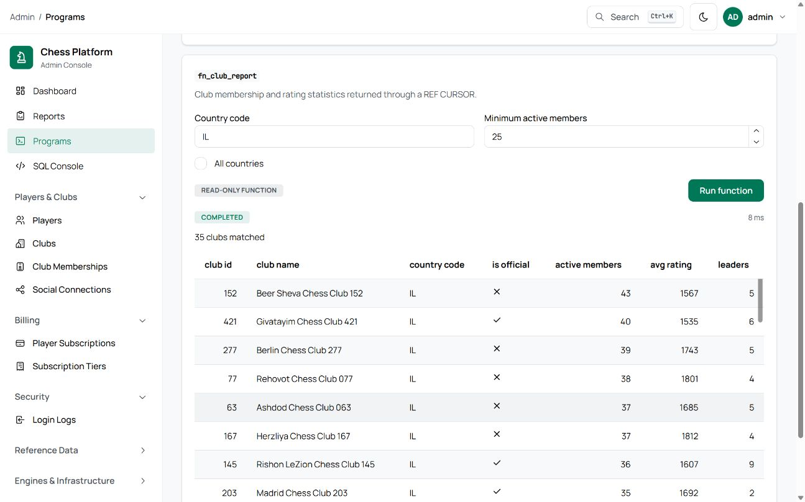

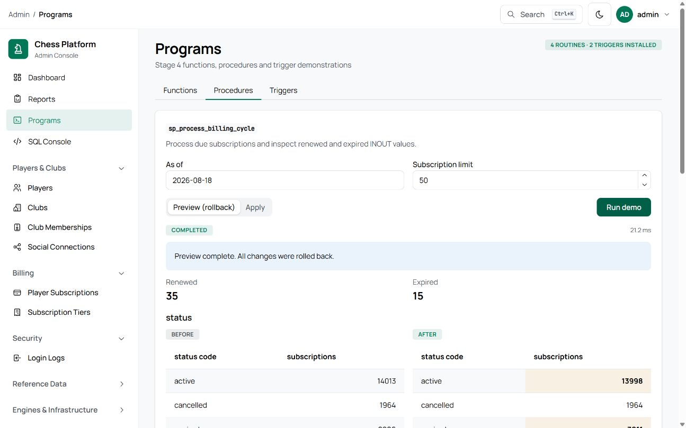

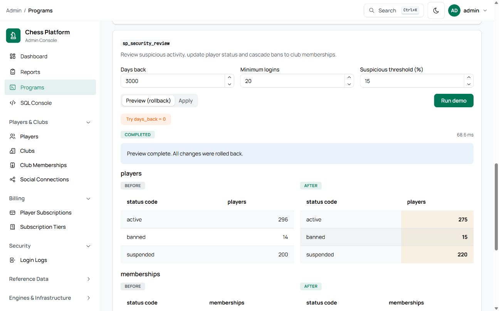

**הדגמות הטריגרים.** קטע נפרד במסך שמפעיל כל תרחיש מ-`Verification.sql` של שלב ד בלחיצה, ומציג את ההודעה של הבסיס ואת הראיות לפני/אחרי:

- `trg_player_update`: העלאת דירוג ב-500 נדחית (`Rating change too large`), העלאה ב-50 מתקבלת, ושינוי סטטוס ל-`banned` מדרדר את החברויות הפעילות ל-`banned` עם NOTICE של הספירה.
- `trg_login_log_insert`: הכנסת התחברות בלי `client_id` מקבלת אותו אוטומטית לפי סוג המכשיר, `failure_reason` נמחק בהתחברות מוצלחת, והתחברות של שחקן חסום או לא קיים נדחית.

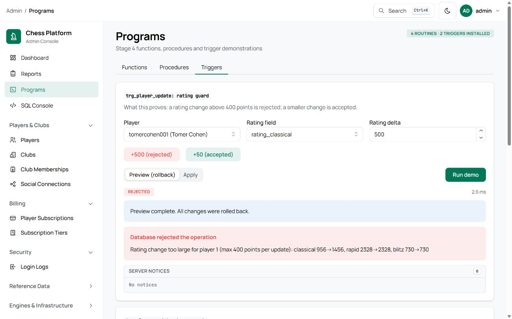

### 5.9 SQL Console

`/sql`. עורך SQL חופשי לצורכי הדגמה ובדיקה: SELECT מוצג בטבלה עם זמן ריצה; DML רץ במצב Preview (ROLLBACK) אלא אם בוחרים Apply; הודעות `RAISE NOTICE` ושגיאות מוצגות מתחת לתוצאה.

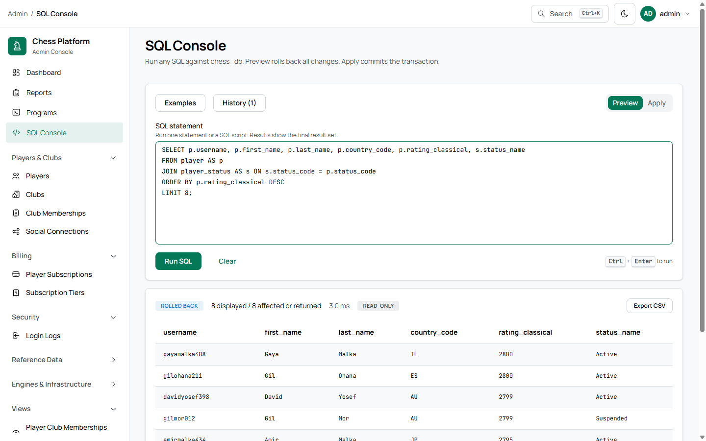

### 5.10 מעטפת המסכים

סרגל ניווט מקובץ עם אייקון לכל טבלה, פירורי לחם, התראות (toast) אחרי כל פעולה, מצבי טעינה/ריק/שגיאה אחידים, תפריט משתמש עם יציאה. מתג מצב כהה בכותרת, ו-**Spotlight** (`Ctrl+K`) לחיפוש מהיר של כל טבלה ומסך לפי שם.

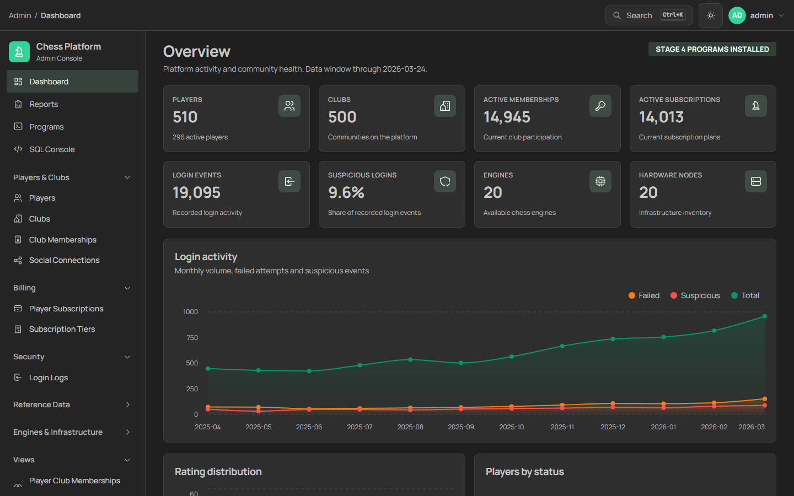

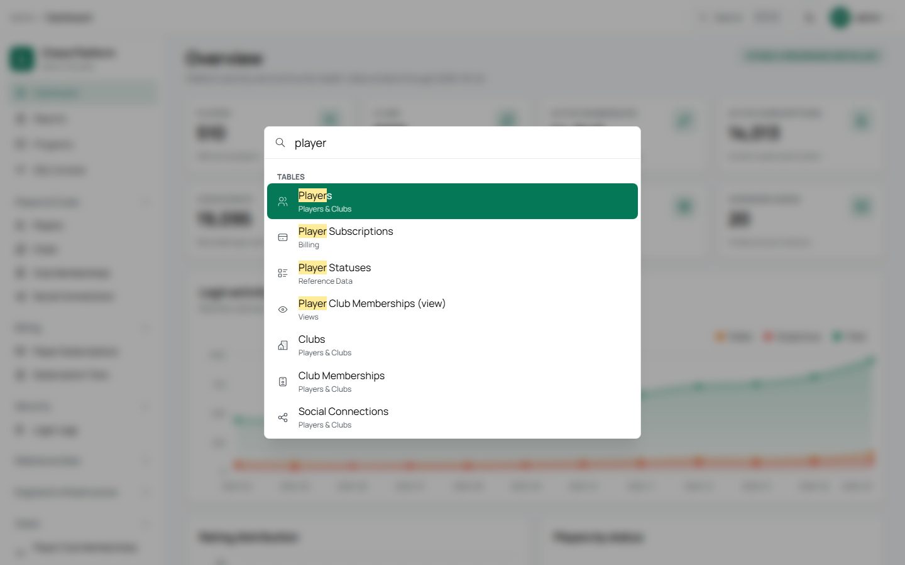

---

## 6. יישום דרישות שלב ה

| דרישה | היכן באפליקציה | צילום |
|---|---|---|
| מסכים לכל הטבלאות (27) והמבטים (3) | מסך הטבלאות הגנרי `/tables/:key`; 30 כניסות בסרגל הניווט בשש קבוצות | 03, 18 |
| שליפה מכל הטבלאות | טבלה עם חיפוש, מיון, עימוד וסינון | 03 |
| הכנסה לכל הטבלאות | New record; מפתח `MAX+1`; בוחרי FK | 04 |
| עדכון בכל הטבלאות | עריכה משורה + Update by key | 05 |
| מחיקה מכל הטבלאות | Delete עם אישור; שגיאות FK מהבסיס | 06 |
| השפעת פונקציות ופרוצדורות על הטבלאות | לפני/אחרי ב-Programs וב-Reports; המחזור והסריקה משנים `player_subscription`, `player`, `club_membership` | 14, 15 |
| השפעת טריגרים | הדגמות הטריגרים; U1 ב-Reports; חסימה ורישום התחברות ב-Player 360 | 16, 07 |
| הפעלת שאילתות שלב ב (לפחות 2) | כל 8 ה-SELECT עם פרמטרים ו-A/B, ו-6 ה-DML עם Preview/Apply | 09, 10, 11 |
| הפעלת תוכניות שלב ד (לפחות 2) | 2 פונקציות + 2 פרוצדורות ב-Programs; `fn_player_activity_score` גם ב-Player 360 | 12, 13, 14, 15 |
| עדכון: מילוי מפתח, הבאת השדות, עדכון | פאנל Update by key בכל טבלה | 05 |
| FK מוצג כשם ולא כ-ID | `_labels` בכל שליפה; בוחרי FK בטפסים מציגים שמות | 03, 04 |
| מסך כניסה שממנו מגיעים לכל המסכים | Login ואז Dashboard עם סרגל ניווט מלא וכרטיסי ניווט | 01, 02 |
| מסך להפעלת שאילתות ותוכניות | Reports, Programs, SQL Console | 09, 12, 17 |
| יופי גרפי ונוחות | ערכת עיצוב אחידה, גרפים, מצב כהה, Ctrl+K, התראות, מצבי ריק/שגיאה | 02, 19, 20 |
| קוד הממשק בתיקייה | `שלב ה/backend`, `שלב ה/frontend` | |
| קובץ הוראות כניסה והפעלה | `שלב ה/הוראות הפעלה.md` + סעיף 2 כאן | |
| תמונות מסכים | `שלב ה/screenshots/` (20 קבצים) | |
| דוח README | קובץ זה | |

---

## 7. מיפוי למסכי שלב א

בשלב א אפיינו ארבעה מסכים. האפליקציה הסופית מממשת כל אחד מהם, ומרחיבה אותם לכל 27 הטבלאות:

| מסך שלב א | מימוש בשלב ה | טבלאות, שאילתות ותוכניות |
|---|---|---|
| **Player Dashboard** (פרופיל, שלושה דירוגים, פעילות אחרונה) | Player 360 (`/players/:id`) + ה-Dashboard הכללי | `player`, `player_status`, `club_membership`, `login_log`; Q1, Q4; `fn_player_activity_score`; `trg_player_update` |
| **Club Management** (מועדונים, חברים, תפקידים) | Club detail (`/clubs/:id`) + טבלאות `club` ו-`club_membership` | `club`, `club_membership`, `membership_role`, `membership_status`; Q5, Q8, U3, D3; `fn_club_report` |
| **Subscription Overview** (תוכנית, מחזור חיוב, חידוש) | קבוצת Billing + המנויים ב-Player 360 | `player_subscription`, `subscription_tier`, `billing_cycle`, `subscription_status`; Q3, Q6, U2; `sp_process_billing_cycle` |
| **Login Activity / Security Log** (מסלול ביקורת עם מכשיר ומיקום) | קבוצת Security + ההתחברויות ב-Player 360 | `login_log`, `login_status`, `uiclient` (הגשר משלב ג), `vw_client_login_activity`; Q2, Q7, U1, D2; `sp_security_review`; `trg_login_log_insert` |

מה שנוסף מעבר לארבעת המסכים המקוריים: מסכי הטבלאות של האגף השותף (מנועים, בוטים, שרתים, טלמטריה) שהתווספו באינטגרציה של שלב ג, שלושת המבטים, מסך הדוחות, מסך התוכניות וקונסולת ה-SQL.

---

## 8. טבלת כיסוי דרישות

| דרישה | מימוש | |
|---|---|:-:|
| אפליקציה שניגשת לכל הטבלאות: מסכים ל-27 טבלאות ו-3 מבטים | מנוע טבלאות גנרי, 30 כניסות ניווט | ✔ |
| שליפה מכל הטבלאות | `GET /api/tables/{t}` עם חיפוש, מיון, עימוד, סינון | ✔ |
| הכנסה לכל הטבלאות | `POST /api/tables/{t}`, מפתח אוטומטי | ✔ |
| עדכון בכל הטבלאות | `PUT /api/tables/{t}` מעריכה ומ-Update by key | ✔ |
| מחיקה מכל הטבלאות | `DELETE /api/tables/{t}` עם אישור | ✔ |
| רואים השפעה של פונקציות, פרוצדורות וטריגרים על הטבלאות | לפני/אחרי, notices, שגיאות מילוליות של הבסיס | ✔ |
| הפעלת לפחות 2 שאילתות משלב ב | 8 SELECT + 3 UPDATE + 3 DELETE | ✔ |
| הפעלת לפחות 2 תתי-תוכניות משלב ד | 2 פונקציות + 2 פרוצדורות + הדגמות 2 הטריגרים | ✔ |
| עדכון: המשתמש ממלא מפתח, המערכת מביאה את השדות | פאנל Update by key | ✔ |
| לא רואים ID של FK אלא את השם | צירופים בצד השרת (`_labels`), בוחרי FK עם שמות | ✔ |
| מסך כניסה שממנו נכנסים לכל המסכים | Login ואז Dashboard וסרגל ניווט | ✔ |
| מסכי CRUD | מסך הטבלאות | ✔ |
| מסך להפעלת שאילתות ותוכניות | Reports, Programs, SQL Console | ✔ |
| יופי גרפי ונוחות | Mantine, ערכת עיצוב, גרפים, מצב כהה, Ctrl+K | ✔ |
| קוד הממשק בתיקייה | `שלב ה/backend`, `שלב ה/frontend`, `start.ps1` | ✔ |
| קובץ הוראות כניסה והפעלה | `הוראות הפעלה.md` | ✔ |
| תמונות מסכים | `screenshots/01..20` | ✔ |
| דוח README: הוראות הפעלה, דרך העבודה והכלים, צילומי מסך | סעיפים 2, 3, 5 של קובץ זה | ✔ |

---

## 9. סיכום

בשלב ה סגרנו את המעגל של הפרויקט: בסיס הנתונים שתכננו בשלב א, השאילתות של שלב ב, האינטגרציה והמבטים של שלב ג והתוכניות של שלב ד נגישים עכשיו ממסך אחד, בלי pgAdmin ובלי SQL ידני.

מה שמאפיין את המימוש:

- **מנוע אחד ל-30 מסכים.** מסכי הטבלאות לא נכתבו אחד-אחד; הם נגזרים מהסכמה ומרשימת הרישום. הוספת טבלה חדשה לבסיס דורשת שורה אחת ב-`registry.py`.
- **הבסיס שומר על עצמו.** האפליקציה לא מגנה על הנתונים בעצמה; היא מעבירה למשתמש את הסירובים של PostgreSQL (אילוצי CHECK, מפתחות זרים, הטריגרים של שלב ד) כלשונם, ומראה את מה שהפרוצדורות עשו.
- **Preview לפני Apply.** כל פעולה שמשנה נתונים (DML של שלב ב, הפרוצדורות, הדגמות הטריגרים) רצה קודם בטרנזקציה שמסתיימת ב-`ROLLBACK`, כך שאפשר להדגים שוב ושוב על אותו baseline, בדיוק כמו בשיטת ההוכחה של שלב ד.
- **המשכיות.** ארבעת מסכי שלב א מומשו במלואם, וההרחבה לאגף השותף עברה דרך אותו מנוע, כולל הגשר `login_log.client_id -> uiclient` שמופיע ב-Player 360, בסריקת האבטחה ובמבט `vw_client_login_activity`.
